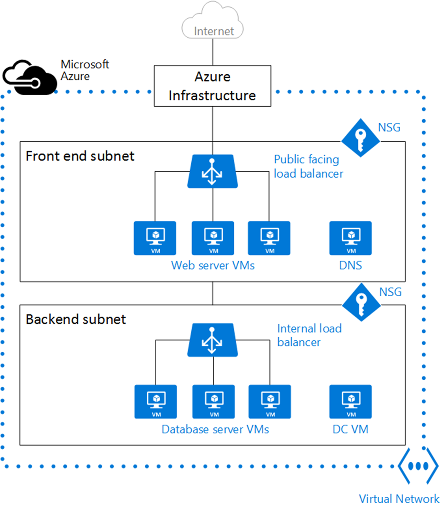
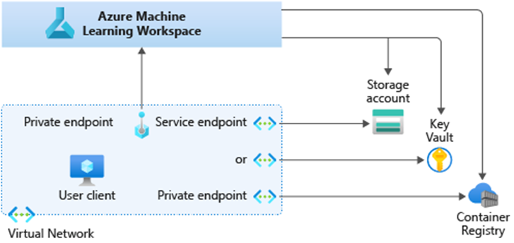
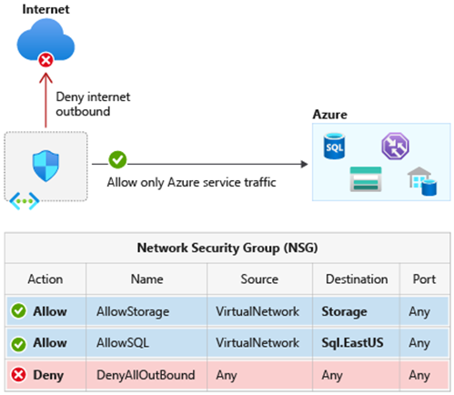

Before you begin training models, it's essential to secure your Azure Machine Learning network from outside intrusion. Without first securing your network, you can leave your data and models exposed to potentially malicious actors and lead to data theft or attacks that could negatively change model behavior. These alterations can often be difficult to spot due to the often large nature of datasets or parameters influencing model behavior. We will begin by separating your model training from the wider net to its own virtual network to avoid these problems.

## Virtual networks and security groups

To secure the Azure Machine Learning workspace and compute resources, we will use a virtual network (VNet). An Azure VNet is the fundamental building block for your private network in Azure. VNet enables Azure resources, such as Azure Blob Storage and Azure Container Registry, to securely communicate with each other, the internet, and on-premises networks. VNet is similar to a traditional network that you'd operate in your own data center, but brings with it additional benefits of Azure's infrastructure such as scale, availability, and isolation. With a VNet, you can enhance security between Azure resources and filter network traffic to ensure only trusted users have access to the network.

> [!div class="mx-imgBorder"]
> 

In the above image, we can see a typical structure for a Virtual Network (VNet) comprised of:

- **IP address space:** When creating a VNet, you must specify a custom private IP address space using public and private (RFC 1918) addresses.
- **Subnets:** Shown above as separate virtual machines (VMs), subnets enable you to segment the virtual network into one or more sub-networks and allocate a portion of the virtual network's address space to each subnet, enhancing security and performance.
- **Network interfaces (NIC)** are the interconnection between a VM and a virtual network (VNet). When you create a VM in the Azure portal, a network interface is automatically created for you.
- **Network security groups (NSG)** can contain multiple inbound and outbound security rules that enable you to filter traffic to and from resources by source and destination IP address, port, and protocol.
- **Load balancers** can be configured to efficiently handle inbound and outbound traffic to VMs and VNets, while also offering metrics to monitor the health of VMs.

### Paths into a VNet

Integrating Azure services to an Azure virtual network enables private access to the service from virtual machines or compute resources in the virtual network. You can integrate Azure services in your virtual network with the following options:

- **Service endpoints** provide the identity of your virtual network to the Azure service. Once you enable service endpoints in your virtual network, you can add a virtual network rule to secure the Azure service resources to your virtual network. Service endpoints use public IP addresses.
- **Private endpoints** are network interfaces that securely connect you to a service powered by Azure Private Link. Private endpoint uses a private IP address from your VNet, effectively bringing the Azure services into your VNet.

> [!div class="mx-imgBorder"]
> 

You can connect your on-premises computers and networks to a VNet through a virtual private network (VPN) in several ways. A **Point-to-site VPN** is a connection between a virtual network and a single computer in your network. The communication is sent through an encrypted tunnel over the internet. Each computer that wants to establish connectivity with a VNet must configure its connection, so it's best used if you only have a few users who need to connect to the VNet. This connection type is great if you're just getting started as it requires little or no changes to your existing network.

While a **Site-to-site VPN** can be established between your on-premises VPN device and an Azure VPN Gateway that's deployed in a virtual network. This connection type enables any on-premises resource that you authorize to access a virtual network. The communication between your on-premises VPN device and an Azure VPN gateway is sent through an encrypted tunnel over the internet.

**ExpressRoute** can be used instead of a VPN If you wish to speed up creating private connections to Azure services. The service allows you to create private connections between Microsoft data centers and infrastructure on your premises or in another facility. ExpressRoute connections are separate from the public internet and offer high security, reliability, and speeds with lower latency than typical connections over the internet. ExpressRoute has a range of pricing options depending on your estimated bandwidth requirements.

### Securing the workspace and resources

To begin securing your network, you will need to connect to your workspace via a private endpoint (private IP), which we will cover in the next exercise. The private endpoint can be added to a workspace through the *Azure Machine Learning Python SDK, Azure CLI,* or within the *Networking tab of the Azure portal.* From there, you can then limit access to your workspace to only occur over the private IP addresses.

However, this alone will not ensure end-to-end security by itself, so make sure other Azure services you are communicating with are also behind the VNet. Since communication to the workspace is then set to be only allowed from the VNet, any development environments that use the workspace must be members of the VNet unless you have configured the network to allow public IP connections.

The following methods can be used to connect to the secure workspace:

- **Azure VPN gateway** - Connects on-premises networks to the VNet over a private connection. Connection is made over the public internet. There are two types of VPN gateways that you might use:
  - **Point-to-site:** Each client computer uses a VPN client to connect to the VNet.
  - **Site-to-site:** A VPN device connects the VNet to your on-premises network.

- **ExpressRoute** - Connects on-premises networks into the cloud over a private connection. Connection is made using a connectivity provider.

- **Azure Bastion** - In this scenario, you create an Azure Virtual Machine (sometimes called a jump box) inside the VNet. You then connect to the VM using Azure Bastion. Bastion allows you to connect to the VM using either an RDP or SSH session from your local web browser. You then use the jump box as your development environment. Since it is inside the VNet, it can directly access the workspace.

### Security groups and traffic

You can use an Azure network security group (NSG) to filter network traffic to and from Azure resources in an Azure virtual network. A network security group contains security rules that allow or deny inbound network traffic to, or outbound network traffic from, several types of Azure resources. NSGs are useful for controlling the traffic flow between VM subnets or limiting outbound communication by resources within an Azure VNet to the internet, which is enabled by default.

The following picture illustrates different scenarios for how network security groups might be deployed to allow network traffic to and from the internet over TCP port 80:

> [!div class="mx-imgBorder"]
> 

Application security groups (ASG) can also be used to configure network security as a natural extension of an application's structure, allowing you to group virtual machines and define network security policies based on those groups. You can reuse your security policy at scale without manual maintenance of explicit IP addresses. The platform handles the complexity of explicit IP addresses and multiple rule sets, simplifying the NSG rule definition process immensely.

#### Service tags

A service tag represents a group of IP address prefixes from a given Azure service. Microsoft manages the address prefixes encompassed by the service tag and automatically updates the service tag as addresses change, minimizing the complexity of frequent updates to network security rules.

You can use service tags in place of specific IP addresses when you create security rules to define network access controls on network security groups or Azure Firewall. By specifying the service tag name, such as ApiManagement, in the appropriate source or destination field of a rule, you can allow or deny the traffic for the corresponding service.

> [!div class="mx-imgBorder"]
> 

## Private endpoints & Private Link

The Azure Machine Learning workspace can use Azure Private Link to create a private endpoint behind the VNet. Azure Private Link is a technology designed to provide connectivity to selected PaaS services. This provides a set of private IP addresses that can be used to access the workspace from within the VNet. Some of the services that Azure Machine Learning relies on can also use Azure Private Link, but some rely on network security groups or user-defined routing.

There are two key components of Azure Private Link:

- **Private endpoint** – a network interface connected to your virtual network, assigned with a private IP address. It is used to connect privately and securely to a service powered by Azure Private Link or a Private Link Service that you or a partner might own.
- **Private Link Service** – your own service, powered by Azure Private Link that runs behind an Azure Standard Load Balancer, enabled for Private Link access. This service can be privately connected with and consumed using Private Endpoints deployed in the user's virtual network.

When you create a private endpoint for your Azure resource, it provides secure connectivity between clients on your virtual network and your Azure resource. You can use private endpoints to communicate and ingress events directly from your virtual network to Azure resources securely over a private link without going through the public internet, boosting security. The private endpoint is assigned an IP address from the IP address range of your virtual network. The service is flexible, allowing connections between VNets with overlapping address spaces and connecting resources running in other regions, offering global reach.

> [!div class="mx-imgBorder"]
> 
