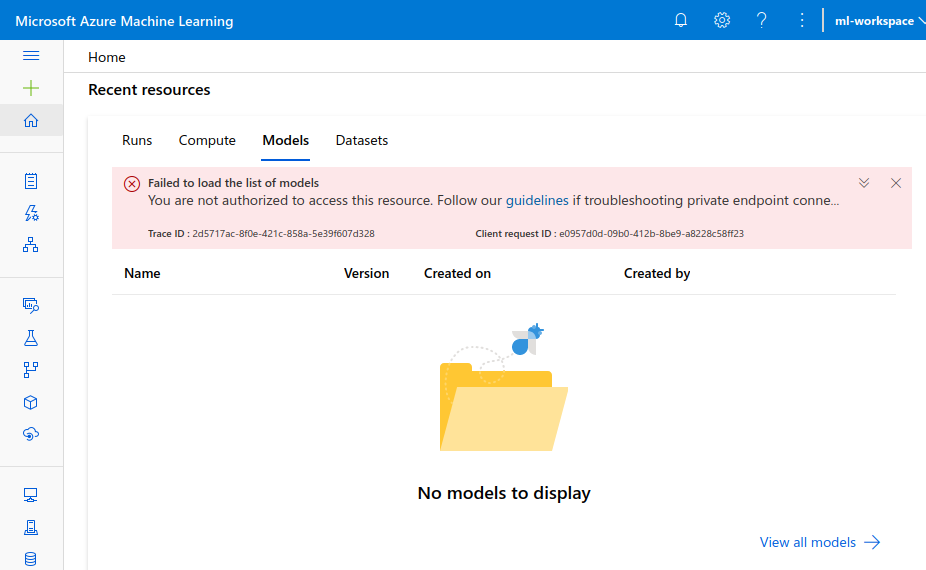

An [Azure Virtual Network (VNet)](/azure/virtual-network/virtual-networks-overview) is similar to a traditional network but with the added benefits provided by Azure infrastructure.

VNets enable your resources, such as virtual machines (VMs) and ML workspaces, to securely communicate with each other and other networks or the internet.

A Machine Learning engineer can use them in a variety of scenarios, such as linking a VM to data stored on-premises, restricting access to a training API so that only personnel from their lab can see it, or exposing an inference endpoint to the internet.

In this exercise, we'll create a VNet and use it to secure access the workspace we created in the previous exercise. While this exercise gives an intuition about the mechanics of securing a workspace, this is not a complete solution. Refer to the documentation linked at the end of the exercise for complete instructions.

> [!WARNING] 
>
> This exercise will only give a basic intuition as to the process involved in securing an ML workspace's network environment. For complete step-by-step process for a production environment, follow the link at the end of this exercise.

> [!WARNING] 
>
> This exercise will block access to the affected workspace and should not be performed on a production workspace.

## Prerequisites

- Basic knowledge of networking concepts.
- An Azure account and a subscription.
- A resource group Azure Machine Learning Workspace as created in the previous exercise.

## Sign in to Azure

Sign in to the [Azure portal](https://portal.azure.com/?azure-portal=true).

## Create a VNet

Let's create a VNet for this exercise:

1. In the Azure portal, Select **Create a resource** in the upper left-hand corner of the portal.
1. In the search box, enter **Virtual Network**. Select **Virtual Network** in the search results.
1. In the **Virtual Network** page, select **Create**.
1. In **Create virtual network**, enter or select this information in the **Basics** tab:
   - **Project details**:
      - **Subscription**: *Select your subscription*
      - **Resource group**: `MLResourceGroup`
   - **Instance details**
      - **Name**: `MLVNet`
      - **Region**: `East US` 
1. Select the **IP Addresses** tab, or select the **Next: IP Addresses** button at the bottom of the page.
1. In **IPv4 address space**, select the existing address space and change it to `10.1.0.0/16`.
1. Select **+ Add subnet**, then enter:
    - **Subnet name**: `default` 
    - **Subnet address range**: `10.1.0.0/24`
1. Select **Add**.
1. Select the **Review + create** tab or select the **Review + create** button.
1. Select **Create** and wait a few moments for the deployment to finish.

> [!IMPORTANT] 
> For simplicity, we are creating a single subnet for our Virtual Network. A subnet is a range of IP addresses in the VNet. We could split a VNet into multiple subnets for organization and security, for example, a *training* subnet that only data scientists could use, and an *inference* subnet that is publicly available.

## Testing workspace access

We just added a VNet to our resource group, but is it restricting access to our **ml-workspace**?

We can test that using [Azure Machine Learning studio](/azure/machine-learning/overview-what-is-machine-learning-studio) to access the contents of the workspace.

> [!TIP] 
> The Azure Machine Learning studio is a web portal with high-level tools for model training, deployment, and asset management.

1. Select **Home** to go back to the home page of the Azure portal.
1. Select the **ml-workspace** in the list of recent resources.
1. Select the **Studio web URL** for your workspace.
1. Azure Machine Learning studio should open in a new tab or window. 

Although you probably don't have any assets or resources in the workspace yet, there should be no warnings or error messages, meaning that there's no network access restrictions on those resources yet.

## Secure network access to the ML Workspace

So far we've created two independent resources:

- An ML workspace (**ml-workspace**)
- A VNet (**MLVNet**)

We now have to connect these two so that the workspace network traffic has to go through our VNet. In other words, we want our workspace available **only** to resources that are connected to the **MLVNet** virtual network.

To accomplish that, we need to define a [Private Endpoint](/azure/private-link/private-endpoint-overview) for the *ml-workspace* resource.

> [!NOTE] 
>
> A Private Endpoint is a network interface that uses a private IP Address from your VNet to create secure and private connections to a resource.

## Create a Private Endpoint

1. Go to the Azure portal, select **Resource Groups**, select the **MLResourceGroup** resource group, and then select your **ml-workspace** workspace.
1. In the left-hand menu, select **Networking**.
1. Select the **Private endpoint connections** tab.
1. Add a new **Private endpoint** with the following settings:
   - **Project details**:
      - **Subscription**: *Select your subscription*
      - **Resource group**: `MLResourceGroup`
   - **Instance details**
      - **Name**: `MLPrivateEndpoint`
      - **Network Interface Name**: *Is filled in when you enter a name*
      - **Region**: `East US` 
1. Select the **Next: Resource >** button.
1. Review that the following details are shown in the **Resource** tab:
    - **Subscription**: *Your subscription*
    - **Resource type**: `Microsoft.MachineLearningServices/workspaces`
    - **Resource**: `ml-workspace`
    - **Target sub-resource**: `amlworkspace`
1. Select the **Next: Virtual Network >** button.
1. Leave the suggested defaults:
    - **Virtual network**: `MLVNet (MLResourceGroup)`
    - **Subnet**: `default`
1. Select the **Next: DNS >** button.
1. Leave the suggested default for **Integrate with private DNS zone** to `Yes`. 
1. Select the **Next: Tags >** button.
1. Select **Review + Create** to validate the deployment, then select **Create** to deploy the endpoint (this can take a few moments).

## Testing the network configuration

We can make sure our workspace is inside the VNet now by testing if we still have access to its resources:

1. Reload the Azure Machine Learning studio window (or [open the Studio](https://ml.azure.com/) again):

   > [!div class="mx-imgBorder"]
   > 

2. As the warning shows, access to those resources is now blocked. That happens because your workspace is now inside the VNet, and it's configured to block all requests that don't originate from within the *default* subnet we created (remember we're trying to access it from the **outside** of the network perimeter).

### Secured but inaccessible

You've just secured the network access to your ML workspace.

Notice that in the same way you can't access it, neither can any other resources in your organization that aren't part of the subnet.

Opening things up so that resources can connect requires some strategical planning!

We recommend reading our [how to secure a workspace using a vnet](/azure/machine-learning/how-to-secure-workspace-vnet) guide for more in-depth reference.

## Summary

In this unit you've covered the following topics:

- What a Virtual Network is and some of its uses
- Creating an Azure Virtual Network
- Creating subnets in a Virtual Network
- How to use Private Endpoints to secure network access to your Machine Learning workspaces
- Accessing a workspace using Azure Machine Learning studio and check if resources are blocked