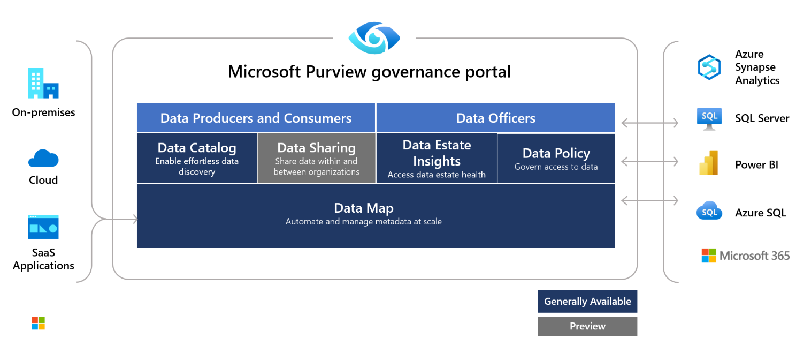
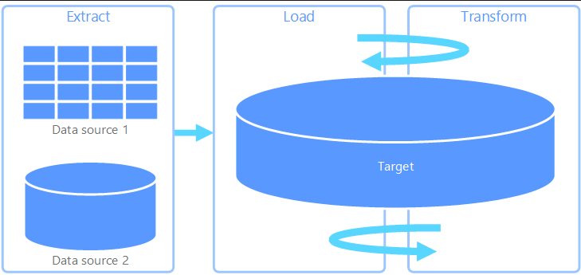

## Understand Azure Synapse Analytics Pipelines

Most data movement activities require several things in order to be successful which include consistency of source and destination file formats, a standard refresh schedule for batch processing, and data lineage in order to track down errors to the source system for correction by their owner(s). Azure Synapse pipelines, like it’s counterpart Azure Data Factory (ADF) is the service that can be used to fulfill these requirements. Azure Synapse Pipelines provide a cloud-based data integration service that orchestrates the movement and transformation of data between various data stores and compute resources to Azure Synapse Analytics as part of the Synapse Service offering.

Azure Synapse Analytics is a cloud-based ETL and data integration service that allows you to create data-driven workflows for orchestrating data movement and transforming data at scale which is integrated within the Azure Synapse Platform. If you are already familiar with Azure Data Factory, then the learning curve is minimal. Using Azure Synapse Pipelines, you can create and schedule data-driven workflows (called pipelines) that can ingest data from disparate data stores. You can build complex ETL or ELT processes that transform data visually with data flows or by using the compute services such as Azure Synapse Analytics to perform the heavy lifting operation of transformation.

The pipelines within Azure Synapse Analytics allow for an integrated approach to all of the businesses analytical needs, allowing data engineers to integrate the pipelines between components such as Dedicated SQL Pools, Spark Pool, and even SQL Serverless pools. As noted before, this functionality is similar to Azure Data Factory, although ADF is focused on external integration between heterogeneous source systems and destinations such as Azure Databricks, HDInsight, and other data destinations.

## ETL and ELT

The term extract, transform, and load (ETL) is part of every data engineer's vernacular and on the Microsoft platform of SQL Server was really introduced with SQL Server 7.0 with the introduction of Data Transformation Services (DTS). In SQL server 2000, we introduced SQL Server Integration Services (SSIS), and this is still supported in Pipeline components as you'll see in other lessons. One thing that has always lacked in SSIS and DTS was the ability to have data lineage which was usually expensive to implement and required third party vendors and software to properly achieve. This functionality is now an integral part of Synapse Pipelines and ADF with the use of Microsoft Purview. Microsoft Purview captures runtime lineage from the following Pipeline activities:

- Copy activity
- Data Flow activity
- Execute SSIS Package activity

You can gain an idea of the level of integration with Microsoft Purview with the image below:

Depending upon several factors, such as data size, target (sink) resources, compute power, and network connectivity which may go through the public internet or securely over an ExpressRoute connection, will determine your approach to data loading and data transformation. Ideally, with Azure and other cloud providers, the goal is to move the data into the cloud provider's environment first, and then use distributed compute such as Synapse Analytics to perform the heavy lifting of data transformation from your Azure Data Lake.

As we can see in the basic concept of ELT, Instead of using a separate transformation engine, the processing capabilities of the target data store, such as Azure Synapse Analytics are used to transform data. This simplifies the architecture by removing a transformation engine from the pipeline. Another benefit to this approach is that scaling the target data store also scales the ELT pipeline performance. However, ELT only works well when the target system is powerful enough to transform the data efficiently.

In practice, the target data store or sink is a data warehouse using either a Hadoop cluster (using Hive or Spark) or SQL dedicated pools on Azure Synapse Analytics. In general, a schema is overlaid on the flat file data at query time and stored as a table, enabling the data to be queried like any other table in the data store. These are referred to as external tables because the data does not reside in storage managed by the data store itself, but on some external scalable storage such as Azure data lake store. This allows the downstream services to connect to these highly compressed and columnar storage files to connect and use the data fully without having to keep the expensive hardware running at full scale which will significantly increase flexibility while reducing costs.