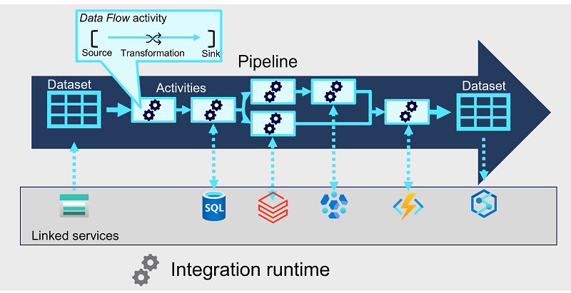

Pipelines in Azure Synapse Analytics encapsulate a sequence of *activities* that perform data movement and processing tasks. You can use a pipeline to define data transfer and transformation activities, and orchestrate these activities through control flow activities that manage branching, looping, and other typical processing logic. The graphical design tools in Azure Synapse Studio enable you to build complex pipelines with minimal or no coding required.

## Core pipeline concepts

Before building pipelines in Azure Synapse Analytics, you should understand a few core concepts.

### Activities

Activities are the executable tasks in a pipeline. You can define a flow of activities by connecting them in a sequence. The outcome of a particular activity (success, failure, or completion) can be used to direct the flow to the next activity in the sequence.

Activities can encapsulate data transfer operations, including simple data copy operations that extract data from a source and load it to a target (or *sink*), as well as more complex data flows that apply transformations to the data as part of an *extract, transfer, and load* (ETL) operation. Additionally, there are activities that encapsulate processing tasks on specific systems, such as running a Spark notebook or calling an Azure function. Finally, there are *control flow* activities that you can use to implement loops, conditional branching, or manage variable and parameter values.

### Integration runtime

The pipeline requires compute resources and an execution context in which to run. The pipeline's *integration runtime* provides this context, and is used to initiate and coordinate the activities in the pipeline.

### Linked services

While many of the activities are run directly in the integration runtime for the pipeline, some activities depend on external services. For example, a pipeline might include an activity to run a notebook in Azure Databricks or to call a stored procedure in Azure SQL Database. To enable secure connections to the external services used by your pipelines, you must define *linked services* for them.

> [!NOTE]
> Linked services are defined at the Azure Synapse Analytics workspace level, and can be shared across multiple pipelines.

### Datasets

Most pipelines process data, and the specific data that is consumed and produced by activities in a pipeline is defined using *datasets*. A dataset defines the schema for each data object that will be used in the pipeline, and has an associated linked service to connect to its source. Activities can have datasets as inputs or outputs.

> [!NOTE]
> Similarly to linked services, datasets are defined at the Azure Synapse Analytics workspace level, and can be shared across multiple pipelines.
