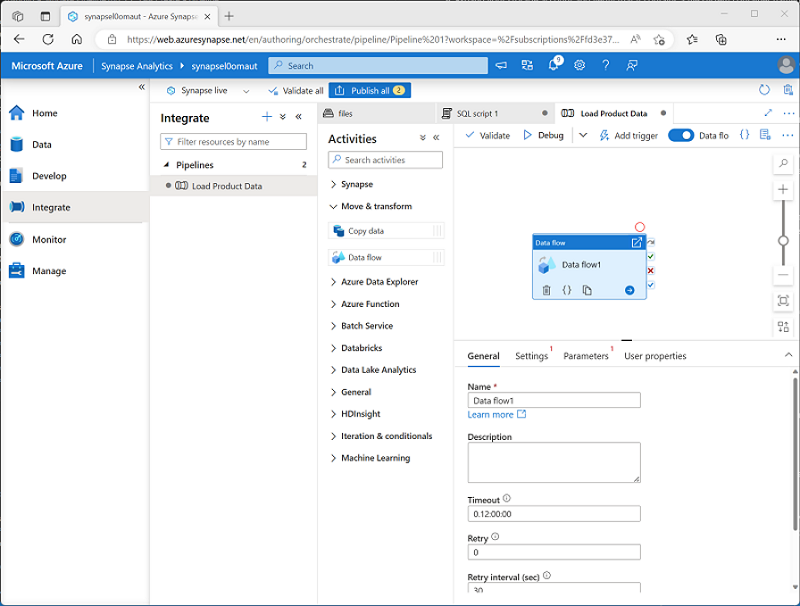

You can create a pipeline in Azure Synapse Studio by using shortcuts on the **Home** page, but the primary place where pipelines are created and managed is the **Integrate** page.

When you create a pipeline in Azure Synapse Studio, you can use the graphical design interface.

.

The pipeline designer includes a set of activities, organized into categories, which you can drag onto a visual design canvas. You can select each activity on the canvas and use the properties pane beneath the canvas to configure the settings for that activity.

To define the logical sequence of activities, you can connect them by using the **Succeeded**, **Failed**, and **Completed** dependency conditions, which are shown as small icons on the right-hand edge of each activity.

## Defining a pipeline with JSON

While the graphical development environment is the preferred way to create a pipeline, you can also create or edit the underlying JSON definition of a pipeline. The following code example shows the JSON definition of a pipeline that includes a **Copy Data** activity:

```json
{
  "name": "CopyPipeline",
  "properties": {
    "description": "Copy data from a blob to Azure SQL table",
    "activities": [
      {
        "name": "CopyFromBlobToSQL",
        "type": "Copy",
        "inputs": [
          {
            "name": "InputDataset"
          }
        ],
        "outputs": [
          {
            "name": "OutputDataset"
          }
        ],
        "typeProperties": {
          "source": {
            "type": "BlobSource"
          },
          "sink": {
            "type": "SqlSink",
            "writeBatchSize": 10000,
            "writeBatchTimeout": "60:00:00"
          }
        },
        "policy": {
          "retry": 2,
          "timeout": "01:00:00"
        }
      }
    ]
  }
}
```
