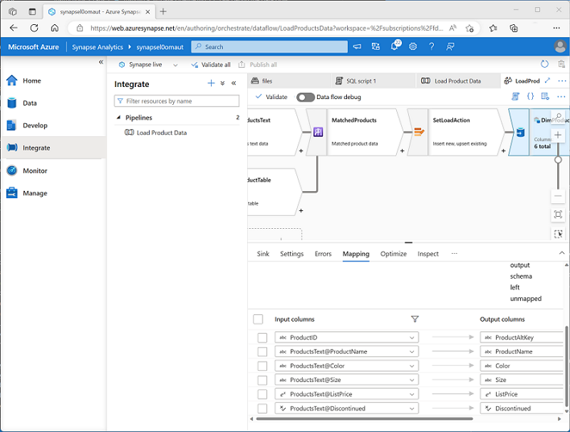

A **Data Flow** is a commonly used activity type to define data flow and transformation. Data flows consist of:

- **Sources** - The input data to be transferred.
- **Transformations** – Various operations that you can apply to data as it streams through the data flow.
- **Sinks** – Targets into which the data will be loaded.

When you add a **Data Flow** activity to a pipeline, you can open it in a separate graphical design interface in which to create and configure the required data flow elements.

An important part of creating a data flow is to define mappings for the columns as the data flows through the various stages, ensuring column names and data types are defined appropriately. While developing a data flow, you can enable the **Data flow debug** option to pass a subset of data through the flow, which can be useful to test that your columns are mapped correctly.

> [!TIP]
> To learn more about implementing a **Data Flow** activity, see [Data Flow activity in Azure Data Factory and Azure Synapse Analytics](/azure/data-factory/control-flow-execute-data-flow-activity?azure-portal=true) in the Azure documentation.
