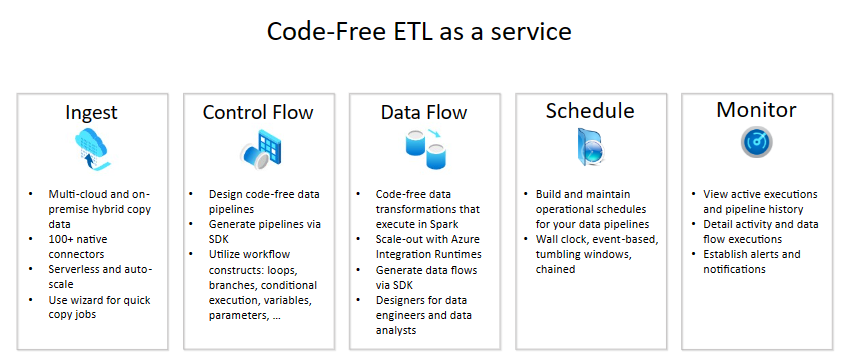

### Top-level concepts

An Azure subscription might have one or more Azure Data Factory instances (or data factories). Azure Data Factory is composed of below key components.

- Pipelines
- Activities
- Datasets
- Linked services
- Data Flows
- Integration Runtimes
These components work together to provide the platform on which you can compose data-driven workflows with steps to move and transform data.

### Pipeline

A pipeline is a logical grouping of activities that performs a unit of work. Together, the activities in a pipeline perform a task. For example, a pipeline can contain a group of activities that ingests data from an Azure blob, and then runs a notebook on a synapse serverless compute cluster to partition the data.

The benefit of this is that the pipeline allows you to manage the activities as a set instead of managing each one individually. The activities in a pipeline can be chained together to operate sequentially, or they can operate independently in parallel.

### Mapping data flows

Create and manage graphs of data transformation logic that you can use to transform any-sized data. You can build-up a reusable library of data transformation routines and execute those processes in a scaled-out manner from your Synapse pipelines. Synapse or ADF will execute your logic on a Spark cluster that spins-up and spins-down when you need it. You won't ever have to manage or maintain clusters.

### Activity

Activities represent a processing step within a pipeline. For example, you might use a copy activity to copy data from one data store to another data store. Similarly, you might use a Hive activity, which runs a Hive query on an Azure HDInsight cluster, to transform or analyze your data. Synapse and ADF both support three types of activities: data movement activities, data transformation activities, and control activities.

### Datasets

Datasets represent data structures within the data stores, These simply point to or reference the data you want to use in your activities as inputs or outputs.

### Linked services

Linked services are much like connection strings, which define the connection information that's needed for Synapse or ADF to connect to external resources.  Linked services are used for two purposes in Data Factory:

To represent a data store that includes, but isn't limited to, a SQL Server database, Oracle database, file share, or an Azure Data Lake, amongst others. For a list of supported data stores, see the copy activity article.

### Integration Runtime

In Data Factory, an activity defines the action to be performed. A linked service defines a target data store or a compute service. An integration runtime provides the bridge between the activity and linked Services. It's referenced by the linked service or activity, and provides the compute environment where the activity either runs on or gets dispatched from. This way, the activity can be performed in the region closest possible to the target data store or compute service in the most performant way while meeting security and compliance needs.

### Triggers

Triggers represent the unit of processing that determines when a pipeline execution needs to be kicked off. There are different types of triggers for different types of events.

### Pipeline runs

A pipeline run is an instance of the pipeline execution. Pipeline runs are typically instantiated by passing the arguments to the parameters that are defined in pipelines. The arguments can be passed manually or within the trigger definition.

### Parameters

Parameters are key-value pairs of read-only configuration.  Parameters are defined in the pipeline. The arguments for the defined parameters are passed during execution from the run context that was created by a trigger or a pipeline that was executed manually. Activities within the pipeline consume the parameter values.

A dataset is a strongly typed parameter and a reusable and referenceable entity. An activity can reference datasets and can consume the properties that are defined in the dataset definition.

A linked service is also a strongly typed parameter that contains the connection information to either a data store or a compute environment. It is also a reusable and referenceable entity.

### Control flow

Control flow is an orchestration of pipeline activities that includes chaining activities in a sequence, branching, defining parameters at the pipeline level, and passing arguments while invoking the pipeline on-demand or from a trigger. It also includes custom-state passing and looping containers, that is, For-each iterators.

### Variables
Variables can be used inside of pipelines to store temporary values and can also be used in conjunction with parameters to enable passing values between pipelines, data flows, and other activities.