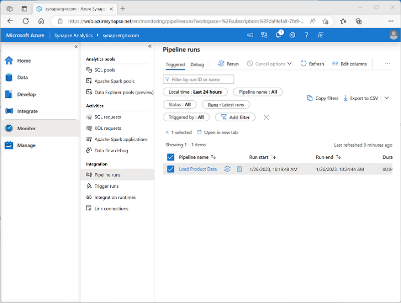

When you’re ready, you can publish a pipeline and use a trigger to run it. Triggers can be defined to run the pipeline:

- Immediately
- At explicitly scheduled intervals
- In response to an event, such as new data files being added to a folder in a data lake.

You can monitor each individual run of a pipeline in the **Monitor** page in Azure Synapse Studio.

The ability to monitor past and ongoing pipeline runs is useful for troubleshooting purposes. Additionally, when combined with the ability to integrate Azure Synapse Analytics and Microsoft Purview, you can use pipeline run history to track data lineage data flows.

> [!TIP]
> To learn more about integration between Azure Synapse Analytics and Microsoft Purview, consider completing the [Integrate Microsoft Purview and Azure Synapse Analytics](/training/modules/integrate-microsoft-purview-azure-synapse-analytics?azure-portal=true) module.
