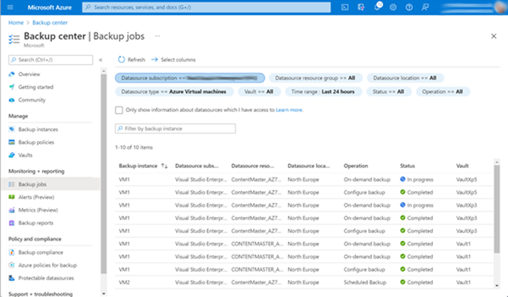
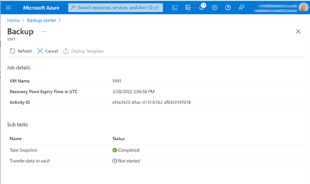
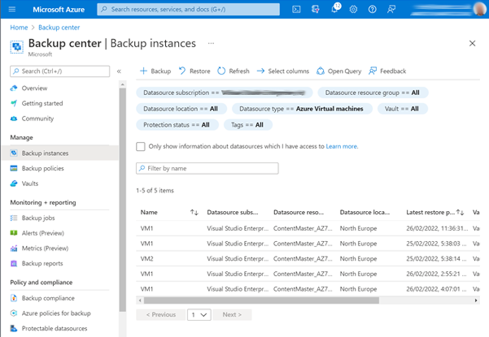
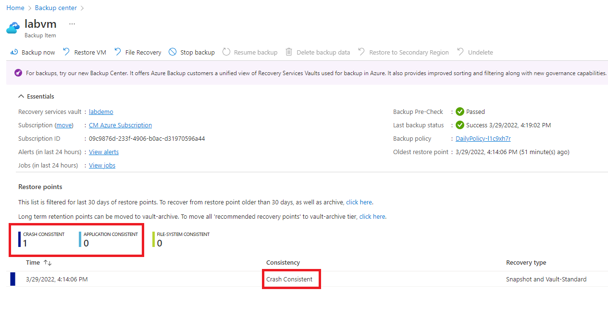
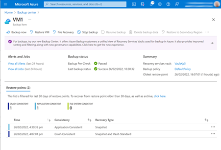
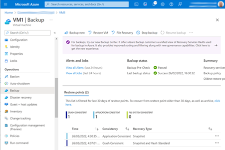

This module requires a sandbox to complete. A sandbox gives you access to free resources. Your personal subscription will not be charged. The sandbox may only be used to complete training on Microsoft Learn. Use for any other reason is prohibited, and may result in permanent loss of access to the sandbox.

Microsoft provides this lab experience and related content for educational purposes. All presented information is owned by Microsoft and intended solely for learning about the products and services in this Microsoft Learn module.

Sign in to activate the sandbox

You have been asked to make a backup of a virtual machine. The backup must be application consistent.

## Create the exercise environment
Using the cloud shell on the right, run these commands to create the example topology.  The environment will take approximately 5 minutes to build.

1. Clone the setup script from GitHub.

```console
git clone https://github.com/MicrosoftDocs/mslearn-business-continuity/blob/main/setup.md networking
```

1. Run the setup script.

```console
bash networking/setup.sh
```

1. The script will create all the resources. Wait until it completes, you should see a Lab Environment Created message.

## Create a backup

1. Sign in to the [Azure portal](https://portal.azure.com/learn.docs.microsoft.com) using the same account you used to activate the sandbox.

- Select the portal menu on the top left.
- Select **Virtual machines**.
- Select **labvm**.
- In the left navigation pane, select **Operations > Backup.**

- Make the following settings and then click **Enable Backup.**

- Recovery services vault: **Create new**

- Vault: **labdemo**

- Choose backup policy: **DefaultPolicy**


1. This takes you back to the resource group. Navigate back to the VM and the Backup page.

1. Click **Backup now.**


1. Select **OK**.

1. The backup starts. It runs in two phases.

- In the first phase, it takes a snapshot of the VM. This takes about 10 minutes.

## Monitor progress of the first phase

You won't see anything in the Backup page of the VM until the backup has completed. However, you can monitor it in the Backup center.

1. Go to the Azure Portal home page, and in the Azure Services section, select **Backup Center.**

1. In the left navigation pane, **select Monitoring + reporting** > **Backup jobs**. You should see your job running.



1. Click the backup job to see more info. You can see in the screen picture that the first phase has completed.



## View results of first phase

When the first phase has completed, you can see that it is Crash Consistent.

1. Still in the Backup center, in the left navigation pane, navigate to **Manage > Backup instances.**



1. Select VM1. This shows that the backup is Crash Consistent. This is incorrect: the backup should be application consistent. You need to find out why, and fix the problem.

> [!NOTE]
> Only the first phase has completed, and the data will now be transferring to the vault. You can continue with the lab; you don’t have to wait for this to complete.



## Resolution

The VM was in a Stopped state. You need to start the VM and wait for it to come to running state before making another backup.

1. Navigate to the **VM Backup page**. You should see that there is one Crash Consistent restore point.

1. Click **Backup now.**



1. Retain backup till: <whenever>. Click OK. The second backup will be an incremental backup and should take less time than the first backup.

1. You can monitor progress in the **Backup center.**

1. When the first phase is complete, navigate to **the Backup page** of the VM. The send backup is Application Consistent.


