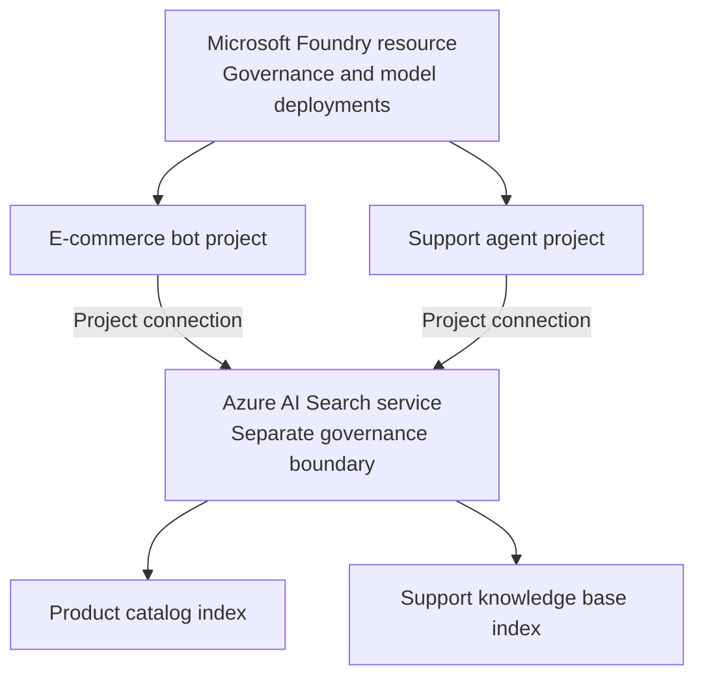

## Plan Azure AI Search connections

When multiple AI applications require search, decide whether they can use one Azure AI Search service or need separate services. Consider data isolation, regional requirements, query and indexing capacity, network boundaries, and cost allocation. Sharing a service can reduce duplicated administration, but it also creates a shared capacity and governance boundary. Also decide whether to expose the Search connection from the parent Foundry resource for reuse or create a connection for a specific project.

A connection associates an external Azure AI Search service with a Foundry resource or project. Projects can reuse connections available from the parent resource, and they can have project-specific connections. In either case, the search service remains an independent Azure resource, so its network settings and role assignments must permit access from the workload identity.

## Create a project connection

Before you create a connection, provision an Azure AI Search service that meets your region, capacity, and network requirements. In the current Foundry portal, open the project, and then select **Manage** > **Project details** > **Connected resources**. Select **Add connection**, select **Azure AI Search**, browse for the search service, select an authentication method, and add the connection.

For the documented Foundry agents Azure AI Search tool workflow with keyless authentication, assign the project managed identity the **Search Index Data Contributor** and **Search Service Contributor** roles on the search service before you use the connection. Creating or saving the connection doesn't assign these roles automatically. Other consumers of the connection might require different data-plane roles, so verify the requirements for the workload that accesses Search.

After you add the connection, confirm that it appears on the project's **Connected resources** tab. Test access from the workload that uses the connection. If another project needs the same search service, verify whether a suitable parent-resource connection is already available or create a project connection. Authorize the identity used by that project because connection reuse doesn't grant access to the external service.

## Organizing indexes for multi-project access

When projects share a search service, establish index naming and ownership conventions. For example, use separate indexes for customer support, product catalog, and employee directory data. Include version suffixes when you need to test schema changes before switching application traffic.

Separate indexes organize data but don't, by themselves, prevent an authorized identity from accessing another index. Assign least-privilege roles and design application authorization for the required boundary.

For solutions that can't use built-in document-level access control, use security filters when callers should retrieve different subsets of documents from the same index. Define a field such as `group_ids` as `Collection(Edm.String)`, set it as filterable and not retrievable, and store authorized Microsoft Entra user or group object IDs as an array:

```json
"group_ids": ["group_id1", "group_id2"]
```

At query time, filter the results by the identities associated with the authenticated caller. For example, `group_ids/any(g: search.in(g, 'group_id1, group_id2'))` returns documents assigned to either group. The application must derive these values from a trusted identity context and escape them correctly. Azure AI Search treats the identifiers as strings in a filter; the filter doesn't authenticate the caller or validate group membership.

## Capacity planning and performance optimization

Monitor query volume, latency, throttled requests, storage, and indexing load to right-size a shared search service. Add replicas to support query load and availability, and add partitions to support storage and indexing requirements. Available scaling options depend on the service tier.

Load-test representative query and indexing workloads before production. Because projects that share a service also share its capacity, coordinate scaling and change management across application owners.

With capacity monitored, optimize each index for its query patterns. Configure a suggester on suitable string fields when an application needs suggestions or autocomplete. Configure semantic ranking when the service tier, region, index schema, and query type support it. Use synonym maps where equivalent domain terms should increase recall. These settings affect every application that queries the index, so test relevance and latency before deployment.

:::image type="content" source="../media/capacity-monitor-optimize-query-performance.png" alt-text="Diagram showing capacity monitored to optimize query performance through index-specific tuning.":::

## Connection troubleshooting and monitoring

When a project reports an access error, verify that the connection points to the intended search service and that the workload identity has the roles required by its operation. For the Foundry agents Azure AI Search tool with keyless authentication, confirm the **Search Index Data Contributor** and **Search Service Contributor** assignments on the project managed identity.

For network errors, verify the Foundry and search service network configurations, private endpoints, and DNS resolution. Both resources have independent network boundaries.

Enable supported diagnostic settings on the Foundry resource and Azure AI Search. Send logs and metrics to your organization's monitoring destination so operations teams can investigate authentication, connectivity, and performance issues.



The diagram shows one valid design in which two projects under one Foundry resource have project connections to the same Azure AI Search service. The search service remains a separate governance boundary and contains application-specific indexes.

## Additional resources

- [Connect an Azure AI Search index to Foundry agents](/azure/foundry/agents/how-to/tools/ai-search)
- [Azure AI Search security and access control](/azure/search/search-security-overview)
- [Security trimming in Azure AI Search](/azure/search/search-security-trimming-for-azure-search)
- [Monitor Azure AI Search performance](/azure/search/search-performance-analysis)

Next, apply these architecture and connection decisions in the hands-on exercise.
