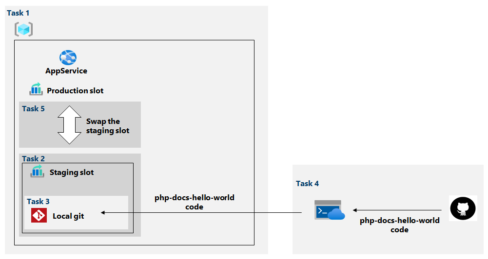

Now it's your opportunity to explore web app services in Azure.

## Prerequisites

This exercise requires an Azure account with an active subscription. If you don't already have one, you can sign up for a [free trial](https://azure.com/free). 

## Lab scenario

You have been asked to evaluate the use of Azure Web apps for your organization's web sites. These web sites are currently hosted in on-premises data centers. The web sites are running on Windows servers using the PHP runtime stack. You want to use Azure web apps deployment slots for keeping the content up to date. 

You have created a basic architecture and identified the tasks. You will be deploying a Hello World PHP program and testing production and staging slots. 



+ Task 1: Create an Azure web app
+ Task 2: Create a staging deployment slot
+ Task 3: Configure web app deployment settings
+ Task 4: Deploy code to the staging deployment slot
+ Task 5: Swap the deployment slots and test. 

## Task 1: Create an Azure web app

1. Sign into the Azure portal. 

1. In the Azure portal, search for and select **App services**.

1. On the **App Services** blade, click **+ Create**.

1. On the **Basics** tab of the **Create Web App** blade, specify the following settings (do not change the other values):

    | Setting | Value |
    | --- | ---|
    | Subscription | use the subscription provided |
    | Resource group | use the drop-down and select the existing resource group |
    | Name | any globally unique name |
    | Publish | **Code** |
    | Runtime stack | **PHP 7.4** |
    | Operating system | **Windows** |
    | Region | use the provided region |
    | App service plan | select a plan that supports [staging slots](/azure/azure-resource-manager/management/azure-subscription-service-limits#app-service-limits) |

1. Click **Review + create**. 

1. On the **Review + create** tab, click **Create**.

   > [!NOTE]
   > Wait until the web app is created before you proceed to the next task. This should  only take about a minute.

1. Click **Go to resource**.

## Task 2: Create a staging deployment slot

In this task, you will create a staging deployment slot.

1. On the blade of the newly deployed web app, click the **URL** link to display the default web page in a new browser tab. Notice that your app is waiting for content. 

1. Close the new browser tab and, back in the Azure portal, in the **Deployment** section of the web app blade, click **Deployment slots**.

   > [!NOTE]
   > The web app, at this point, has a single deployment slot labeled **PRODUCTION**.

1. Click **+ Add slot**, and add a new slot with the following settings:

    | Setting | Value |
    | --- | ---|
    | Name | **staging** |
    | Clone settings from | **Do not clone settings**|

   > [!NOTE]
   >  Once you click **Add** it can take a minute for the slot to be deployed. **Close** when the slot is created. 
	
1. Back on the **Deployment slots** blade of the web app, click the entry representing the newly created staging slot.

   > [!NOTE]
   > This will open the blade displaying the properties of the staging slot.

1. Review the staging slot blade and note that its URL differs from the one assigned to the production slot. This URL page is also waiting for content. 

## Task 3: Configure web app deployment settings

In this task, you will configure web app deployment settings.

1. On the staging deployment slot blade, in the **Deployment** section, click **Deployment Center** and then select the **Settings** tab.

   > [!NOTE]
   > Make sure you are on the staging slot blade (rather than the production slot).
    
1. On the **Settings** tab, in the **Source** drop-down list, select **Local Git** and click the **Save** button

1. On the **Deployment Center** blade, copy the **Git Clone Url** entry to Notepad.

   > [!NOTE]
   > You will need the Git Clone Url value in the next task of this lab.

1. On the **Deployment Center** blade, select the **Local Git/FTPS credentials** tab, in the **User Scope** section, specify the following settings, and click **Save**.

    | Setting | Value |
    | --- | ---|
    | User name | any globally unique name (must not contain `@` character) |
    | Password | any password that satisfies complexity requirements |

   > [!NOTE]
   > Don't forget to **Save** your information. 

1. Click **Manage publish profile** and then **Download publish profile**.

1. Open the profile file. You will need the information is this file for the next task.  

## Task 4: Deploy code to the staging deployment slot

In this task, you will deploy code to the staging deployment slot.

1. In the Azure portal, open the **Azure Cloud Shell** by clicking on the icon in the top right of the Azure portal.

1. In the drop-down select **PowerShell**. If prompted **Confirm** your choice. 

1. From the Cloud Shell pane, run the following to clone the remote repository containing the code for the web app. Always *paste as text*. 

   ```powershell
   git clone https://github.com/Azure-Samples/php-docs-hello-world
   ```

1. From the Cloud Shell pane, run the following to set the current location to the newly created clone of the local repository containing the sample web app code.

   ```powershell
   Set-Location -Path $HOME/php-docs-hello-world/
   ```

1. From the Cloud Shell pane, run the following to add the remote git (make sure to replace the `[deployment_user_name]` and `[git_clone_url]` placeholders with the value of the **Deployment Credentials** user name and **Git Clone Url**, respectively, which you identified in previous task):

   ```powershell
   git remote add [deployment_user_name] [git_clone_url]
   ```

   > [!NOTE]
   > The [deployment_user_name] value must be unique

1. From the Cloud Shell pane, run the following to push the sample web app code from the local repository to the Azure web app staging deployment slot (make sure to replace the `[deployment_user_name]` placeholder with the value of the **Deployment Credentials** user name, which you identified in previous task):

   ```powershell
   git push [deployment_user_name] master
   ```

1. The authentication information is available in the Profile file. 

	Username: <Use the **userName** value.>

	Password: <Use the **userPWD** value.>

1. Ensure all of your commands completes successfully without error.

1. Close the Cloud Shell pane.

1. On the staging slot blade, click **Overview** and then click the **URL** link to display the default web page in a new browser tab.

1. Verify that the browser page displays the **Hello World!** message and close the new tab.

## Task 5: Swap the deployment slots and test.

In this task, you will swap the staging slot with the production slot

1. Navigate back to the blade displaying the production slot of the web app.

1. In the **Deployment** section, click **Deployment slots** and then, click **Swap** toolbar icon.

1. On the **Swap** blade, review the default settings and click **Swap**.

1. Click **Overview** on the production slot blade of the web app and then click the **URL** link to display the web site home page in a new browser tab.

1. Verify the default web page has been replaced with the **Hello World!** page.

> [!TIP]
> If you used your own Azure subscription, and you have finished exploring, you can delete the resource group that you created in this exercise.
