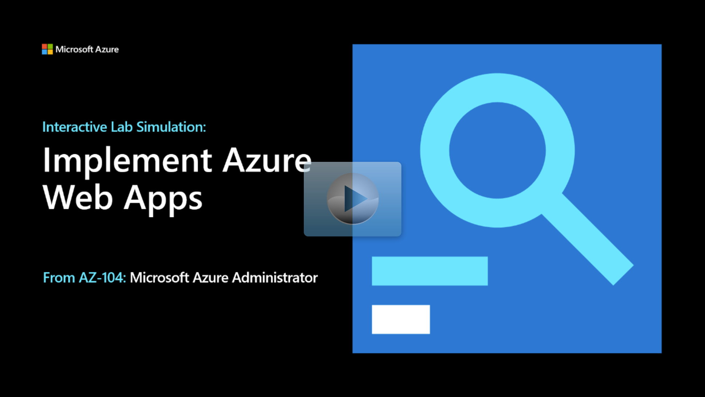

## Lab scenario

Your organization is migrating on-premises web apps to Azure. As the Azure Administrator you need to:
+ Host web sites running on Windows servers by using the PHP runtime stack. 
+ Use Azure Web Apps deployment slots.

## Architecture diagram

:::image type="content" source="../media/lab-09a.png" alt-text="Architecture diagram as explained in the text." border="false":::

## Objectives

+ **Task 1**: Create an Azure web app.
+ **Task 2**: Create a staging deployment slot.
+ **Task 3**: Configure Web App deployment settings.
+ **Task 4**: Deploy code to the staging deployment slot.
+ **Task 5**: Swap the staging slots.
+ **Task 6**: Configure and test autoscaling of your Azure web app.

> [!NOTE]
> Select the thumbnail image to start the lab simulation. When you're done, be sure to return to this page so you can continue learning. 

> [!NOTE]
>You may find slight differences between the interactive simulation and the hosted lab, but the core concepts and ideas being demonstrated are the same.

