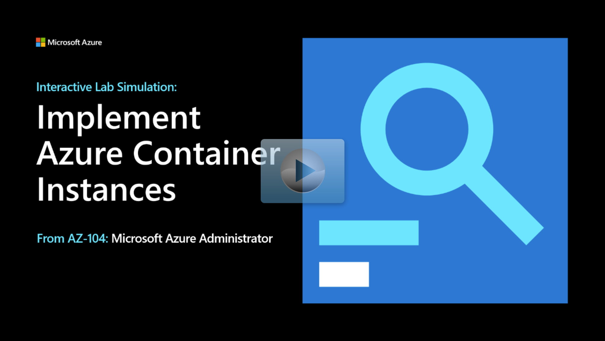

## Lab scenario

Your organization needs a new platform for its virtualized workloads. As the Azure Administrator you need to:
+ Evaluate Azure Container Instances.
+ Identify and test your app container by using Docker images. 

## Architecture diagram

:::image type="content" source="../media/lab-09b.png" alt-text="Architecture diagram as explained in the text." border="false":::

## Objectives

+ **Task 1**: Deploy an Azure Container Instances using a Docker image.
    + Create a new container instance by using a [Linux image](https://github.com/Azure-Samples/aci-helloworld). 
    + Configure a valid globally unique DNS host name. This host name is used to test the container.
+ **Task 2**: Review the functionality of Azure Container Instances.
    + Confirm the container instance is running.
    + Verify that the Welcome to Azure Container Instances page is displayed.

> [!NOTE]
> Select the thumbnail image to start the lab simulation. When you're done, be sure to return to this page so you can continue learning. 

