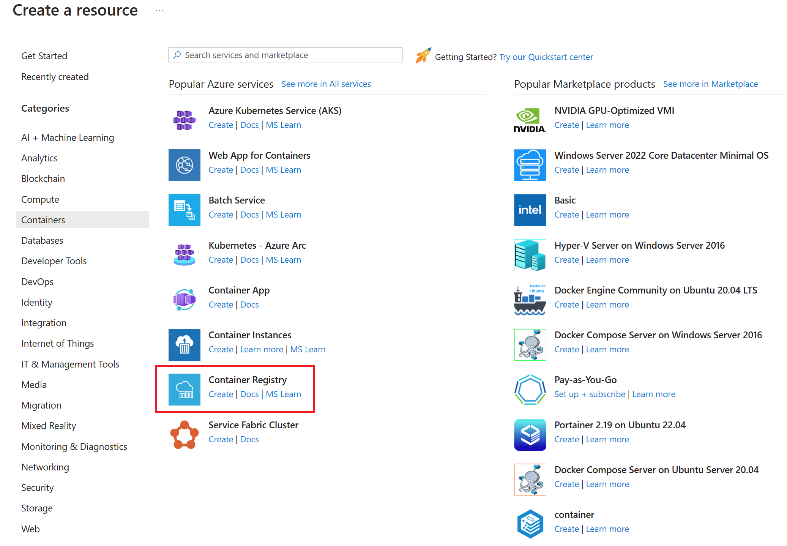
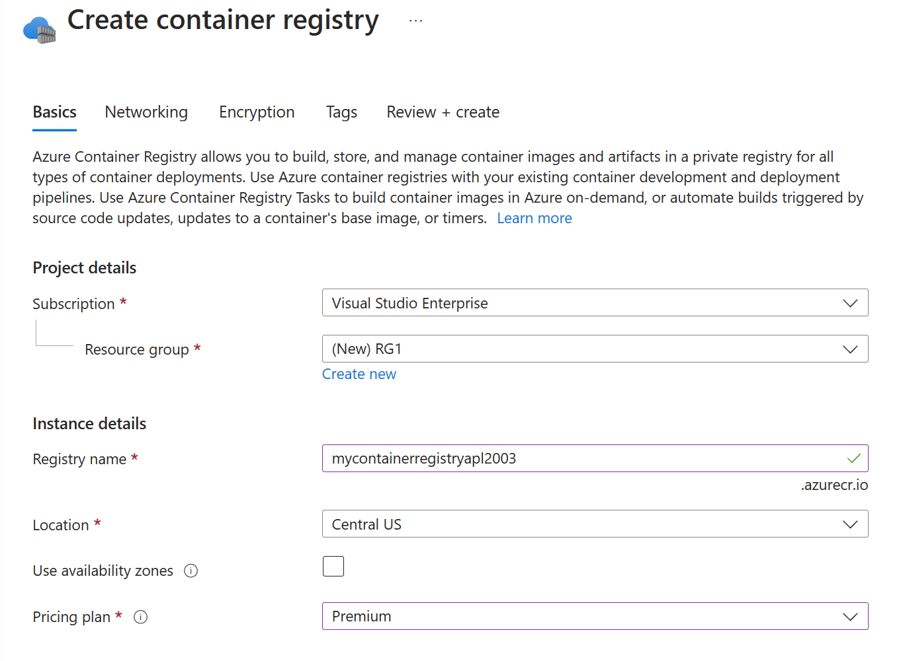
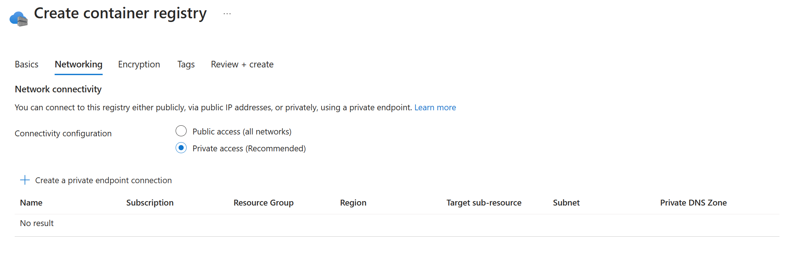
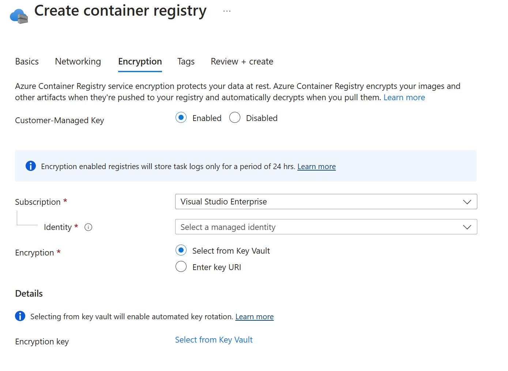
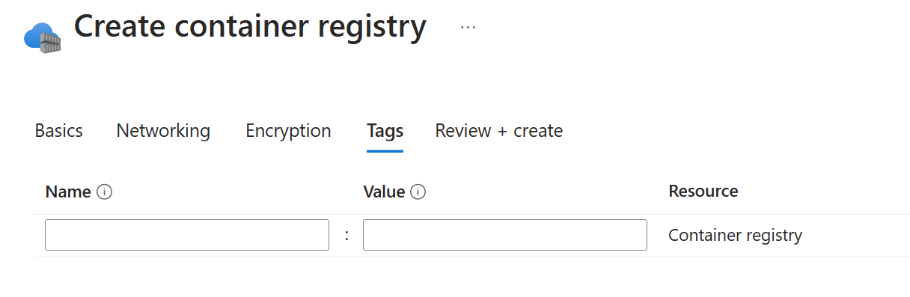
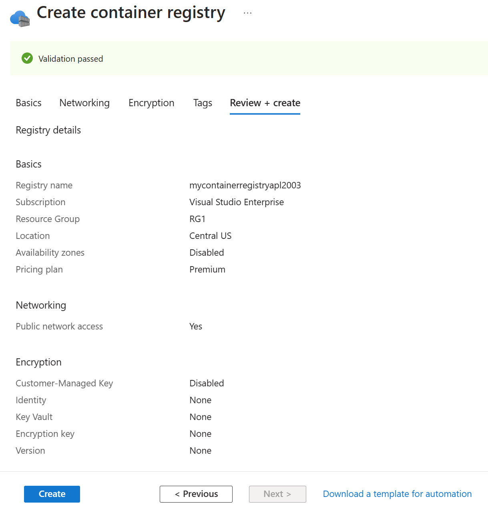

Azure Container Registry is a private registry service for building, storing, and managing container images and related artifacts.

## Create a container registry in the portal

The Azure portal provides an easy to use graphical UI alternative to command-line tools where you can manage all of your Azure resources in one unified hub. The portal interface provides a tactile experience that can be useful when creating an Azure resource for the first time.

Container Registry can be found in the Azure Marketplace under **Containers**, or by entering **container registry** in the search text box. Select **Container Registry** to start the create process.

The create container registry process begins with a **Basics** tab, which provides a list of required fields.

The **Project details** section is used to specify the Azure Subscription and Resource group for the project. A new Resource group can be created if one hasn't already been created for your project.

The **Instance details** section is used to specify the fields specific to the registry instance being created. **Registry name**, **Location**, **Use availability zones**, and **Pricing plan** are configured to meet project requirements.

- The Registry name must be unique within Azure, and contain 5-50 alphanumeric characters. No special characters are allowed (including "-", "_", and ".").
- The Location specified should match the location/region specified for other resources in your solution, such as virtual networks and other container resources.
- The availability zones option is a high-availability offering that provides resiliency and high availability to a container registry in a specific region.
- The Pricing plan can be used to select the performance level and capabilities required. The Basic, Standard, and Premium tiers all provide the same programmatic capabilities. They also all benefit from image storage managed entirely by Azure. Choosing a higher-level tier provides more performance and scale. You can get started with Basic, then convert to Standard and Premium as your registry usage increases. Premium registries provide the highest amount of included storage and concurrent operations, enabling high-volume scenarios. In addition to higher image throughput, Premium also adds features such as:

    - Geo-replication for managing a single registry across multiple regions.
    - Content trust for image tag signing.
    - Private link with private endpoints to restrict access to the registry.

The **Networking** tab provides access to networking options.

Selecting **Private access** provides the option to create a private endpoint connection that uses a Virtual network and subnets.

The **Encryption** tab provides access to encryption options.

Selecting the **Enabled** option for Customer-Managed Key exposes the options to specify **Identity** and **Encryption** settings.

The **Tags** tab provides access to Name:Value pair settings for the registry.

The **Review + create** tab validates the specified configuration and provides the chance to review settings before creating the service instance.

Once the configuration passes a validation test, the **Create** button can be used to create the container registry instance.

## Create a container registry using Azure CLI commands

Azure CLI can also be used to create a resource group and container registry as follows:

- Resource group: `az group create --name RG1 --location centralus`
- Container Registry: `az acr create --resource-group RG1 --name mycontainerregistryapl2003 --sku Premium`

If no Location is specified in the CLI command, the resource group location is assigned to the container registry.
