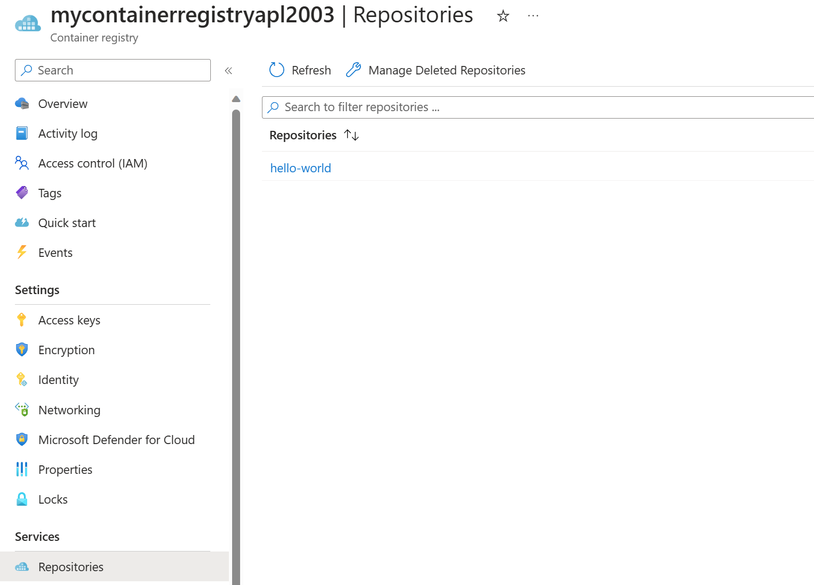

An Azure container registry stores and manages private container images and other artifacts, similar to the way Docker Hub stores public Docker container images. You can use the Docker command-line interface (Docker CLI) for login, push, pull, and other container image operations on your container registry.

Before you begin managing images in a container registry, configure the following resources:

- Azure container registry: Create a container registry in your Azure subscription. For example, use the Azure portal, the Azure CLI, or Azure PowerShell.
- Azure CLI: You should have Azure CLI installed locally. Azure CLI can simplify repetitive tasks.
- Docker CLI: You should have Docker Desktop installed locally. Docker Desktop enables you to create and push images based on a code repository. Docker provides packages that easily configure Docker on any macOS, Windows, or Linux system.

## Log in to registry using Azure CLI

You must log in to the registry before pushing and pulling container images. Log in can be accomplished using an Azure CLI command.

The Azure CLI is available to install in Windows, macOS and Linux environments. It can also be run in a Docker container and Azure Cloud Shell. The current version of the Azure CLI is 2.53.0. To find your installed version and see if you need to update, run the `az version` command.

Log in to Azure using the `az login` command. Use the Azure subscription associated with your container project.

Log in to the registry using the `az acr login` command. Specify only the registry resource name when logging in with the Azure CLI. Don't use the fully qualified login server name. For example, use the following command to log in to a registry named **mycontainerregistryapl2003**.

```azurecli
az acr login --name mycontainerregistryapl2003
```

The command returns a 'Login Succeeded' message once completed.

## Push image to registry

To push an image to an Azure Container registry, you must first have an image. If you don't have any local container images, use a `docker pull` command to pull an existing public image.

The following example pulls the hello-world image from a public Microsoft Container Registry to your local computer:

```dockercli
docker pull mcr.microsoft.com/hello-world
```

Before you can push an image to your registry, you must tag it with the fully qualified name of your registry login server. The login server name is in the format `<registry-name>.azurecr.io` (must be all lowercase), for example, `mycontainerregistryapl2003.azurecr.io`.

You can tag the image using the `docker tag` command as follows:

```dockercli
docker tag mcr.microsoft.com/hello-world mycontainerregistryapl2003.azurecr.io/hello-world:v1
```

This example creates tag target image (`mycontainerregistryapl2003.azurecr.io/hello-world:v1`) that refers to the source image (`mcr.microsoft.com/hello-world`).

Finally, use the docker `push` command to push the local image to the registry instance. The following example creates the `hello-world` repository, containing the `hello-world:v1` image.

```dockercli
docker push mycontainerregistryapl2003.azurecr.io/hello-world:v1
```

After pushing the image to your container registry, remove the `hello-world:v1` image from your local Docker environment. The `docker rmi` command doesn't remove the image from the hello-world repository in your Azure container registry.

```dockercli
docker rmi mycontainerregistryapl2003.azurecr.io/hello-world:v1
```

In the Azure portal, to view the pushed image, open your container registry, and then select **Repositories**.



## Pull and remove registry image

Use the `docker pull` command to pull the image from your registry to the local computer:

```dockercli
docker pull mycontainerregistryapl2003.azurecr.io/hello-world:v1
```

To remove images from your Azure container registry, you can use the Azure CLI command `az acr repository delete`. For example, the following command deletes the manifest referenced by the `hello-world:v1` tag, any unique layer data, and all other tags referencing the manifest.

```azurecli
az acr repository delete --name mycontainerregistryapl2003 --image hello-world:v1
```
