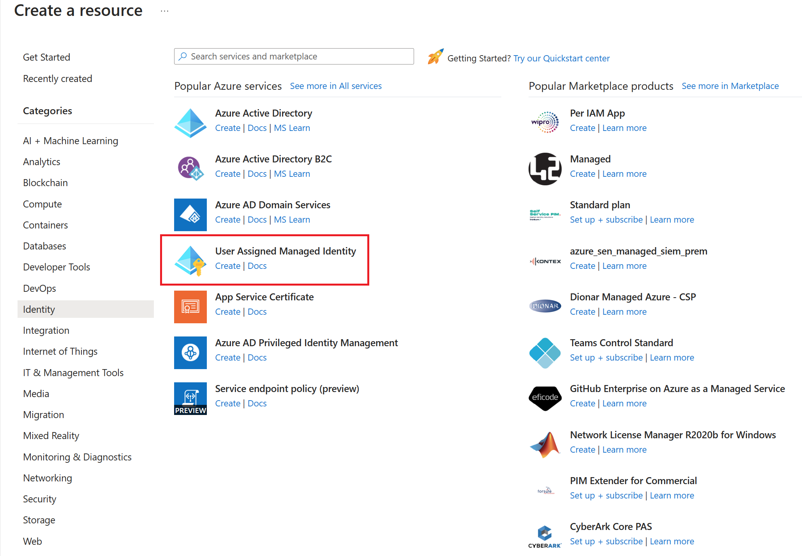
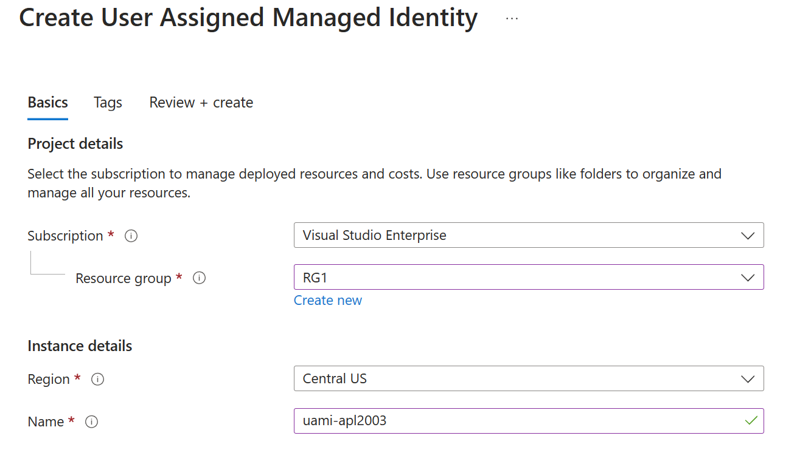

There are several ways to authenticate with container registry instances, each of which is applicable to one or more usage scenarios.

Recommended ways include:

- Authenticate directly using an individual login.
- Authenticate using a service principal.
- Authenticate using a managed identity.

## Why use a managed identity with container registry?

Managed identities for Azure resources can be used to authenticate to an Azure container registry from another Azure resource, without needing to provide or manage registry credentials. For example, set up a user-assigned or system-assigned managed identity on a Linux VM to access container images from your container registry, as easily as you use a public registry. Or, set up an Azure Kubernetes Service cluster to use its managed identity to pull container images from Azure Container Registry for pod deployments.

There are two types of managed identities: system-assigned and user-assigned. System-assigned managed identities have their lifecycle tied to the resource that created them. User-assigned managed identities can be used on multiple resources.

You can create a user-assigned managed identity and assign it to one or more Azure Resources. When you enable a user-assigned managed identity:

- A service principal of a special type is created in Microsoft Entra ID for the identity. The service principal is managed separately from the resources that use it.
- Multiple resources are able to use the managed identity.
- You authorize the managed identity to have access to one or more services.

## Create a user-assigned managed identity

You can create a user-assigned managed identity using the Azure portal, Azure CLI, PowerShell, Resource Manager, or REST.

> [!NOTE]
> To create a user-assigned managed identity, your account needs the **Managed Identity Contributor** role assignment (or a role with elevated authority, such as **Owner**).

To create a user-assigned managed identity with Azure CLI, use the `az identity create` command. The `-g` parameter specifies the resource group for the user-assigned managed identity. The `-n` parameter specifies the name of the user-assigned managed identity. For example, the following command creates a user-assigned managed identity named **uami-apl2003** in a resource group named **RG1**:

```azurecli
az identity create -g RG1 -n uami-apl2003
```

> [!IMPORTANT]
> When you create user-assigned managed identities, only alphanumeric characters (0-9, a-z, and A-Z) and the hyphen (-) are supported. For the assignment to a virtual machine or virtual machine scale set to work properly, the name is limited to 24 characters.

To create a user-assigned managed identity in the Azure portal, select **Create a resource**, and then either find the service listed under the **Identity** category or search for **user assigned managed identity**.



On the **Create User Assigned Managed Identity** page, specify values for the **Subscription**, **Resource group**, **Region**, and **Name**.


