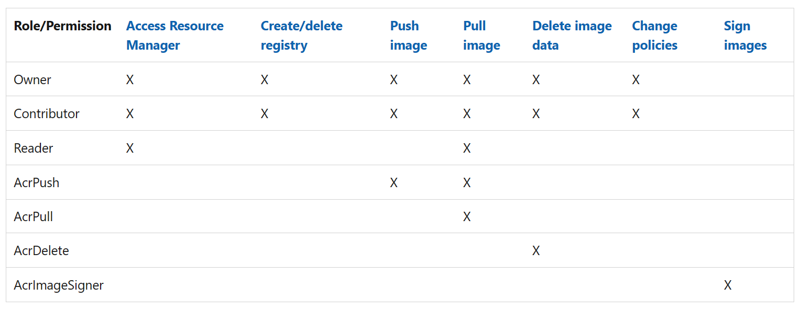

Azure role-based access control (Azure RBAC) is the authorization system you use to manage access to Azure resources.

The Azure Container Registry service supports a set of built-in Azure roles that provide different levels of permissions to an Azure container registry. Azure role-based access control is used to assign specific permissions to users, service principals, or other identities that need to interact with a registry. For example, you can assign a role for pushing or pulling container images.

## Role assignment process

To grant access, you assign roles to users, groups, service principals, or managed identities at a particular scope. There are five steps in this process:

1. Determine who needs access

    You first need to determine who needs access. You can assign a role to a user, group, service principal, or managed identity.

1. Select the appropriate role

    Permissions are grouped together into a role definition, typically called a role. You can select from a list of several built-in roles. If the built-in roles don't meet the specific needs of your organization, you can create your own custom roles.

1. Identify the needed scope

    Scope is the set of resources that the access applies to. In Azure, you can specify a scope at four levels: management group, subscription, resource group, and resource. Scopes are structured in a parent-child relationship. Each level of hierarchy makes the scope more specific. You can assign roles at any of these levels of scope. The level you select determines how widely the role is applied. Lower levels inherit role permissions from higher levels.

1. Check your prerequisites

    To assign roles, you must be signed in with a user account that has permission to write role assignments. For example, roles such as Owner or User Access Administrator have permission to write role assignments. Similarly, to remove a role assignment, you must have the role assignments delete permission.

1. Assign role

    Once you know the security principal, role, and scope, you can assign the role. You can assign roles using the Azure portal, Azure PowerShell, Azure CLI, Azure SDKs, or REST APIs.

## Differentiate users and services

Anytime permissions are applied, a best practice is to provide the most limited set of permissions for a person, or service, to accomplish a task.

### CI/CD solutions

When automating `docker build` commands from CI/CD solutions, you need `docker push` capabilities. For these headless service scenarios, we recommend assigning the **AcrPush** role. This role, unlike the broader **Contributor** role, prevents the account from performing other registry operations or accessing Azure Resource Manager.

### Container host nodes

Likewise, nodes running your containers need the **AcrPull** role, but shouldn't require **Reader** capabilities.

### Visual Studio Code Docker extension

For tools like the Visual Studio Code Docker extension, extra resource provider access is required to list the available Azure container registries. In this case, provide your users access to the **Reader** or **Contributor** role. These roles allow `docker pull`, `docker push`, `az acr list`, `az acr build`, and other capabilities.
