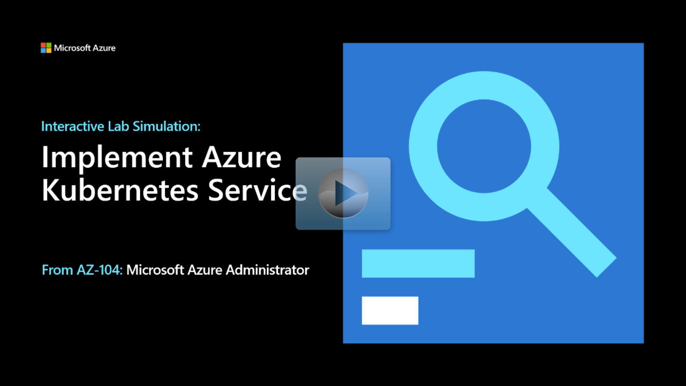

## Lab scenario

Your organization has several multi-tier applications that aren't suitable for Azure Container Instances. As the Azure Administrator you need to:
+ Evaluate using Azure Kubernetes as the container orchestrator. 
+ Test the Azure Kubernetes Service, including its deployment experience and scaling capabilities.

## Architecture diagram

:::image type="content" source="../media/lab-09c.png" alt-text="Architecture diagram as explained in the text.":::

## Objectives

+ **Task 1**: Register the Microsoft Kubernetes and Microsoft Kubernetes Configuration resource providers.
    + Identify resource providers necessary to deploy an Azure Kubernetes Services cluster.
    + Use Azure PowerShell to register the required resource providers. 
+ **Task 2**: Deploy an Azure Kubernetes Service cluster.
    + Create an Azure Kubernetes cluster using the Azure portal.
    + The cluster should have manual scaling, no virtual nodes, and container monitoring should be disabled.
+ **Task 3**: Deploy pods into the Azure Kubernetes Service cluster.
    + Verify that the cluster consists of a single pool with one node.
    + Verify connectivity to the AKS cluster and deploy the nginx image from the Docker Hub.
    + Verify that a Kubernetes pod has been created and is accessible. 
    + Confirm that a browser page displays the Welcome to nginx message.
+ **Task 4**: Scale containerized workloads in the Azure Kubernetes service cluster.
    + Scale the deployment by increasing of the number of pods.
    + Verify the outcome of scaling the deployment.

> [!NOTE]
> Click on the thumbnail image to start the lab simulation. When you're done, be sure to return to this page so you can continue learning. 

