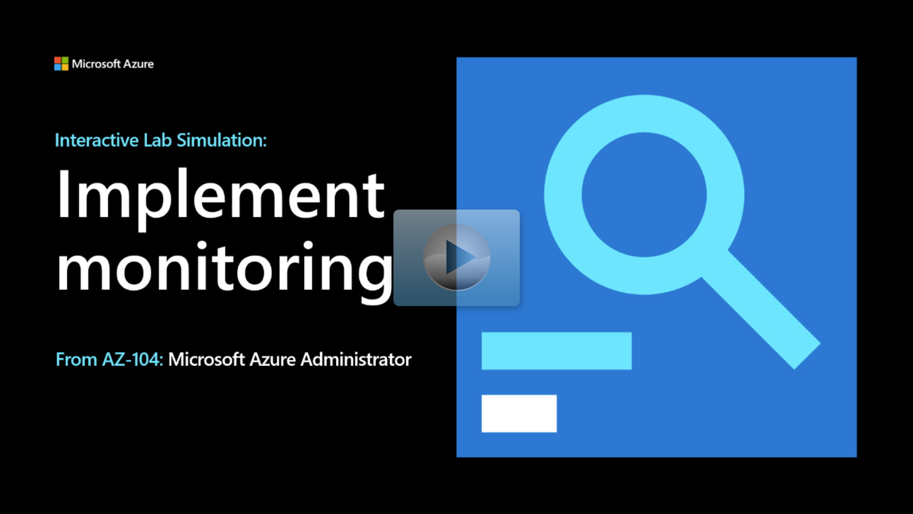

## Lab scenario

Your organization wants insight into the performance and configuration of Azure resources. As the Azure Administrator you need to:
+ Explore Azure virtual machine monitoring capabilities, including available metrics.
+ Explore alerts and notification features. 
+ Review logs by using Azure Monitor Logs (Log Analytics) queries. 

## Architecture diagram

:::image type="content" source="../media/lab-11.png" alt-text="Architecture diagram as explained in the text." border="false":::

## Objectives

+ **Task 1**: Provision the lab environment. 
    + Review an [Azure Resource Manager (ARM) template](https://github.com/MicrosoftLearning/AZ-104-MicrosoftAzureAdministrator/blob/master/Allfiles/Labs/11/az104-11-vm-template.json).
    + Use the ARM template to deploy a virtual machine to use to test monitoring scenarios.
+ **Task 2**: Register the Microsoft Insights and Microsoft Alerts Management resource providers.
    + Create a Log Analytics workspace in the same region as the virtual machines.
    + Create an Azure Automation Account and associate it with the Azure Monitor Logs (Log Analytics) workspace.
    + Enable update management.
+ **Task 3**: Create and configure an Azure Monitor Logs (Log Analytics) workspace and Azure Automation-based solutions.
    + Review Azure virtual machine monitoring options.
    + Review the list of available metrics.
+ **Task 4**: Review default monitoring settings of Azure virtual machines.
+ **Task 5**: Configure Azure virtual machine diagnostic settings.
    + Review the Azure virtual machine monitoring settings and enable guest-level monitoring.
    + Enable Azure Monitor Agent and available metrics.  
+ **Task 6**: Review Azure Monitor functionality.
    + Configure Azure Monitor metrics.
    + Create an alert rule based on average percentage CPU.
    + Configure notifications for an action group.
    + Trigger increased CPU utilization and review alert notifications. 
+ **Task 7**: Review Azure Monitor Logs (Log Analytics) functionality.
    + Create a log query to chart the virtual machine's available memory over the last hour.
    + Run the log query and preview the data.

> [!NOTE]
> Select the thumbnail image to start the lab simulation. When you're done, be sure to return to this page so you can continue learning. 

