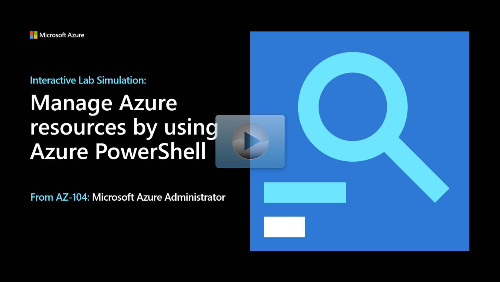

## Lab scenario

You're the Azure Administrator for your organization. You decide to automate some common administration tasks by using Azure PowerShell.

+ Create resources groups.
+ Create managed disks.
+ Change the configuration of managed disks. 

## Architecture diagram

:::image type="content" source="../media/lab-03c.png" alt-text="Architecture diagram as explained in the text.":::

## Objectives

+ **Task 1**: Start a PowerShell session in the Azure Cloud Shell
+ **Task 2**: Create a resource group and managed disk by using PowerShell. 
    + Create a resource group.
    + Create a managed disk in the resource group.
+ **Task 3**: Configure the managed disk by using Azure PowerShell.
    + Increase the size of the managed disk.
    + Change the disk performance SKU. 

> [!NOTE]
> Click on the thumbnail image to start the lab simulation. When you're done, be sure to return to this page so you can continue learning. 

