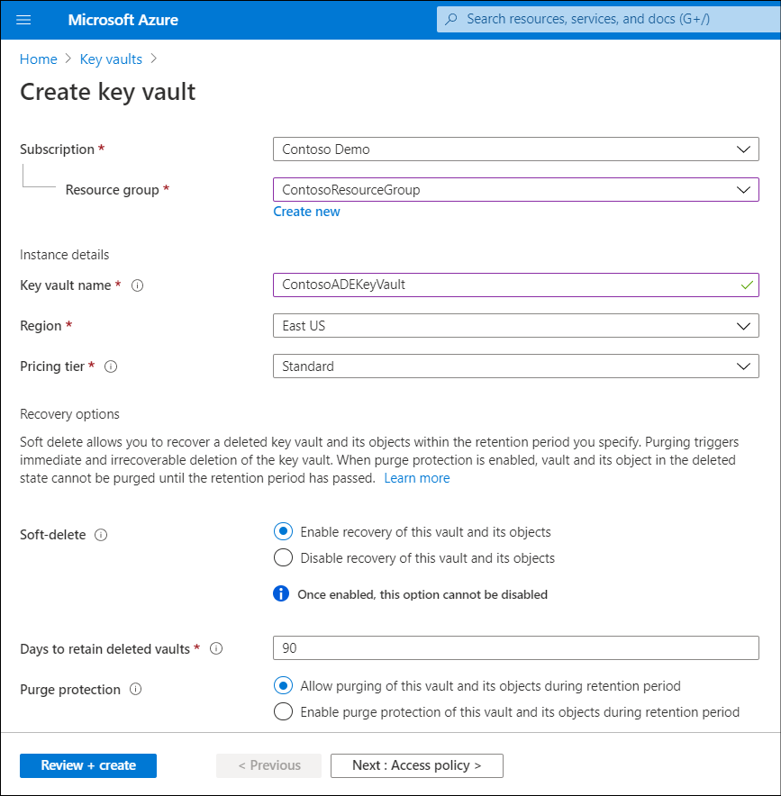
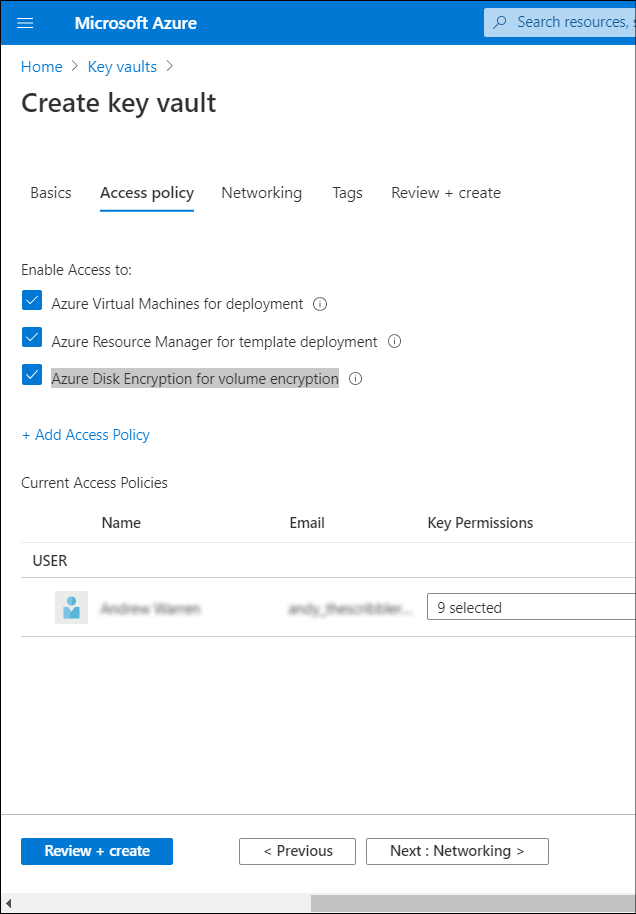

To apply encryption to a new VM using Azure Disk Encryption, Contoso needs to configure a key vault to control and manage disk encryption keys and secrets.

> [!NOTE]
> You can create a key vault as a separate task before you enable Azure Disk Encryption, or you can choose to create your key vault during the process of enabling Azure Disk Encryption.

There are three steps you must perform to configure a key vault:

1. Create a resource group. This is an optional step. You can create a resource group to host your key vault or use one which already exists. You can use the Azure portal, Azure Command-Line Interface (Azure CLI), or PowerShell to create your resource group.
2. Create a key vault. You can use the Azure portal, Azure CLI, or PowerShell to create a key vault.
3. Set the key vault advanced access policies. Azure requires access to the encryption keys or secrets in your key vault. This enables Azure to make them available to the VM for starting and decrypting the volumes.

> [!TIP]
> If you didn't enable your key vault for disk encryption at the time of creation by using the `-enabled-for-disk-encryption` parameter, you must update its advanced access policies.

## Use Azure CLI

The procedure to create and configure a key vault using Azure CLI is as follows.

1. Create a resource group.

     Perform the following steps  to create a resource group in Azure CLI:

     1. Sign in to Azure using the following command:

         ```AzureCLI
         az login
         ```

     2. Run the following command to create your resource group, changing the name and location to suit your needs:

         ```AzureCLI
         az group create --name "ContosoResourceGroup" --location eastus
         ```

2. The next step is to create a key vault. Run the following command in Azure CLI to create a key vault, changing the name, resource group name, and location to suit your needs:

     ```AzureCLI
     az keyvault create --name "ContosoADEKeyVault" --resource-group "ContosoResourceGroup" --location "eastus" --enabled-for-disk-encryption
     ```

     > [!NOTE]
     > Each key vault must have a unique name

3. Set the key vault advanced access policies.

     Run the following commands in Azure CLI to complete this process.

     1. First, enable the vault for disk encryption. This is required:

         ```azurecli
         az keyvault update --name "ContosoADEKeyVault" --resource-group "ContosoResourceGroup" --enabled-for-disk-encryption "true"
         ```

     2. Next, run the following command to enable the key vault for deployment, if needed. This option enables the Microsoft.Compute resource provider to retrieve secrets from the key vault when it's referenced in resource creation, such as when creating a VM:

         ```azurecli
         az keyvault update --name "ContosoADEKeyVault" --resource-group "ContosoResourceGroup" --enabled-for-deployment "true"
         ```

     3. Finally, you can enable the key vault for template deployment, if needed, by allowing Resource Manager to retrieve secrets from the vault. Use the following code to enable the key vault for template deployment:

         ```azurecli
         az keyvault update --name "ContosoADEKeyVault" --resource-group "ContosoResourceGroup" --enabled-for-template-deployment "true"
         ```

## Use PowerShell

You can also use PowerShell commands to create and configure the key vault.

1. Create a resource group using the following PowerShell command:

     ```PowerShell
     New-AzResourceGroup -Name "ContosoResourceGroup" -Location "EastUS"
     ```

2. Create a key vault using the following PowerShell command:

     ```PowerShell
     New-AzKeyvault -name ContosoADEKeyVault -ResourceGroupName ContosoResourceGroup -Location EastUS -EnabledForDiskEncryption
     ```

3. Set the key vault advanced access policies. Use the following PowerShell command to configure the key vault access policy:

     ```PowerShell
     Set-AzKeyVaultAccessPolicy -VaultName 'ContosoADEKVault' -ResourceGroupName 'ContosoResourceGroup' -enabled-for-disk-encryption -EnabledForDeployment -EnabledForTemplateDeployment
     ```

> [!IMPORTANT]
> Remember to change the key vault name and resource group name in these preceding commands to match your specific environment.

## Use the portal

A final option is to use the Azure portal to create a key vault. This enables you to combine all three steps outlined in the preceding sections.

To create and configure a key vault using the portal, use the following procedure:

1. In the Azure portal, in the search box, enter **Key vaults**, and then from the **Services** list, select **Key vaults**.
2. On the **Key vaults** blade, select **Create key vault**.
3. Select the appropriate **Subscription**, **Resource group**, **Region**, and **Pricing tier**.

      

4. Select **Next : Access policy >**.
5. In the **Enable Access to** section, on the **Access policy** tab, select the appropriate check boxes to configure the key vault advanced access policies:

     - Azure VMs for deployment
     - Azure Resource Manager for template deployment
     - Azure Disk Encryption for volume encryption

6. Select **Review + create**, and then select **Create**.

     
