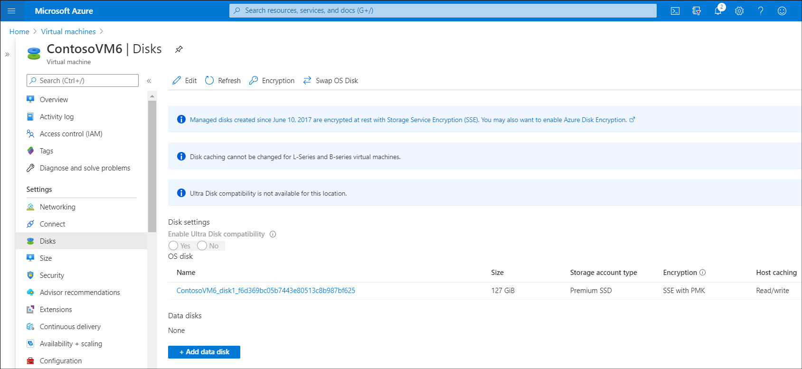
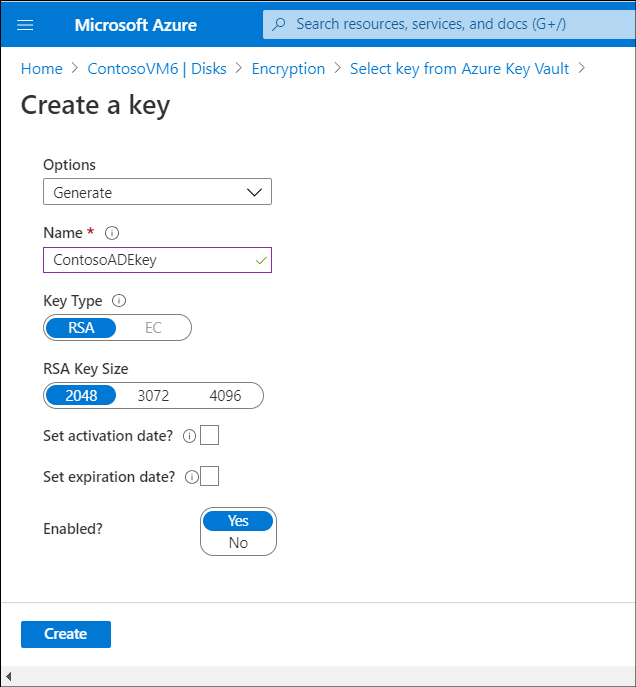
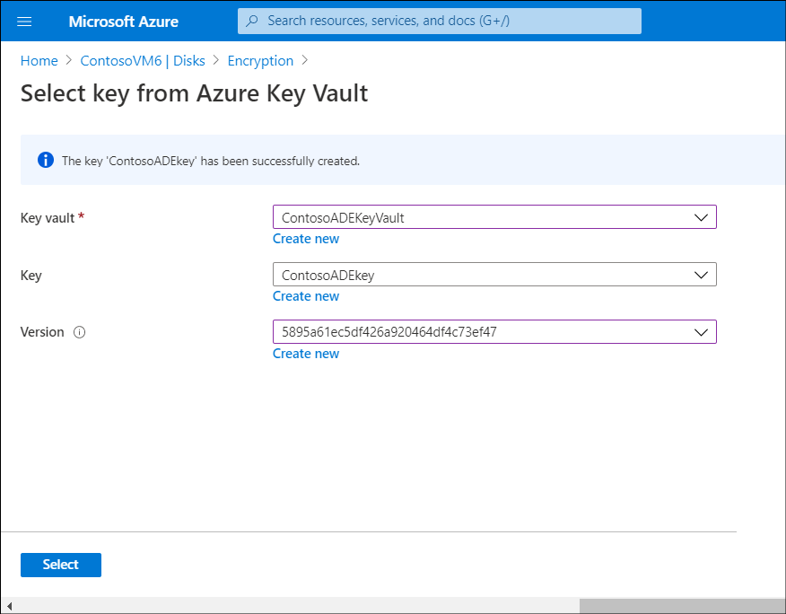
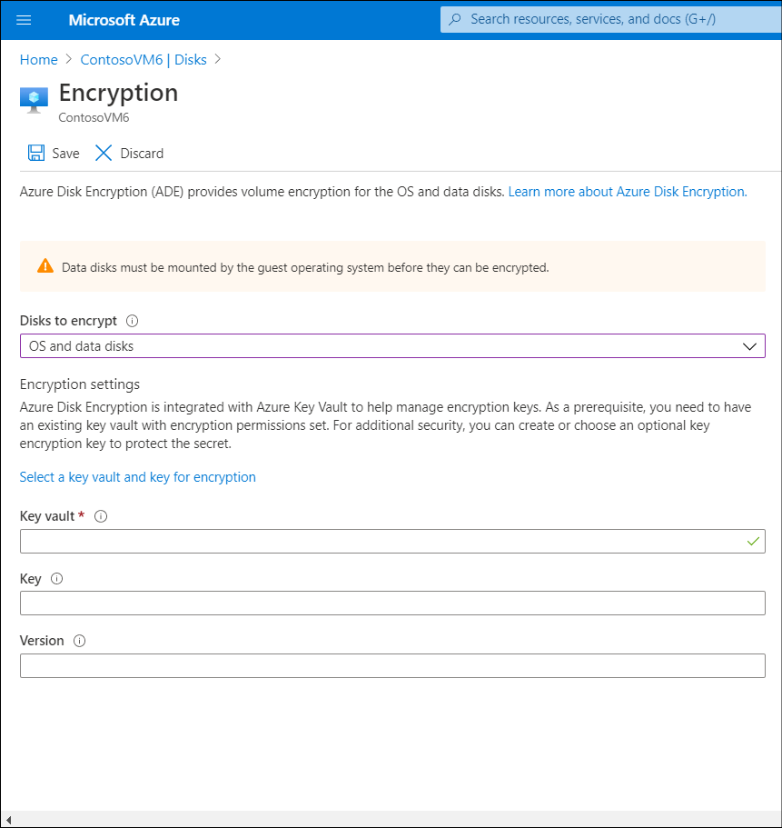

After you've created a key vault for Contoso, you can encrypt their VMs. You can do this using the Azure portal, Azure CLI, or PowerShell.

## Use the Azure portal to encrypt Azure VM hard disks

To use the portal to encrypt the disks attached to an Azure VM, perform the following steps:

1. In the Azure portal, navigate to your VMs, and then select the appropriate VM.
2. On the **Virtual machine** blade, in the navigation pane, in the **Settings** section, select **Disks**.
3. On the **Disks** blade, select **Encryption**.

    

4. On the **Encryption** blade, in the **Disks to encrypt** list, select from the available disks. For example, select **operating system and data disks**.
5. Select the **Select a key vault and key for encryption** link.
6. On the **Select key from Azure Key Vault** blade, select the appropriate **Key vault** (or create a new one). Select the appropriate **Key** (or create a new one).
7. To create a key, in the **Key** section, select **Create new**.
8. On the **Create a key** blade, in **Options**, you can select from **Generate**, **Import**, or **Restore backup**. If you're creating a new key, select **Generate**.
9. Enter a **Name** for the key, specify the **Key Type** and **RSA Key Size**, and then select **Create**.

    

10. On the **Select key from Azure Key Vault** blade, select a version from the **Version** drop-down list (or create a new version), and then select **Select**.

    

11. On the **Encryption** blade, select **Save**.

    

12. In the **Enabling Azure Disk Encryption will cause the VM to reboot** message, select **Yes**.

## Use the command line to encrypt Azure VM hard disks

You can also use both Azure CLI or PowerShell to encrypt a VM.

### Use Azure CLI to encrypt a VM

Use the following Azure CLI command to encrypt a running VM. Remember to change the resource group, VM name, and key vault name to match your environment:

```AzureCLI
az vm encryption enable -g ContosoResourceGroup --name ContosoVM1 --disk-encryption-keyvault ContosoADEKeyVault
```

### Use PowerShell to encrypt a VM

Use the following PowerShell command to encrypt a running VM. Again, change the resource group, VM name, and key vault name to match your environment:

```PowerShell
$KeyVault = Get-AzKeyVault -VaultName ContosoADEKeyVault -ResourceGroupName ContosoResourceGroup

Set-AzVMDiskEncryptionExtension -ResourceGroupName MyResourceGroup -VMName ContosoVM1 -DiskEncryptionKeyVaultUrl $KeyVault.VaultUri -DiskEncryptionKeyVaultId $KeyVault.ResourceId
```
