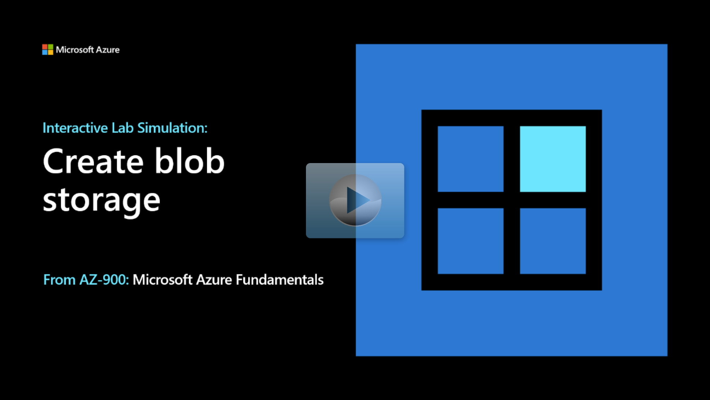

## Lab scenario

Your organization is migrating storage to Azure. As the Azure Administrator you need to:

+ Organize content into storage accounts. 
+ Upload and manage images. 
+ Monitor and troubleshoot storage accounts. 

## Objectives

+ **Task 1**: Create a storage account. 
    + Create a storage account in your region with locally redundant storage. 
    + Verify the storage account was created. 
+ **Task 2**: Work with blob storage.
    + Create a private blob container. 
    + Upload a file to the container. 
+ **Task 3**: Monitor the storage container.
    + Review common storage problems and troubleshooting guides.
    + Review insights for performance, availability, and capacity. 

> [!NOTE]
> Click on the thumbnail image to start the lab simulation. When you're done, be sure to return to this page so you can continue learning. 

