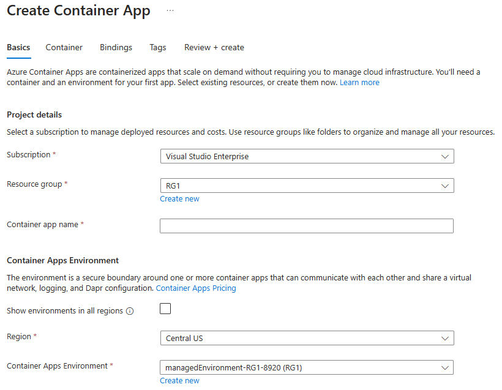
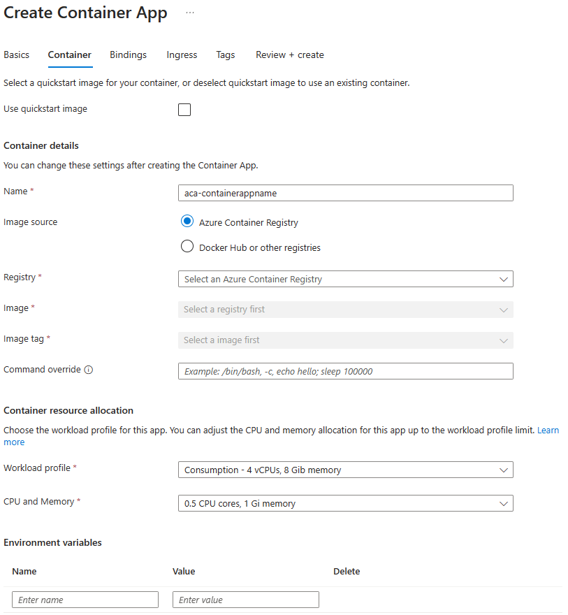

Azure Container Apps enables you to run microservices and containerized applications on a serverless platform. With Container Apps, you enjoy the benefits of running containers while leaving behind the concerns of manually configuring cloud infrastructure and complex container orchestrators.

## Create a container app instance in the Azure portal

> [!NOTE]
> To specify a container image when creating a container app instance, you need an existing registry resource. Containers can be configured after creating the container app instance. Containers can be sourced from registries such as Azure Container Registry or Docker Hub.

Container Apps can be found in the Azure Marketplace under **Containers**, or by entering **container app** in the search text box. Select **Container App** to start the create process.

The Create Container App page opens to a **Basics** tab, which provides a list of required fields.

The Project details section of the Basics tab includes the following:

- Subscription: Select your Azure subscription.
- Resource group: Select the resource group for your project.
- Container app name: Enter a name that's unique to your resource group.

The Container Apps Environment section of the Basics tab includes the following options:

- Show environments in all regions: This checkbox can be selected to include existing container environments.
- Region: The region should normally match your resource group. If you are using a virtual network, it's important for the regions to match.
- Container Apps environment: The **Create new** link to create a container apps environment for your resource.

Every container app must be part of a container app environment. An environment provides an isolated network for one or more container apps, making it possible for them to easily invoke each other.

The **Create Container Apps Environment** process opens to a Basics tab.

The **Basics** tab on the Create Container Apps Environment page, provides the following:

- Environment name: Enter a name for the environment.
- Zone redundancy: Select an option for zone redundancy.

The **Workload profiles** tab on the Create Container Apps Environment page can be used to add dedicated workload profiles. Dedicated workload profiles allow you to run your apps on customized hardware options. An environment always has a Consumption workload profile where you can run apps that can scale-to-zero and pay only for resources your apps use.

The **Monitoring** tab on the Create Container Apps Environment page provides option for specifying monitoring and logging preferences. Your Log Analytics workspace will contain all your application logs.

The **Networking** tab on the Create Container Apps Environment page provides the option of selecting your own virtual network. This allows you to connect your application to other Azure resources or on-premises systems through the same network.

The **Networking** tab provides the following options:

- Use your own virtual network: Select **Yes** to use your own virtual network.
- Virtual network: Select your virtual network from the dropdown. Only networks located in the same region as the container apps environment are listed.
- Infrastructure subnet: Select the subnet that you've prepared for your container app.

> [!NOTE]
> When using the Consumption only Architecture for Azure Container Apps, you must use a dedicated subnet with a CIDR range of /23 or larger. When using a workload profiles environment, a /27 or larger is required.

When you select **Create** on the Create Container Apps Environment page, you're returned to the Basics tab of the Create Container App page.

The **Container** tab on the Create Container App page provides the option to use a quickstart image, or to specify an image in a repository. Deselect **Use quickstart image** to specify a registry and image that you have prepared.

- The Container details section provides the option to choose a Container Registry and image.
- The Container resource allocation (Preview) section allows you to adjust the CPU and memory allocation for your app.
- The Environment variables section allows you to specify name/value pairs that are accessible as environment variables.

The **Bindings** tab can be used to connect your container app to other Azure resources. Bindings are optional but can be used to provide additional functionality.

The **Ingress** tab can be used to enable ingress for applications that need an HTTP or TCP endpoint.

The **Tags** tab can be used to specify name/value pairs that enable you to categorize resources and view consolidated billing by applying the same tag to multiple resources and resource groups. If you create tags and then change resource settings on other tabs, your tags will be automatically updated.

The **Review + create** tab performs a validation check and provides the option to review your configuration settings before you create your Container App and Container Apps Environment.

> [!NOTE]
> The deployment for a Container App can takes about 10 minutes to complete.

A page with the message Deployment is in progress is displayed. Once the deployment is successfully completed, you'll see the message: Your deployment is complete.
