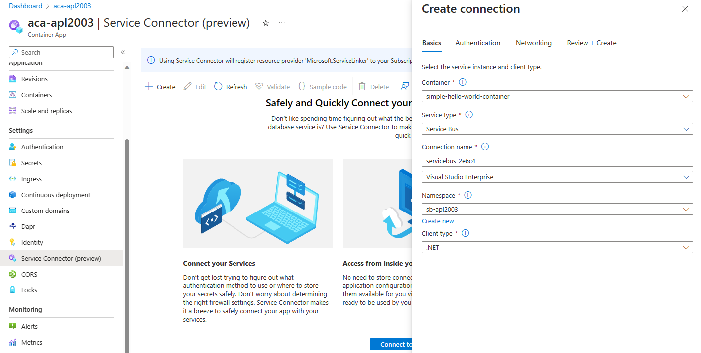
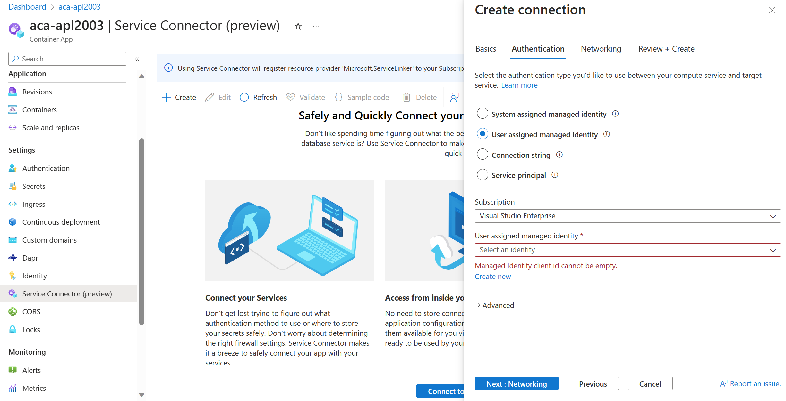

Azure Container Apps allows you to use Service Connector to connect to cloud services in just a few steps. Service Connector manages the configuration of the network settings and connection information between different services.

## Service Connector internals

Service Connector is an Azure extension resource provider designed to provide a simple way to create and manage connections between Azure services.

Service Connector offers the following features:

- Lets you connect Azure services together with a single Azure CLI command or in a few steps using the Azure portal.
- Supports an increasing number of databases, storage, real-time services, state, and secret stores that are used with your cloud native application.
- Configures network settings, authentication, and manages connection environment variables or properties for you.
- Validates connections and provides suggestions to fix faulty connections.

### Service connection overview

The concept of service connection is a key concept in the resource model of Service Connector. A service connection represents an abstraction of the link between two services. Service connections have the following properties:

| Property | Description |
|---|---|
| Source Service Type | Source services are usually Azure compute services. These are the services you can connect to target services. Source services include Azure App Service, Azure Container Apps and Azure Spring Apps. |
| Target Service Type | Target services are backing services or dependency services that your compute services connect to. Service Connector supports various target service types including major databases, storage, real-time services, state, and secret stores. |
| Client Type         | Client type refers to your compute runtime stack, development framework, or specific type of client library that accepts the specific format of the connection environment variables or properties. |
| Authentication Type | The authentication type used for the service connection. It could be a secret/connection string, a managed identity, or a service principal.    |

Source services and target services support multiple simultaneous service connections, which means that you can connect each resource to multiple resources.

Service Connector manages connections in the properties of the source instance. Creating, getting, updating, and deleting connections is done directly by opening the source service instance in the Azure portal or by using the CLI commands of the source service.

Connections can be made across subscriptions or tenants, meaning that source and target services can belong to different subscriptions or tenants. When you create a new service connection, the connection resource is created in the same region as your compute service instance by default.

## Connect to a cloud service with Service Connector in Azure Container Apps

Azure Container Apps allows you to use Service Connector to connect to cloud services in just a few steps. Service Connector manages the configuration of the network settings and connection information between different services.

You can find Service Connector on the left-side menu under Settings. Selecting **Connect to your Service** opens a Create connection page. The Basics tab enables you to configure container and service information.

The Authentication tab enables you to configure the authentication type you’d like to use between your compute service and target service. The Networking tab enables you to configure network access to a target service by updating firewall settings, network access control, using private link or Virtual Network service endpoints.

