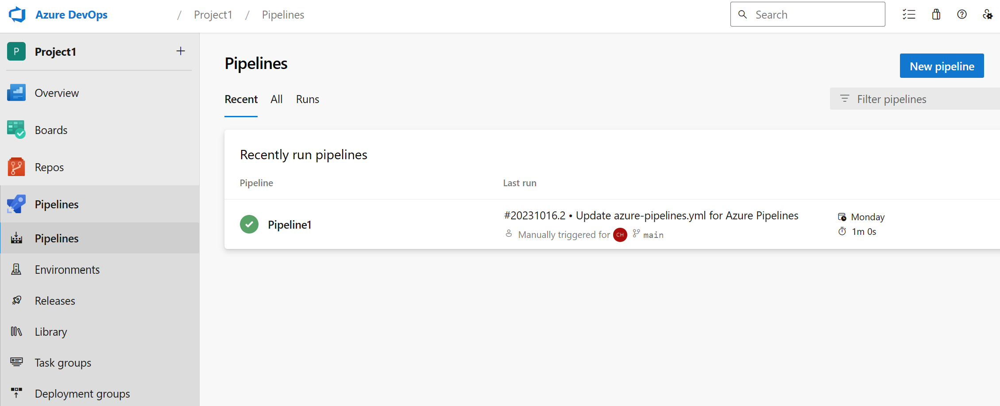

Azure DevOps supports collaboration between developers, project managers, and other contributors as they work together to develop software. It allows organizations to create and improve products at a faster pace than they can with traditional software development approaches.

## What is Azure DevOps?

Azure DevOps provides integrated features that you can access through your web browser or IDE client. You can use all the services included with Azure DevOps, or choose just what you need to complement your existing workflows.

| Standalone service | Description |
| --- | --- |
| Azure Boards | Delivers a suite of Agile tools to support planning and tracking work, code defects, and issues using Kanban and Scrum methods. |
| Azure Repos | Provides Git repositories or Team Foundation Version Control (TFVC) for source control of your code. |
| Azure Pipelines | Provides build and release services to support continuous integration and delivery of your applications. |
| Azure Test Plans | Provides several tools to test your apps, including manual/exploratory testing and continuous testing. |
| Azure Artifacts | Allows teams to share packages such as Maven, npm, NuGet, and more from public and private sources and integrate package sharing into your pipelines. |

Azure DevOps supports adding extensions and integrating with other popular services, such as: Campfire, Slack, Trello, UserVoice, and more, and developing your own custom extensions.

## Azure Pipelines

Azure Pipelines automatically builds and tests code projects. It supports all major languages and project types and combines continuous integration, continuous delivery, and continuous testing to build, test, and deliver your code to any destination.

### Continuous Integration

Continuous Integration (CI) is the practice used by development teams of automating, merging, and testing code. CI helps to catch bugs early in the development cycle, which makes them less expensive to fix. Automated tests execute as part of the CI process to ensure quality. CI systems produce artifacts and feed them to release processes to drive frequent deployments.

### Continuous Delivery

Continuous Delivery (CD) is a process by which code is built, tested, and deployed to one or more test and production environments. Deploying and testing in multiple environments increases quality. CD systems produce deployable artifacts, including infrastructure and apps. Automated release processes consume these artifacts to release new versions and fixes to existing systems. Systems that monitor and send alerts run continually to drive visibility into the entire CD process.

### Continuous Testing

Whether your app is on-premises or in the cloud, you can automate build-deploy-test workflows and choose the technologies and frameworks. Then, you can test your changes continuously in a fast, scalable, and efficient manner. Continuous testing offers the following benefits.

- Maintain quality and find problems as you develop. Continuous testing with Azure DevOps Server ensures your app still works after every check-in and build, enabling you to find problems earlier by running tests automatically with each build.

- Use any test type and any test framework. Choose your preferred test technologies and frameworks.

- View rich analytics and reporting. When your build is done, review your test results to resolve any issues. Actionable build-on-build reports let you instantly see if your builds are getting healthier. But it's not just about speed - detailed and customizable test results measure the quality of your app.

### Version control systems

Azure Pipelines requires your source code to be in a version control (or source control) system. Azure DevOps supports two types of source control: Git-based or Team Foundation Version Control (TFVC). Any changes you push to your version control repository are automatically built and validated.
