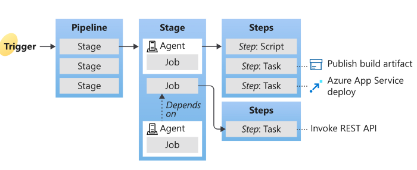

Azure Pipelines can be used to automate build, test, and deployment processes.

## Pipeline terms and parts

Understanding pipeline terms and parts can help you to work more efficiently and to create better, more reliable pipelines.

- A trigger tells a Pipeline to run.
- A pipeline is made up of one or more stages. A pipeline can deploy to one or more environments.
- A stage is a way of organizing jobs in a pipeline and each stage can have one or more jobs.
- Each job runs on one agent. A job can also be agentless, but agentless jobs are limited to a few out-of-the-box tasks.
- Each agent runs a job that contains one or more steps.
- A step can be a task or script and is the smallest building block of a pipeline.
- A task is a prepackaged script that performs an action, such as invoking a REST API or publishing a build artifact.
- An artifact is a collection of files or packages published by a run.

The following sections provide more details.

### Agent

When your build or deployment runs, the system begins one or more jobs. An agent is computing infrastructure with installed agent software that runs one job at a time. For example, your job could run on a Microsoft-hosted Ubuntu agent.

> [!IMPORTANT]
> To build your code or deploy your software using Azure Pipelines, you need at least one agent.

### Artifact

An artifact is a collection of files or packages published by a run. Artifacts are made available to subsequent tasks, such as distribution or deployment.

### Deployment

A deployment typically refers to a deployment job. A deployment job is a collection of steps that are run sequentially against an environment. You can use strategies like run once, rolling, and canary for deployment jobs.

### Deployment group

A deployment group is a set of deployment target machines that have agents installed. A deployment group is just another grouping of agents, like an agent pool. You can set the deployment targets in a pipeline for a job using a deployment group.

### Environment

An environment is a collection of resources, where you deploy your application. It can contain one or more virtual machines, containers, web apps, or any service that's used to host the application being developed. A pipeline might deploy the app to one or more environments after build is completed and tests are run.

### Job

A stage contains one or more jobs. Each job runs on an agent. A job represents an execution boundary of a set of steps. All of the steps run together on the same agent. Jobs are most useful when you want to run a series of steps in different environments. For example, you might want to build two configurations - x86 and x64. In this case, you have one stage and two jobs. One job would be for x86 and the other job would be for x64.

### Pipeline

A pipeline defines the continuous integration and deployment process for your app. It's made up of one or more stages. It can be thought of as a workflow that defines how your test, build, and deployment steps are run.

### Run

A run represents one execution of a pipeline. It collects the logs associated with running the steps and the results of running tests. During a run, Azure Pipelines processes the pipeline and then sends the run to one or more agents. Each agent runs jobs.

### Script

A script runs code as a step in your pipeline using command line, PowerShell, or Bash. You can write cross-platform scripts for macOS, Linux, and Windows. Unlike a task, a script is custom code that is specific to your pipeline.

### Stage

A stage is a logical boundary in the pipeline. It can be used to mark separation of concerns (for example, Build, QA, and production). Each stage contains one or more jobs. When you define multiple stages in a pipeline, by default, they run one after the other. You can specify the conditions for when a stage runs. When you're thinking about whether you need a stage, ask yourself:

- Do separate groups manage different parts of this pipeline? For example, you could have a test manager that manages the jobs that relate to testing and a different manager that manages jobs related to production deployment. In this case, it makes sense to have separate stages for testing and production.

- Is there a set of approvals that are connected to a specific job or set of jobs? If so, you can use stages to break your jobs into logical groups that require approvals.

- Are there jobs that need to run a long time? If part of your pipeline has an extended run time, it makes sense to divide the parts into their own stage.

### Step

A step is the smallest building block of a pipeline. For example, a pipeline might consist of build and test steps. A step can either be a script or a task. A task is prepackaged script offered as a convenience to you.

### Task

A task is the building block for defining automation in a pipeline. A task is packaged script or procedure that has been abstracted with a set of inputs.

### Trigger

A trigger is something that's set up to tell the pipeline when to run. You can configure a pipeline to run upon a push to a repository, at scheduled times, or upon the completion of another build. All of these actions are known as triggers.

## Azure Pipeline tasks

Tasks are used to perform an action in a pipeline. For example, a task can build an app, interact with Azure resources, install a tool, or run a test.

When you add a task to your pipeline, it could also add a set of demands to the pipeline. The demands define the prerequisites that must be installed on the agent for the task to run. When you run the build or deployment, an agent that meets these demands is chosen.

When you run a job, all the tasks are run in sequence, one after the other.

By default, all tasks run in the same context, whether that's on the host or in a job container.

### Built-in tasks and templates

The Azure Pipelines service provides some built-in tasks to enable fundamental build and deployment scenarios. There are built-in tasks available for various platforms, including Azure. Tasks are organized under categories such as build, deploy, and test.  

### Built-in task for Azure Container Apps

The Azure Container Apps Deploy v1 task (AzureContainerApps@1) task is an Azure DevOps Task that can be used to build and deploy Azure Container Apps.

This Azure Pipelines Task makes it easy for users to deploy their application source to an Azure Container App in their Azure Pipelines workflow. Users can choose between providing a previously built image, a Dockerfile that an image can be built from, or using a builder to create a runnable application image for the user.

The task has the following two usage patterns:

- The task pushes an image to ACR - when the task pushes a new image to ACR, the acrName and appSourcePath task inputs are required.

- The task deploys a previously pushed image - when the task deploys a previously pushed image, the imageToDeploy task input is required. If this image is found in an ACR instance that requires authentication to pull, the acrName argument, or the acrUsername and acrPassword arguments, can be provided to authenticate requests to the ACR instance.

If no Dockerfile is found or provided in the application source, this task performs the following steps:

- Uses the `Oryx++ Builder` to build the application source using `Oryx` to produce a runnable application image.

- Pushes this runnable application image to the provided Azure Container Registry.

- Creates or updates a Container App based on this image.

If a Dockerfile is found or discovered in the application source, the builder isn't used. An image is built with a call to `docker build`. The Container App is created or updated based on the image.

If a previously built image has already been pushed to the ACR instance and is provided to this task, no application source is required. The image is used when creating or updating the Container App.
