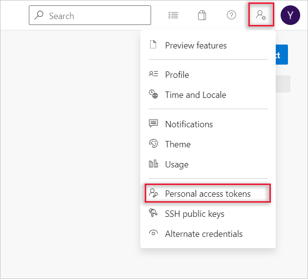
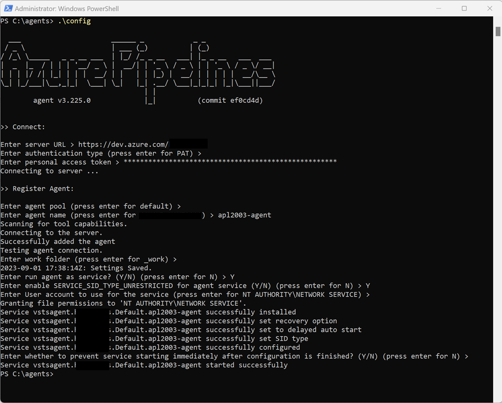

To build your code or deploy your software using Azure Pipelines, you need at least one agent. Eventually, as you add more code and more people, you need more agents.

When your pipeline runs, the system begins one or more jobs. An agent is computing infrastructure with installed agent software that runs one job at a time.

## Agent types

Azure Pipelines provides several different types of agents.

| Agent type | Description | Availability |
| --- | --- | --- |
| Microsoft-hosted agents | Agents hosted and managed by Microsoft | Azure DevOps Services |
| Self-hosted agents | Agents that you configure and manage, hosted on your VMs | Azure DevOps Services, Azure DevOps Server, TFS |
| Azure Virtual Machine Scale Set agents | A form of self-hosted agents, using Azure Virtual Machine Scale Sets, that can be autoscaled to meet demands | Azure DevOps Services |

### Microsoft-hosted agents

If your pipelines are in Azure Pipelines, then you've got a convenient option to run your jobs using a Microsoft-hosted agent. With Microsoft-hosted agents, maintenance and upgrades are taken care of for you. Each time you run a pipeline, you get a fresh virtual machine for each job in the pipeline. The virtual machine is discarded after one job (which means any change that a job makes to the virtual machine file system, such as checking out code, will be unavailable to the next job). Microsoft-hosted agents can run jobs directly on the VM or in a container.

Azure Pipelines provides a predefined agent pool named Azure Pipelines with Microsoft-hosted agents.

For many teams, this approach is the simplest way to run your jobs. You can try it first and see if it works for your build or deployment. If not, you can use a self-hosted agent.

### Self-hosted agents

An agent that you set up and manage on your own to run jobs is a self-hosted agent. You can use self-hosted agents in Azure Pipelines or Azure DevOps Server, formerly named Team Foundation Server (TFS). Self-hosted agents give you more control to install dependent software needed for your builds and deployments. Also, machine-level caches and configuration persist from run to run, which can boost speed.

> [!NOTE]
> Although multiple agents can be installed per machine, it's strongly suggested that you only install one agent per machine. Installing two or more agents may adversely affect performance and the result of your pipelines.

You can install a self-hosted agent on Linux, macOS, or Windows machines. You can also install an agent on a Docker container.

## Self-hosted Windows agents

Self-hosted agents can be used to build and deploy Windows, Azure, and other Visual Studio solutions. Windows agents can also build Java and Android apps.

### Prerequisites

Make sure your machine has these prerequisites:

- Operating system version

    - Client OS

        - Windows 7 SP1 ESU
        - Windows 8.1
        - Windows 10
        - Windows 11

    - Server OS

        - Windows Server 2012 or higher

- The agent software installs its own version of .NET so there is no .NET prerequisite.

- PowerShell 3.0 or higher

- Subversion - If you're building from a Subversion repo, you must install the Subversion client on the machine.

- Recommended - Visual Studio build tools (2015 or higher)

You should run agent setup manually the first time. After you get a feel for how agents work, or if you want to automate setting up many agents, consider using unattended config.

### Information security for self-hosted agents

The user configuring the agent needs pool admin permissions, but the user running the agent does not.

The folders controlled by the agent should be restricted to as few users as possible and they contain secrets that could be decrypted or exfiltrated.

The Azure Pipelines agent is a software product designed to execute code it downloads from external sources. It could be a target for Remote Code Execution (RCE) attacks.

Therefore, it's important to consider the threat model surrounding each individual usage of Pipelines agents to perform work.  You need to determine the minimum permissions that could be granted to the following resources:

- The user running the agent.
- The machine where the agent runs.
- The users who have write access to the Pipeline definition.
- The git repos where the yaml is stored.
- The group of users who control access to the pool for new pipelines.

It's a best practice to have the identity running the agent be different from the identity with permissions to connect the agent to the pool. The user generating the credentials (and other agent-related files) is different than the user that needs to read them. Therefore, it's safer to carefully consider access granted to the agent machine itself, and the agent folders that contain sensitive files, such as logs and artifacts.

It makes sense to grant access to the agent folder only for DevOps administrators and the user identity running the agent process. Administrators might need to investigate the file system to understand build failures or get log files to be able to report Azure DevOps failures.

As a one-time step, you must register the agent. Someone with permission to administer the agent queue must complete these steps. The agent doesn't use this person's credentials in everyday operation, but they're required to complete registration.

### Deploy a self-hosted Windows agent

The following information describes how to get the personal access token for the self-hosted Windows agent:

Sign in to DevOps with the user account you plan to use in your Azure DevOps organization. From the home page of your organization, open your user settings, and then select **Personal access tokens**.



To create a personal access token, select **+ New Token**. At the bottom of the Create a new personal access token window, to see the complete list of scopes, select **Show all scopes**. Select the **Agent Pools (read, manage)** and **Deployment group (read, manage)** scopes. Ensure that all the other boxes are cleared. Copy the token.

> [!NOTE]
> You use this token when you configure the agent.

The following information describes how to download and configure the agent.

Ensure that you’re signed into Azure DevOps as the Azure DevOps organization owner. Select your DevOps organization, and then select **Organization settings**. Next, select **Agent pools**.

On the Get the agent dialog box, select **Windows**. On the left pane, select the processor architecture of the installed Windows OS version on your machine. The x64 agent version is intended for 64-bit Windows, whereas the x86 version is intended for 32-bit Windows. On the right pane, select **Download**, and then follow the instructions to download the agent.

Create the following folder location for the agent: `C:\agents`. Unpack the agent zip file into the directory you created. Open PowerShell as an Administrator, navigate to the agents folder, and then enter the following PowerShell command:

```powershell
.\config
```

Use the following screenshot to guide you through the self-hosted agent configuration steps:



### Test the self-hosted Windows agent

The following information describes how to test/verify the agent using a pipeline.

On your DevOps page, open a project and then create a deployment pipeline. On the left-side menu, select **Pipelines**, and then select your deployment pipeline. Select **Run**, and ensure that the deployment is completed successfully.
