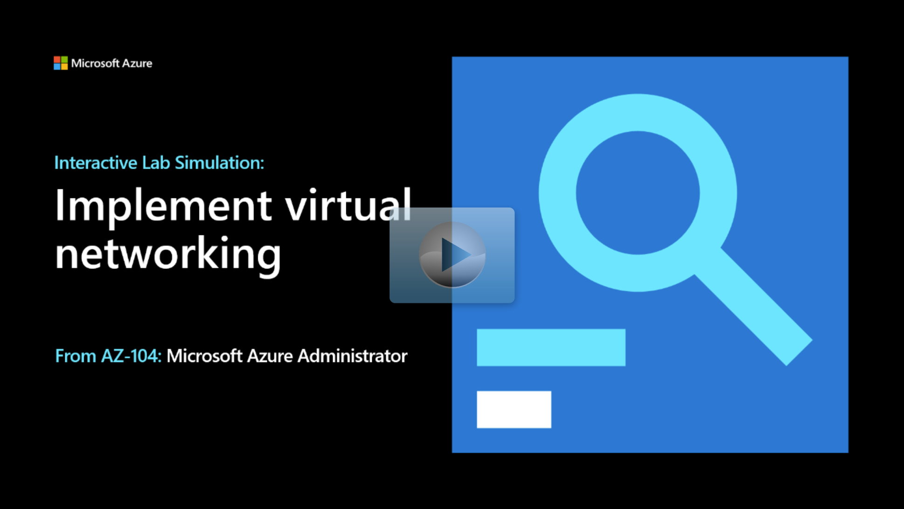

## Lab scenario

Your organization is exploring Azure virtual networking capabilities. As the Azure Administrator you've been tasked to implement the following requirements:

+ Create and configure a virtual network in Azure.
+ Deploy two virtual machines into different subnets of the virtual network.
+ Ensure the virtual machines have public IP addresses that won't change over time. 
+ Protect the virtual machine public endpoints from being accessible from the internet. 
+ Ensure internal Azure virtual machines names and IP addresses can be resolved.
+ Ensure a publicly available domain name can be resolved by external queries. 

## Architecture diagram

:::image type="content" source="../media/lab-04.png" alt-text="Architecture diagram as explained in the text." border="false":::

> [!NOTE]
> Tasks 1 - 4 focus on IP addresses and access. 

## Objectives

+ **Task 1**: Create and configure a virtual network in Azure. 
    + Create a virtual network, **az104-04-vnet1**.
    + Add two subnets, **Subnet0** and **Subnet1**, to the virtual network.
+ **Task 2**: Deploy virtual machines into different subnets of the virtual network.
    + Review a JSON template that will deploy two virtual machines, **VM0** and **VM1**.
    + Use Azure PowerShell to deploy the template. 
+ **Task 3**: Configure private and public IP addresses of Azure virtual machines. Ensure the IP addresses don't change over time. 
    + Associate the VM0 NIC with a static public IP address, **az104-04-pip0**.
    + Associate the VM1 NIC with a static public IP address, **az104-04-pip1**. 
+ **Task 4**: Configure network security groups. Protect the virtual machine public endpoints from being accessible from the internet. 
    + Verify you can't use RDP to connect to a virtual machine. 
    + Create a network security group.
    + Configure inbound security rules to allow RDP.
    + Associate the network security group with the virtual machine NICs.
    + Confirm that you can now use RDP to connect to a virtual machine. 
+ **Task 5**: Configure Azure DNS for internal name resolution. Ensure internal Azure virtual machines names and IP addresses can be resolved.
    + Create a private DNS zone for your organization.
    + Add a virtual network link to the virtual network.
    + Verify the virtual machines DNS records are registered.
    + Verify internal DNS name resolution is working. 
+ **Task 6**: Configure Azure DNS for external name resolution. Ensure a publicly available domain name can be resolved by external queries. 
    + Create a DNS zone for a publicly available domain name. 
    + Add a DNS record for each virtual machine. 
    + Verify external DNS name resolution is working. 

> [!NOTE]
> Select the thumbnail image to start the lab simulation. When you're done, be sure to return to this page so you can continue learning. 

