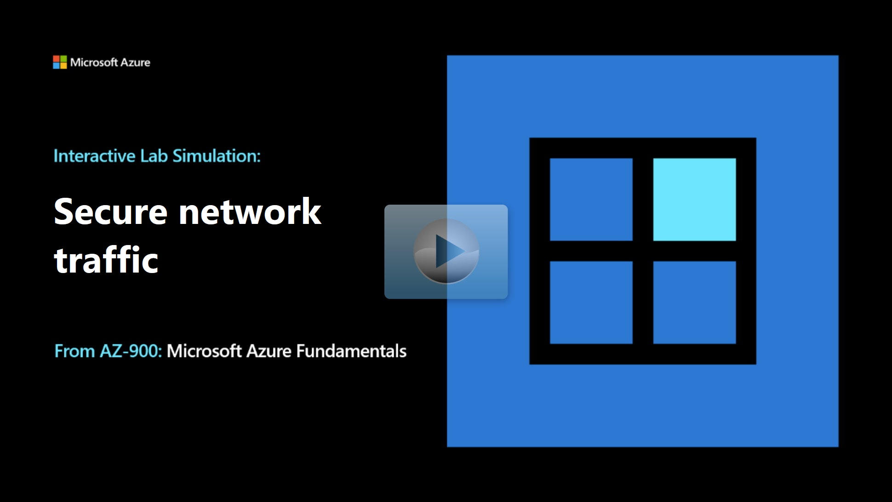

## Lab scenario

Your organization wants to ensure that access to virtual machines is restricted. As the Azure Administrator, you need to:

+ Create and configure network security groups.
+ Associate network security groups to virtual machines. 
+ Deny and allow access to the virtual machines by using network security groups.

## Architecture diagram

:::image type="content" source="../media/architecture-create-networks.png" alt-text="Diagram showing the architecture as explained in the text." border="false":::

## Objectives

+ **Task 1**: Create a virtual machine to test network security.
    + Create a Windows Server virtual machine. 
    + Don't configure any inbound port rules or NIC network security groups.
    + Verify the virtual machine is created.
    + Review the **Inbound port rules** tab, and note there are no network security groups associated with the virtual machine.
+ **Task 2**: Create a network security group, and associate the group with the virtual machine.
    + Create a network security group.
    + Associate the network security group with the virtual machine network interface (NIC).  
+ **Task 3**: Configure an inbound security port rule to allow RDP.
    + Verify you can't connect to the virtual machine by using RDP.
    + Add an **inbound port rule** to allow RDP to the virtual machine on port 3389. 
    + Verify you can now connect to the virtual machine with RDP. 
+ **Task 4**: Configure an outbound security port rule to deny internet access
    + Verify you can access the internet from the virtual machine.
    + Add an **outbound port rule** to deny internet access from the virtual machine. 
    + Verify you can no longer access the internet from the virtual machine. 

> [!NOTE]
> Select the thumbnail image to start the lab simulation. When you're done, be sure to return to this page so you can continue learning. 

