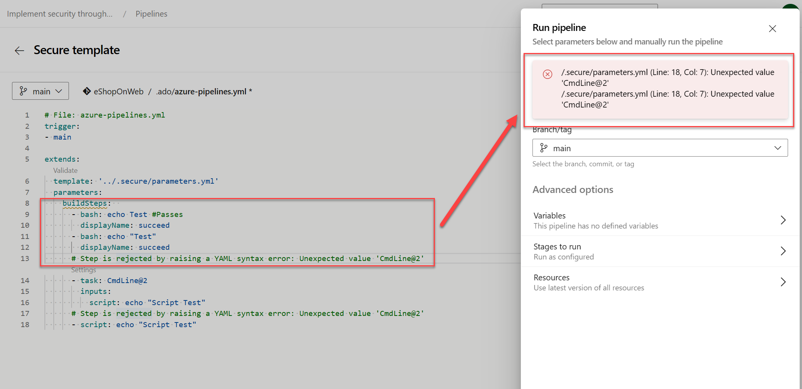

In Azure Pipelines, you can use YAML files to define your pipeline's configuration as code. Parameters in YAML files help you to reuse the pipeline and keep the code clean. In this unit, you'll learn how to move parameters into a YAML file.

## Why use parameters in YAML files?

Benefits of using parameters in YAML files:

- It helps in reusing the pipeline configuration.
- It enables you to define the pipeline as code, allowing you to track pipeline changes over time.
- It keeps the code clean and organized.

## Move parameters into a YAML file

You can enforce that a pipeline extends from a particular template to increase security.

In the following example, the file parameters.yml defines the parameter buildSteps, which is then used in the pipeline azure-pipelines.yml. In parameters.yml, if a buildStep gets passed with a script step, it's rejected, and the pipeline build fails.

Create a file named `parameters.yml` in your repository, or other repository specific for your templates.

Define your parameters in this file using the YAML syntax:

```YAML
# File: parameters.yml
parameters:
- name: buildSteps # the name of the parameter is buildSteps
  type: stepList # data type is StepList
  default: [] # default value of buildSteps
stages:
- stage: secure_buildstage
  pool:
    vmImage: windows-latest
  jobs:
  - job: secure_buildjob
    steps:
    - script: echo This happens before code 
      displayName: 'Base: Pre-build'
    - script: echo Building
      displayName: 'Base: Build'

    - ${{ each step in parameters.buildSteps }}:
      - ${{ each pair in step }}:
          ${{ if ne(pair.value, 'CmdLine@2') }}:
            ${{ pair.key }}: ${{ pair.value }}       
          ${{ if eq(pair.value, 'CmdLine@2') }}: 
            # Step is rejected by raising a YAML syntax error: Unexpected value 'CmdLine@2'
            '${{ pair.value }}': error         

    - script: echo This happens after code
      displayName: 'Base: Signing'
```

Create a file named `azure-pipelines.yml`, and reference the `parameters.yml` file:

```YAML
# File: azure-pipelines.yml
trigger:
- main

extends:
  template: parameters.yml
  parameters:
    buildSteps:  
      - bash: echo Test #Passes
        displayName: succeed
      - bash: echo "Test"
        displayName: succeed
      # Step is rejected by raising a YAML syntax error: Unexpected value 'CmdLine@2'
      - task: CmdLine@2
        inputs:
          script: echo "Script Test"
      # Step is rejected by raising a YAML syntax error: Unexpected value 'CmdLine@2'
      - script: echo "Script Test"
```

Here you can see that the pipeline is extended from the template `parameters.yml`. The parameter `buildSteps` is passed to the template. The template checks if the value of the parameter `buildSteps` is a `stepList` type. If it is, the pipeline continues. If it isn't, the pipeline fails.

Try to run the pipeline. You should see the following error:



You can increase security by adding a [required template approval](https://learn.microsoft.com/azure/devops/pipelines/security/templates) when extending from a template.

## Challenge yourself

Create a pipeline using parameters from a YAML template file that deploys a web app to different regions based on a user's choice of environment.

For more information about parameters and templates, see:

- [Securing Azure Pipelines.](https://learn.microsoft.com/azure/devops/pipelines/security/overview/)
- [Runtime parameters.](https://learn.microsoft.com/azure/devops/pipelines/process/runtime-parameters/)
- [Template types & usage.](https://learn.microsoft.com/azure/devops/pipelines/process/templates)
