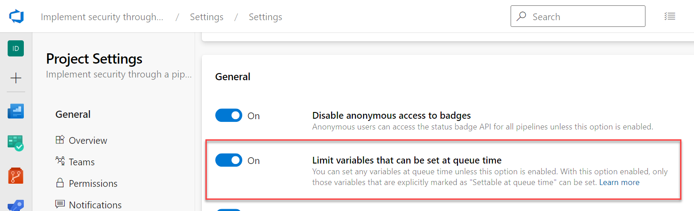

In this unit, learn how to limit variables set at queue time for Azure Pipelines.

## Why limit queue time variables?

In some scenarios, you may want to allow certain variables to be changed when you run a YAML pipeline. For example, you may have a variable that controls the target environment, such as dev, test, or prod. By allowing this variable to be set at queue time, you can reuse the same pipeline definition for different deployments without modifying the YAML file.

However, allowing variables to be set at queue time can also introduce some risks. For example, someone could change a variable value to access a sensitive resource, bypass a security check, or alter the behavior of the pipeline in an unexpected way. To prevent these risks, you should limit the variables that can be set at queue time to only those that are necessary and safe.

## Limit queue time variables

The setting is designed to work at the organization and project levels.

In Azure DevOps, you have a setting to limit variables that can be set at queue time. With this setting enabled, only those variables that are explicitly marked as "Settable at queue time" can be set. In other words, you can set any variables at queue time unless this setting is enabled.

- **Organization**: When the setting is on, it enforces that, for all pipelines in all projects in the organization, only those variables that are explicitly marked as "Settable at queue time" can be set. When the setting is off, each project can choose to restrict variables set at queue time. The setting is a toggle under Organization Settings > Pipelines > Settings. Only Project Collection Administrators can enable or disable it.

    

- **Project**: When the setting is on, it enforces that, for all pipelines in the project, only those variables that are explicitly marked as "Settable at queue time" can be set. If the setting is on at the organization level, it is on for all projects and can't be turned off. The setting is a toggle under Project Settings > Pipelines > Settings. Only Project Administrators can enable or disable it.

## Challenge yourself

Now that you have learned how to limit queue time variables, try to apply this concept to your own YAML pipeline.

- With the "Limit variables that can be set at queue time" enabled try to create a new variable at queue time.
- With the "Limit variables that can be set at queue time" disabled try to create a new variable at queue time.

For more information about queue time variables, see:

- [Define variables.](https://learn.microsoft.com/azure/devops/pipelines/process/variables)
- [How to securely use variables and parameters in your pipeline](https://learn.microsoft.com/azure/devops/pipelines/security/inputs)
