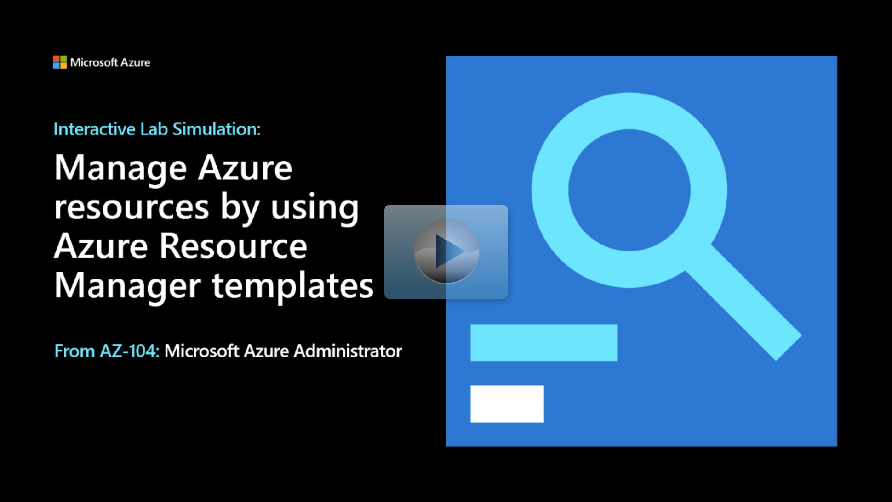

## Scenario

Tailwind Traders are migrating their storage needs to Azure. You've successfully deployed a managed disk in a resource group. You've decided to create an Azure Resource Manager template to simplify the other disk deployments.   

## Architecture diagram 

Your first disk deployment in the resource group az104-**03a**-rg1 is complete. You plan to customize the template and use it to deploy another disk in resource group az104-**03b**-rg1.  

:::image type="content" source="../media/simulation-templates.png" alt-text="Architecture diagram as explained in the text.":::

## Tasks 

**Task 1**: Review an ARM template for deployment of an Azure managed disk. 

**Task 2**: Create an Azure managed disk by using an ARM template. 

**Task 3**: Review the ARM template-based deployment of the managed disk. 

> [!NOTE]
> Click on the thumbnail image to start the lab simulation. When you're done, be sure to return to this page so you can continue learning. 

