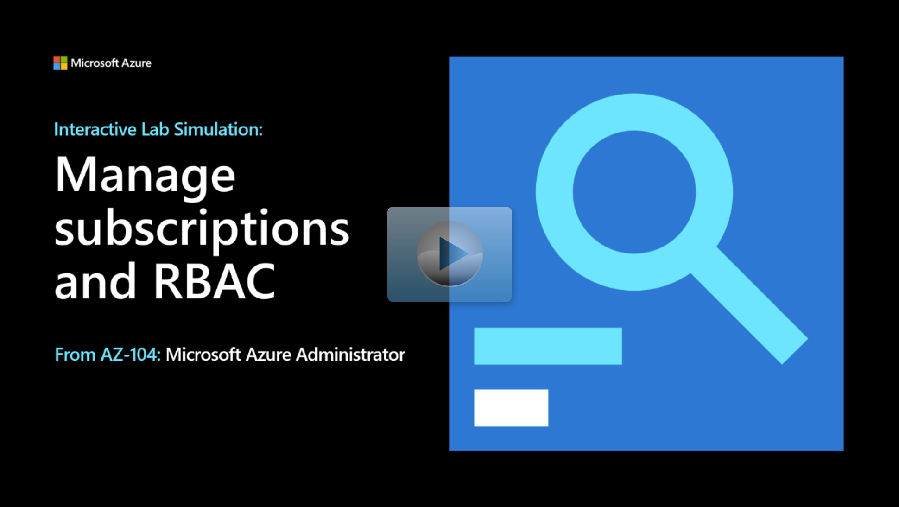

## Lab scenario

Your organization is setting up a new Help Desk. You've been tasked to configure the appropriate user account permissions. The specific requirements are: 

+ As the organization grows, ensure it will be easy to manage multiple subscriptions. 
+ Ensure the Help Desk members can create support requests. 
+ Ensure the Help Desk members can view resource groups, but not the resources in the resource groups. 

## Architecture diagram

:::image type="content" source="../media/lab02a.png" alt-text="Architecture diagram as explained in the text.":::

## Objectives

+ **Task 1**:Implement management groups. This will make it easy to manage multiple subscriptions. 
    + Ensure you have the necessary permissions to access the root management group.
    + Create a management group and add your subscription. 
+ **Task 2**: Create a custom RBAC role for the Help Desk users. 
    + Create a JSON file that defines the custom Support Request Contributor role permissions. 
    + Use PowerShell to upload the new custom role. 
+ **Task 3**: Assign RBAC roles. 
    + Create a new user, **az104-02-aaduser1**, and assign them the Support Request Contributor (Custom) role.
    + Test the user permissions. The user should be able to view resource groups and create support requests. 

> [!NOTE]
> Click on the thumbnail image to start the lab simulation. When you're done, be sure to return to this page so you can continue learning. 

