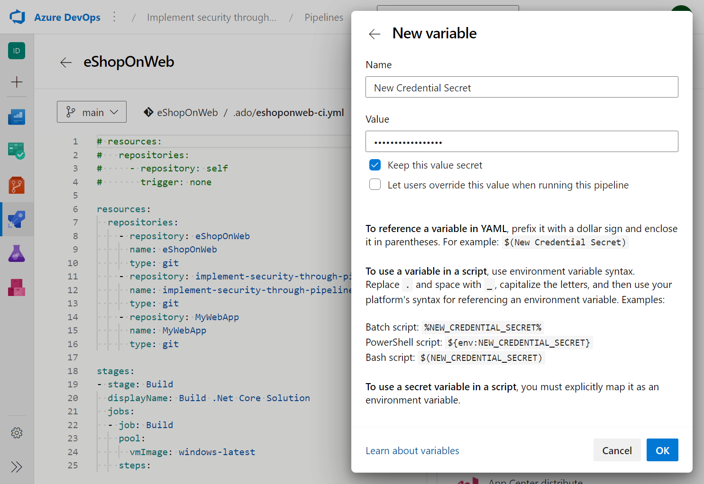
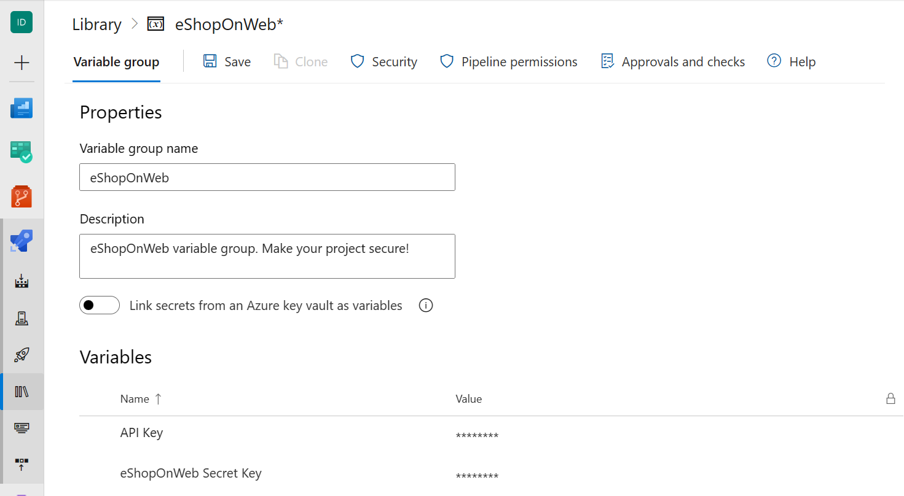
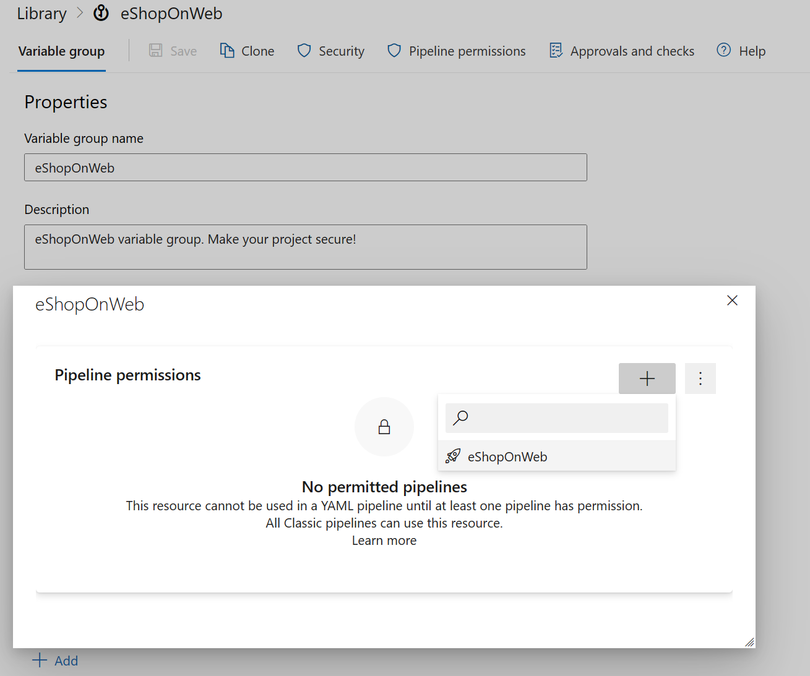

In this unit, you'll learn how to secure your pipeline secrets using Azure DevOps variables and hidden secrets. It's essential to ensure that your pipeline is secure and your secrets are protected. You'll also learn how to use Azure DevOps variables to store your secrets and how to access them within your pipeline.

## Use variables to store values or encrypted secrets

1. Open your Azure DevOps project and navigate to the Pipelines section.
2. Click on Pipelines in the left-hand menu.
3. Open your pipeline (for example "eShopOnWeb"), or create a new one.
4. Click the Edit button in the right-top corner to edit your pipeline.
5. Click the Variables button.
6. Click the New variable button to create a new variable.
7. Enter the name and value for your secret.
8. Check the "Keep this value secret" checkbox to encrypt your secret.
9. (Optional) Check the "Let users override this value when running this pipeline" checkbox to allow users to override the value of your variable at queue time.
10. Click the OK button to save your variable.
11. Click the Save button to save your pipeline.

    

## Create a secret in an Azure DevOps variable group

1. Open your Azure DevOps project and navigate to the Pipelines section.
2. Click on Library in the left-hand menu.
3. Open your variable group (for example "eShopOnWeb"), or create a new one.
4. Click the Add button to add a new variable.
5. Give your variable a name (for example "eShopOnWeb Secret Key").
6. Enter the value for your secret in the Value field.
7. Click the Save button to save your variable group.

    

## Allow variable groups use in your pipeline

1. Open your Variable Group.
2. Click on the Pipeline permissions button.
3. Add the pipelines that will use this Variable Group.
4. Click the Save button to save your Variable Group.

    

## Access secrets within your pipeline

1. Open your pipeline YAML file.
2. Add the following code to the top of your YAML file:

    ```YAML
    variables:
      - group: eShopOnWeb
    
    ```

3. Replace "eShopOnWeb" with the name of your variable group.
4. Use the following syntax to access your secrets within your pipeline:

    ```YAML
    $(eShopOnWeb Secret Key)
    
    ```

5. Replace "eShopOnWeb Secret Key" with the name of your secret.
6. If you want to use your pipeline variables, you can use the following:

    ```YAML
    $(New Credential Secret)
    
    ```

    > [!NOTE]
    > The variable use will be the same, but one is coming from Variable Groups, and other from Variables from your pipeline UI.

7. Save your YAML file.

Secret variables are encrypted at rest with a 2048-bit RSA key. Secrets are available on the agent for tasks and scripts to use. Be careful about who has access to alter your pipeline.

You must decide whether to use the Variable Groups or the pipeline UI variables. The advantage of using the Variable Groups is that you can use the same variables in multiple pipelines. The advantage of using the pipeline UI variables is that you can override the variable's value at queue time.

> [!IMPORTANT]
> We try to mask secrets from appearing in Azure Pipelines output, but you still need to take precautions. Never echo secrets as output. Some operating systems log command line arguments. Never pass secrets on the command line. Instead, we suggest that you map your secrets into environment variables. 
> We never mask the substrings of secrets. If, for example, "abc123" is set as a secret, "ABC" isn't masked from the logs. This is to avoid masking secrets at too granular of a level, making the logs unreadable. For this reason, secrets should not contain structured data. If, for example, "{ "foo": "bar" }" is set as a secret, "bar" isn't masked from the logs.

## Challenge yourself

- Create a pipeline that retrieves a password from Azure DevOps Variable Group.
- Store a variable using secret variable and use in your pipeline.
- Override the variable of your variable in your pipeline with the secret variable at queue time.

For more information about secret variables, see:

- [Manage and modularize tasks and templates.](https://learn.microsoft.com/training/modules/manage-modularize-tasks-templates/)
- [Set secret variables.](https://learn.microsoft.com/azure/devops/pipelines/process/set-secret-variables)
- [Add & use variable groups.](https://learn.microsoft.com/azure/devops/pipelines/library/variable-groups)
- [Set pipeline permissions.](https://learn.microsoft.com/azure/devops/pipelines/policies/permissions)
