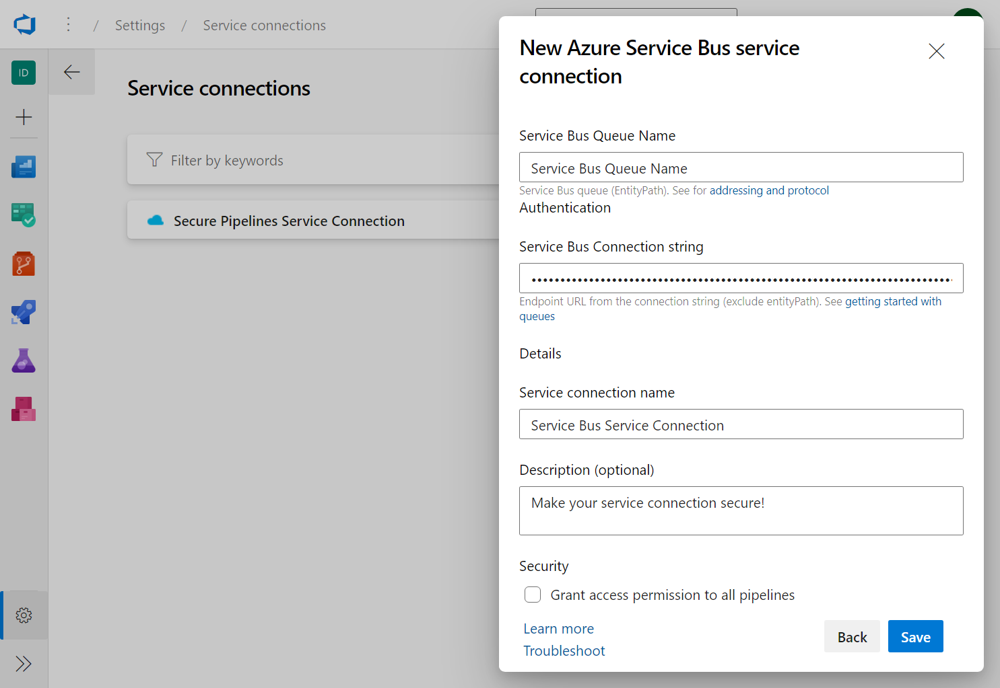
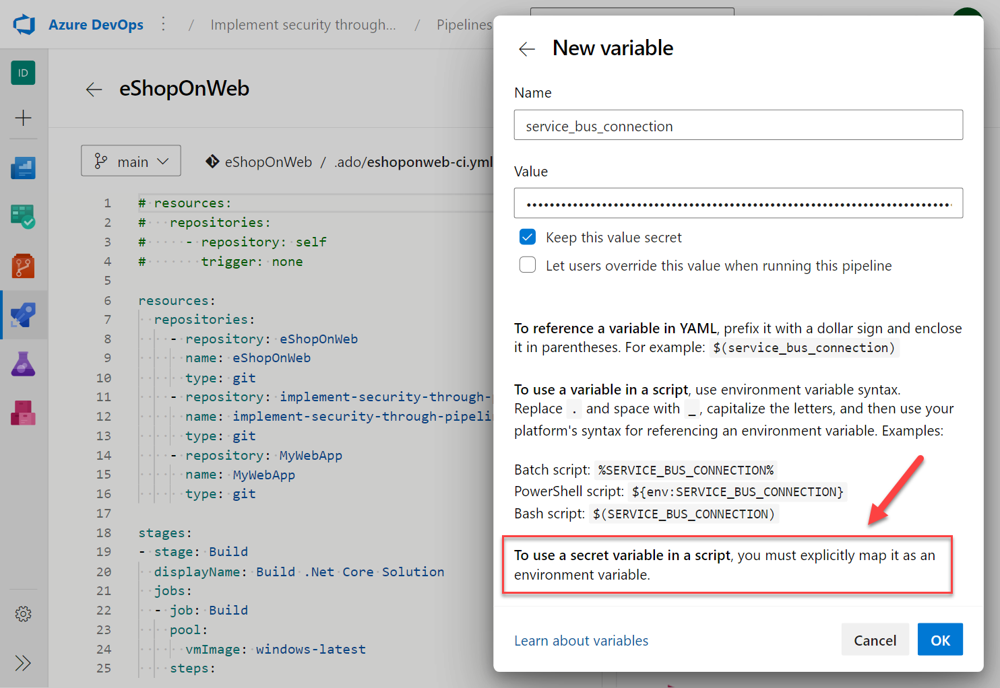

Securing access to services is essential when working with pipelines in Azure DevOps. Service connections allow you to store your pipelines' credentials to access external resources, such as databases, web APIs, and other systems. 

In this unit, learn how to use secrets for services and service connection secrets in Azure Pipelines using YAML.

## Create a service connection

1. Go to your Azure DevOps project.
2. Navigate to the Project settings.
3. Click on Service connections under Pipelines.
4. Click on New service connection.
5. Select the type of service connection you want to create (for example, Azure Service Bus, Kubernetes, Apple App Store or other).
6. Enter the required information for the service connection.
7. Click on Save.

    

## Store the service connection using variables

1. Go to your pipeline definition.
2. Click on Edit.
3. Click on Variables.
4. Create a new variable with the name that represents the service connection (for example, service_bus_connection).
5. Enter the value of the service connection.
6. Check the checkbox "Keep this value secret" to encrypt the variable.
7. Click on Save.

    

    > [!IMPORTANT]
    > Unlike normal variables, they are not automatically decrypted into script environment variables. You need to map secret variables explicitly.

## Use the service connection in YAML

In your pipeline definition, add the following YAML code to use the service connection secrets:

```YAML
    steps:
    - powershell: |
        Write-Host "Using the mapped env var for this task works and is recommended: $env:MY_MAPPED_ENV_VAR"
      env:
        MY_MAPPED_ENV_VAR: $(service_bus_connection) # the recommended way to map to an env variable
    
    - task: PublishToAzureServiceBus@1
      inputs:
        azureSubscription: $(service_bus_connection)
        messageBody: '"hello world!"'
        signPayload: false
        waitForCompletion: true

```

In the above example, the variable service_bus_connection is used in the pipeline to access the Azure Service Bus service connection name.

## Challenge yourself

- Create a new pipeline that deploys a sample web application to an Azure App Service using a service connection for Azure.
- Store the Azure App Service password as a variable and use it in the pipeline.
- Add a step to the pipeline that updates the Azure App Service configuration with the connection string to a database.
- Add the service connection to a pipeline using the service connection name as a secret variable.

For more information about secret variables, see:

- [Define variables.](https://learn.microsoft.com/azure/devops/pipelines/process/variables/)
- [Manage service connections.](https://learn.microsoft.com/azure/devops/pipelines/library/service-endpoints/)
- [Provision and test environments.](https://learn.microsoft.com/training/modules/configure-provision-environments/)
