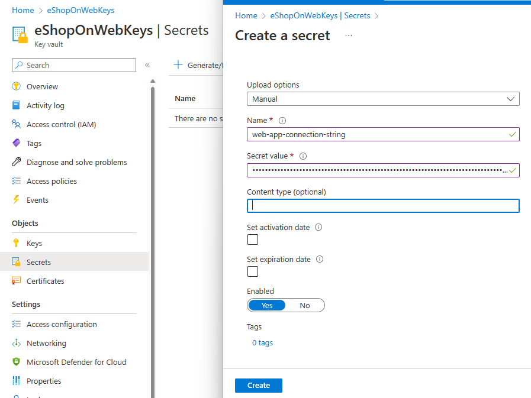
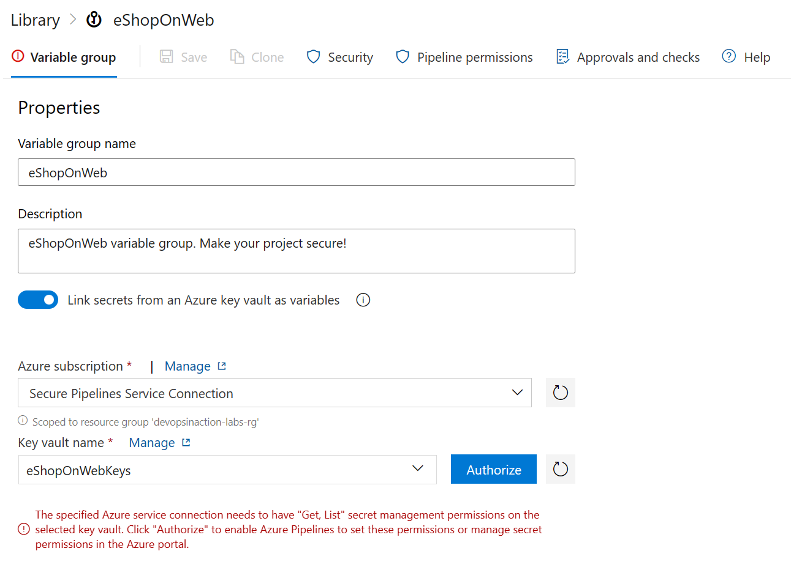
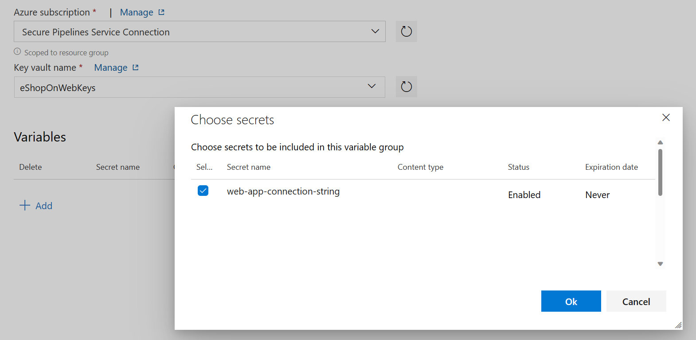
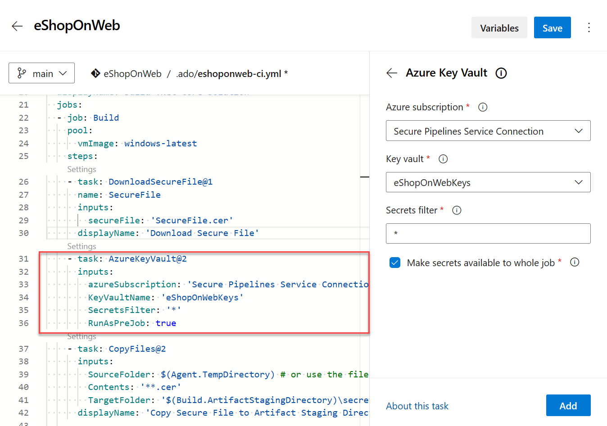

Securing access to sensitive information, such as passwords and API keys, is essential to DevOps. 

In this unit, learn how to configure pipeline access to credential secrets using Azure DevOps and Azure Key Vault.

By following the steps outlined in this unit, you can keep your project secure and protected.

## Create an Azure Key Vault and Service Principal

The first step in securing access to credential secrets is to store them in Azure Key Vault. This service allows you to store and manage secrets, keys, and certificates securely and provides you with the ability to control access to these secrets.

1. To create an Azure Key Vault, go to the Azure portal and click on the "Create a resource" button.
2. Search and select the "Key Vault" option, click create and then fill out the required information to create a new vault.
3. Create a new Service Principal in Azure Active Directory to grant access to the Key Vault.

    > [!NOTE]
    > Follow [this guide](https://learn.microsoft.com/azure/active-directory/develop/howto-create-service-principal-portal) to create your service principal.

4. Assign the service principal to the Key Vault following [this guide](https://learn.microsoft.com/azure/key-vault/general/assign-access-policy-portal).

    > [!IMPORTANT]
    > The service principal that you created will need to have **Secret permissions** access ("Get, List") to the Key Vault. If the service principal does not have access to the Key Vault, you will see an error message when you try to link the Variable Group to the Key Vault.

5. Once you've created your Key Vault, you need to store the secrets that you want to use in your pipeline. You can create secrets directly in your Key Vault, or from the Azure DevOps.

## Create secrets in Azure Key Vault

1. In the Azure portal, go to the Azure Key Vault that you created in step 1.
2. Open the "Secrets" option and click on the "Generate/Import" button.
3. From the Azure Key Vault you can create manual secrets, or upload a certificate.
    
4. Once you've created your secret, you can use it in your pipeline.

## Create secrets in Azure DevOps

1. In Azure DevOps, go to the Azure DevOps organization and project that you want to use.
2. Click on Library and then open your Variable group.
3. Toggle the "Link to Key Vault" option and select the Key Vault and secret that you want to use.
    

    > [!IMPORTANT]
    > The service principal that you created in step 1 will need to have access ("Get, List") to the Key Vault and the secret that you want to use in your pipeline. If the service principal does not have access to the Key Vault, you will see an error message when you try to link the Variable Group to the Key Vault.

4. Click "Authorize" to enable Azure Pipelines to set these permissions or manage secret permissions in the Azure portal.
5. When authorization is complete, click Add under Variables to add the secret from your linked Key Vault to your Variable group.
    

6. Select the secret that you want to use in your pipeline and click OK to add it to your Variable group.
7. Save the Variable group.

## Grant Azure DevOps Access to Key Vault

Now that you've stored your secrets in Azure Key Vault, you need to grant Azure DevOps access to the Key Vault so that your pipeline can retrieve the secrets.

1. In the Azure portal, go to the Azure DevOps organization and project.
2. Go to the "Project Settings" and then "Service connections".
3. Click the "New service connection" button, and then select "Azure Resource Manager".
4. Fill out the required information to create the connection, including the name of the Key Vault and the secrets that you want to use in your pipeline.
5. After you've created the service connection, you'll need to grant Azure DevOps access to the Key Vault. To do this, go to the Azure Key Vault and click on the "Access policies" option.
6. Add a new policy, and then select the Azure DevOps service connection that you created in step 4.
7. Assign the "Get" and "List" permissions to the service connection.

## Use secrets in your pipeline

Once you have granted Azure DevOps access to your Key Vault, you can now use the secrets in your pipeline.

1. Open your pipeline definition in Azure DevOps, and then add the following YAML code:

    ```YAML
    steps:
    - task: AzureKeyVault@2
      inputs:
        azureSubscription: '<your_azure_subscription_name>'
        KeyVaultName: '<your_key_vault_name>'
        SecretsFilter: |
          <secret_name>
    
    ```

    Replace <your_azure_subscription_name> with the name of your Azure subscription, <your_key_vault_name> with the name of your Key Vault, and <secret_name> with the name of the secret that you want to use in your pipeline.

    

2. Save the pipeline definition, and then run the pipeline. The secret should now be available in your pipeline, and you can use it as needed.

## Challenge yourself

Try to implement a secure way of storing and accessing multiple secrets in your pipeline.

- Create a new pipeline for a sample project.
- Add a step to the pipeline that requires access to a service connection, for example, access to a database or API.
- Create a new Azure Key Vault and store the credentials for the service connection securely in the Key Vault.
- Update the pipeline to retrieve the credentials from the Key Vault.
- Verify that the pipeline can access the service connection successfully using the credentials stored in the Key Vault.

> [!NOTE]
> To complete this challenge, you will need access to an Azure subscription and to Azure DevOps. You may need to create an Azure Key Vault and an Azure DevOps project if you do not have these resources available.

For more information about Azure Key Vault and pipeline integration, see:

- [Manage application configuration data.](https://learn.microsoft.com/training/modules/manage-application-configuration-data/)
- [Use Azure Key Vault secrets in Azure Pipelines.](https://learn.microsoft.com/azure/devops/pipelines/release/azure-key-vault/)
- [Azure Key Vault keys, secrets and certificates overview.](https://learn.microsoft.com/azure/key-vault/general/about-keys-secrets-certificates)
