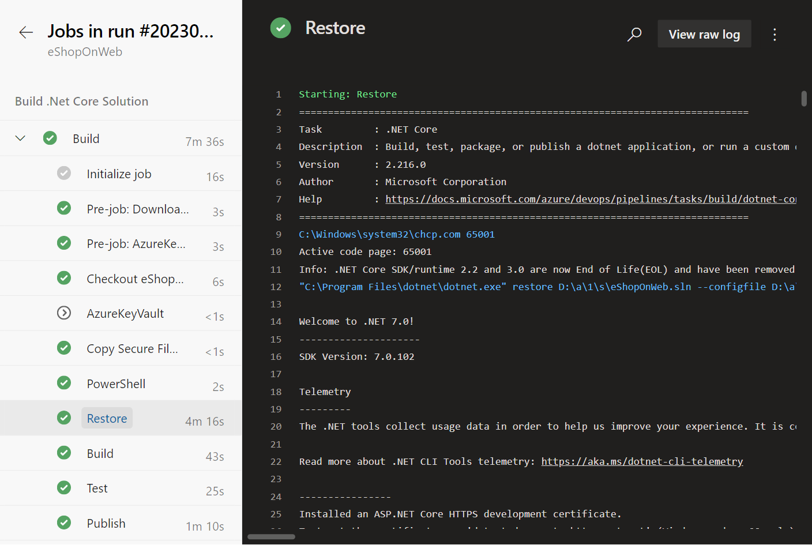

This unit explores how to access and secure log files in Azure Pipelines and secure them from displaying secrets in plain text.

## Access log files in Azure Pipelines

The job details page provides detailed information about the pipeline run, including the tasks executed, their status, and any output generated.



You can access the logs for a specific pipeline run by following these steps:

1. In your Azure DevOps project, navigate to the pipelines section, under pipelines menu.
2. Select the pipeline for which you want to view the logs.
3. Click on a specific run of the pipeline.
4. In the run details page, find the Jobs tab and click on the job for which you want to view the logs.

You can also access the logs for a specific task by clicking on the task name, or download logs for the entire job by clicking on the "Download logs" link.

## Secure log files

Securing log files in Azure Pipelines is crucial to ensure that sensitive information, such as secrets and credentials, isn't displayed in plain text. Azure Pipelines attempts to scrub secrets from logs wherever possible. This filtering is on a best-effort basis and can't catch every way that secrets can be leaked. Avoid echoing secrets to the console, using them in command line parameters, or logging them to files.

There are many ways to secure log files in Azure Pipelines, including:

- By using the `issecret=true` command in a script or task, you can ensure that specific values aren't displayed in the logs. When issecret is set to true, the variable's value is saved as secret and masked out from the log. Secret variables aren't passed into tasks as environment variables and must instead be passed as inputs.

    Set a variable as a secret in a script or task:

    ```YAML
        steps:
        - pwsh: |
            Write-Host "##vso[task.setvariable variable=nonSecretVar;]Now you can see me!"
            Write-Host "##vso[task.setvariable variable=secretVar;issecret=true]Now you don't!"
          name: SetVariables
    
    ```

    Read the variables:

    ```YAML
        - pwsh: |
            Write-Host "The magician says: $env:NONSECRETVAR = Not a secret."
            Write-Host "The magician says: $env:SECRETVAR = Yes, it's hidden, can't you see it? =)"
            Write-Host "The magician says: $(secretVar) = It's encrypted."

    ```

    Output:

    ```OUTPUT
        The magician says: Now you can see me! = Not a secret.
        The magician says:  = Yes, it's hidden, can't you see it? =)
        The magician says: *** = It's encrypted.
    ```

- By using the `isoutput=false` command in a script or task, the variable's value is hidden out from the log.

    Set a variable as a secret in a script or task:

    ```YAML
        steps:
        - pwsh: |
            Write-Host "##vso[task.setvariable variable=outputVarTrue;isoutput=true]No, it's not a secret!"
            Write-Host "##vso[task.setvariable variable=outputVarFalse;isoutput=false]Yes, it's a secret!"
          name: SetVariables
    
    ```

    Read the variables:

    ```YAML
        - pwsh: |
            Write-Host "Hidden out from the log: $env:SETVARIABLES_OUTPUTVARTRUE"
            Write-Host "Hidden out from the log: $(SetVariables.outputVarTrue)"
            Write-Host "Hidden out from the log: $env:SETVARIABLES_OUTPUTVARFALSE = Yes, it's hidden."

    ```

    Output:

    ```OUTPUT
        Hidden out from the log: No, it's not a secret!
        Hidden out from the log: No, it's not a secret!
        Hidden out from the log:  = Yes, it's hidden
    ```

A few other ways to secure log files in Azure Pipelines include:

- Use Secure Files type to upload a file to Azure Pipelines and then download it to the pipeline using the "Download secure file" task. This is useful for uploading certificates and other files that are required by tasks in the pipeline, but shouldn't be displayed in plain text.
- Azure Pipelines will automatically delete log files after a certain amount of time, or by the **retention settings**. This is useful for ensuring that secrets and other sensitive information aren't stored indefinitely.
- Azure Key Vault integration is another way to secure your secrets from log files.
- Secure files, Secret variables, and Variable groups are another way to secure log files in Azure Pipelines.

## Challenge yourself

1. Create a new pipeline in your Azure DevOps project.
2. Add a task that prints a secret value to the console.
3. Run the pipeline and confirm that the secret value is displayed in the logs.
4. Modify the pipeline to secure the logs, following the suggestions outlined in this unit.
5. Rerun the pipeline and confirm that the secret value is no longer displayed in the logs.

This challenge helps reinforce your understanding of log files in Azure Pipelines and how to secure them from displaying secrets in plain text.

> [!NOTE]
> To complete this challenge, you will need access to an Azure subscription and to Azure DevOps. You may need to create an Azure Key Vault and an Azure DevOps project if you do not have these resources available.

For more information about Azure Key Vault and pipeline integration, see:

- [Manage application configuration data.](https://learn.microsoft.com/training/modules/manage-application-configuration-data/)
- [Use Azure Key Vault secrets in Azure Pipelines.](https://learn.microsoft.com/azure/devops/pipelines/release/azure-key-vault/)
- [Azure Key Vault keys, secrets and certificates overview.](https://learn.microsoft.com/azure/key-vault/general/about-keys-secrets-certificates)
- [Repository protection](https://learn.microsoft.com/azure/devops/pipelines/security/repos/)
- [Plan how to secure your YAML pipelines](https://learn.microsoft.com/azure/devops/pipelines/security/approach)
- [Other security considerations](https://learn.microsoft.com/azure/devops/pipelines/security/misc)
- [Recommendations to securely structure projects in your pipeline](https://learn.microsoft.com/azure/devops/pipelines/security/projects/)
