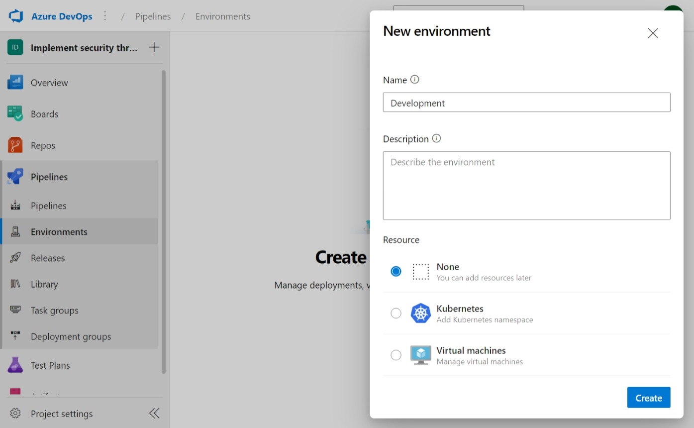
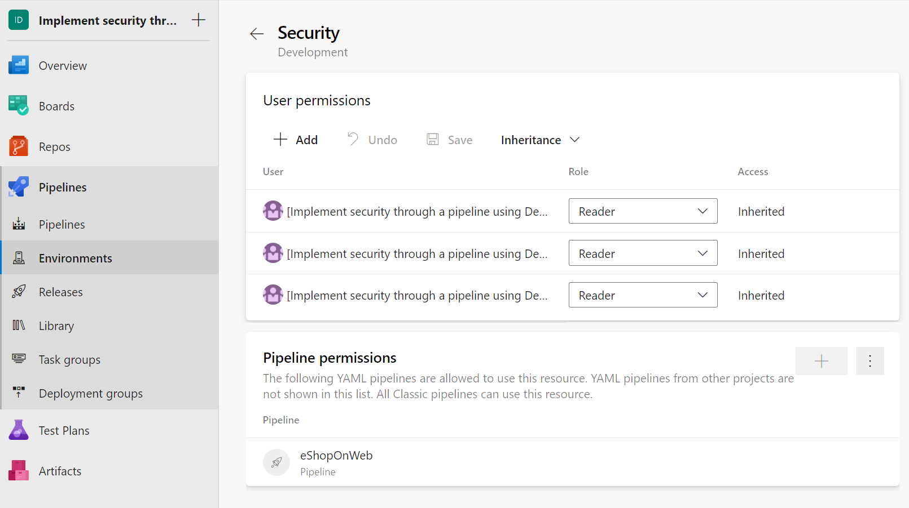

You can use Environments to isolate different application stages, such as development, testing, and production. Azure DevOps provides an environment management feature that makes it easy to manage the environments used in your pipelines. In this unit, you'll learn how to configure and manage environments and how to use them in YAML pipelines.

In this unit, learn how to create, manage and consume environments in Azure DevOps.

## Why use environments in Azure DevOps?

Using Environments in Azure DevOps provides traceability from code to the physical deployment targets, improve resource health/availability visibility, and support zero downtime deployments using deployment strategies (runOnce, canary, blueGreen, and rolling). Also, you can easily manage the deployment of the application to different stages.

## Configure environments

While an environment is a grouping of resources, the resources represent actual deployment targets. The Kubernetes resource and virtual machine resource types are currently supported.

1. Sign-in to your Azure DevOps organization.
2. Go to the project for which you want to configure environments.
3. Go to the Environments, under Pipelines.
4. Click on the Create environment button.
5. Give a name to the environment, such as Development.
6. Choose the environment type. (None if you want to add resources later).
7. Click on the Create button.
8. Repeat the above steps to create more environments, such as Testing and Production.

    

    > [!NOTE]
    > Adding resources to the environment is optional. You can create an empty environment and reference it from deployment jobs. This lets you record the deployment history against the environment.

## Manage environments and security

1. Go to the Environments page.
2. Select an environment, such as Development.
3. Click on the ellipsis (...).
4. Click on the Edit button to update the environment settings, such as the environment name and description.
5. Click on the Security button to update user and pipeline permissions.
6. Add the pipeline you want to allow to use and have access to the Environment.
7. Repeat the above steps to manage other environments.

    

## Use environments in YAML pipelines

Here's an example YAML pipeline that deploys an application to the Development environment:

```YAML
- stage: deploy
  jobs:
  - deployment: DeployWeb
    displayName: Deploy Web App
    pool:
      vmImage: 'Ubuntu-latest'
    environment: 'Development'
    strategy:
      runOnce:
        deploy:
          steps:
          - script: echo Hello world securing your environments!
```

It allows you to deploy the application to different environments by changing the environment name in the env section.

For more information about Environments, see:

- [Create and target an environment.](https://learn.microsoft.com/azure/devops/pipelines/process/environments)
- [Manage multiple environments by using Bicep and Azure Pipelines](https://learn.microsoft.com/training/modules/manage-multiple-environments-using-bicep-azure-pipelines/)
