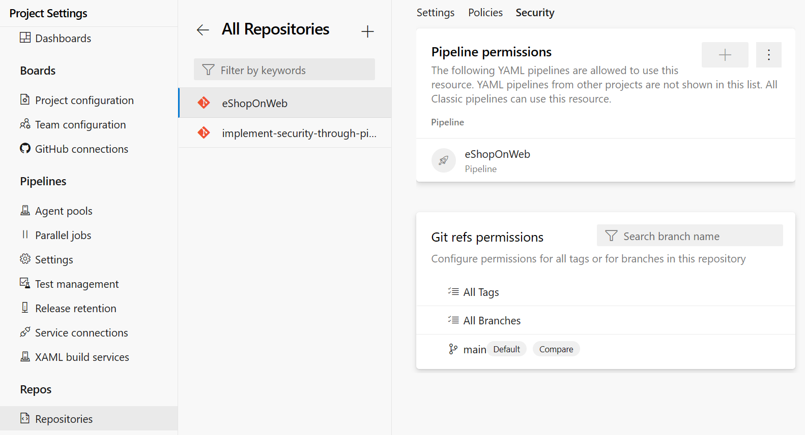

When using Azure DevOps for pipeline automation, it's crucial to limit the access of pipelines to only the repositories they need. It helps to ensure that the pipelines are only making changes and deploying code to the correct places and minimizes the risk of unintended actions that could cause security or stability issues.

In this unit, learn how to configure pipeline access to repositories using Azure DevOps. It's essential to ensure that the pipeline has the necessary permissions to access and integrate with the repository. With the proper configuration, you can maintain the security and privacy of your code while ensuring that the pipeline can access it efficiently.

## Protect access to repositories

Azure DevOps provides a permissions mechanism for Azure Repos in the form of the Protect access to repositories in the YAML pipelines setting. This setting makes a YAML pipeline explicitly ask permission to access all Azure Repos repositories. It's a default configuration.

To verify or disable it for your project:

1. Sign-in to your Azure DevOps organization.
2. Navigate to the project for which you want to configure the pipeline protection.
3. Go to Project Settings, then click on Settings under Pipelines.
4. Under general, toggle the option Protect access to repositories in YAML pipelines to disable or enable it.

## Configure pipeline access to the repository

Once you confirm your settings, you can configure pipeline access to the repository.

1. Navigate to the pipeline you want to configure access for.
2. Click on the "Edit" button to open the pipeline YAML file.
3. In the YAML file, configure the repositories you want to consume. For example:

    ``` YAML
    resources:
      repositories:
        - repository: eShopOnWeb
          name: eShopOnWeb
          type: git
        - repository: implement-security-through-pipeline-using-devops
          name: implement-security-through-pipeline-using-devops
          type: git
        - repository: MyWebApp
          name: Contoso/MyWebApp
          type: git

    ```

This step will checkout the code from the specified repository and reference, and make it available for the rest of the pipeline to use. You can validate the pipeline access by observing the logs and ensuring that the code was retrieved from the repository successfully.

When running the pipeline using more than one repository, the pipeline asks permission to access the "eShopOnWeb", MyWebApp and "implement-security-through-pipeline-using-devops" repositories.

## Authorize specific pipelines to access the repository

By restricting pipeline access to specific repositories, you can ensure that only authorized pipelines have access to the codebase and its sensitive information. It helps to prevent unauthorized access to sensitive data, such as passwords, API keys, and other confidential information that (shouldn't) may be stored in the codebase.

1. Sign-in to your Azure DevOps organization.
2. Navigate to the project for which you want to configure pipeline access and repository.
3. Go to Project Settings, then click on Repositories under Repos.
4. Choose the repository that you want to grant access to your pipeline.
5. Go to the Security tab.
6. Click on the + button (Add pipeline) in the Pipeline permissions section to add a new pipeline.
7. (Optional) Search for the pipeline name.
8. Select the name of your pipeline that you want to grant access to the current repository.
    

Additionally, restricting pipeline access to specific repositories also helps to ensure that pipelines can only make changes to the codebase through authorized means. For example, pipelines that only have access to a particular repository may not be able to push code changes directly to the repository but may be required to submit pull requests for review and approval. It helps to prevent unplanned and unintended changes to the codebase and ensures that changes are made through a controlled and secure process.

## Challenge yourself

Try to integrate your pipeline with multiple repositories and manage the access permissions for each repository. This helps you understand the importance of managing pipeline access to repositories and how to ensure that the pipeline has the necessary permissions to access the code.

For more information about secure repos from pipelines, see:

- [Secure access to Azure Repos from pipelines.](https://learn.microsoft.com/azure/devops/pipelines/security/secure-access-to-repos)
- [Check out multiple repositories in your pipeline](https://learn.microsoft.com/azure/devops/pipelines/repos/multi-repo-checkout)
- [AZ-400: Implement security and validate code bases for compliance](https://learn.microsoft.com/training/paths/az-400-implement-security-validate-code-bases-compliance/)
