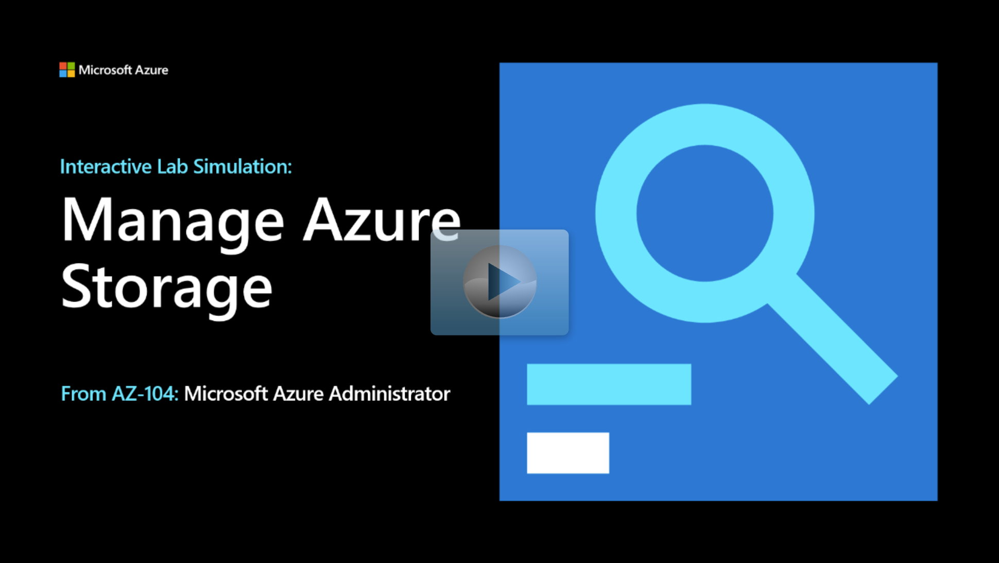

## Lab scenario

Your organization is migrating storage to Azure. As the Azure Administrator you need to:

+ Evaluate the use of Azure storage for storing files. These files are currently residing in on-premises data stores. 
+ Minimize the cost of storage by placing less frequently accessed files in lower-priced storage tiers. 
+ Explore different protection mechanisms that Azure Storage offers, including network access, authentication, authorization, and replication. 
+ Determine to what extent Azure Files service might be suitable for hosting your on-premises file shares.

## Architecture diagram

:::image type="content" source="../media/lab-07.png" alt-text="Architecture diagram as explained in the text.":::

## Objectives

+ **Task 1**: Create the infrastructure environment.
    + Use a template to create the virtual networks and virtual machines. You can review the [lab template](https://github.com/MicrosoftLearning/AZ-104-MicrosoftAzureAdministrator/tree/master/Allfiles/Interactive%20Lab%20Simulation%20Files/07).
    + Use Azure PowerShell to deploy the template. 
+ **Task 2**: Create and configure Azure Storage accounts.
    + Create a storage account.
    + Configure the storage account to include redundancy and access tiers. 
+ **Task 3**: Manage blob storage.
    + Create a private Blob container.
    + Upload a file into the container.
+ **Task 4**: Manage authentication and authorization for Azure Storage.
    + Generate a shared access signature (SAS) with limited time access.
    + Verify the SAS is working correctly. 
+ **Task 5**: Create and configure an Azure Files share.
    + Create a file and connect to it.
    + Use Azure PowerShell to add items to the file share. 
+ **Task 6**: Manage network access for Azure Storage.
    + Limit access to the Azure storage account from only specific IP addresses. 
    + Confirm access is denied from the Cloud Shell. 
> [!NOTE]
> Click on the thumbnail image to start the lab simulation. When you're done, be sure to return to this page so you can continue learning. 

