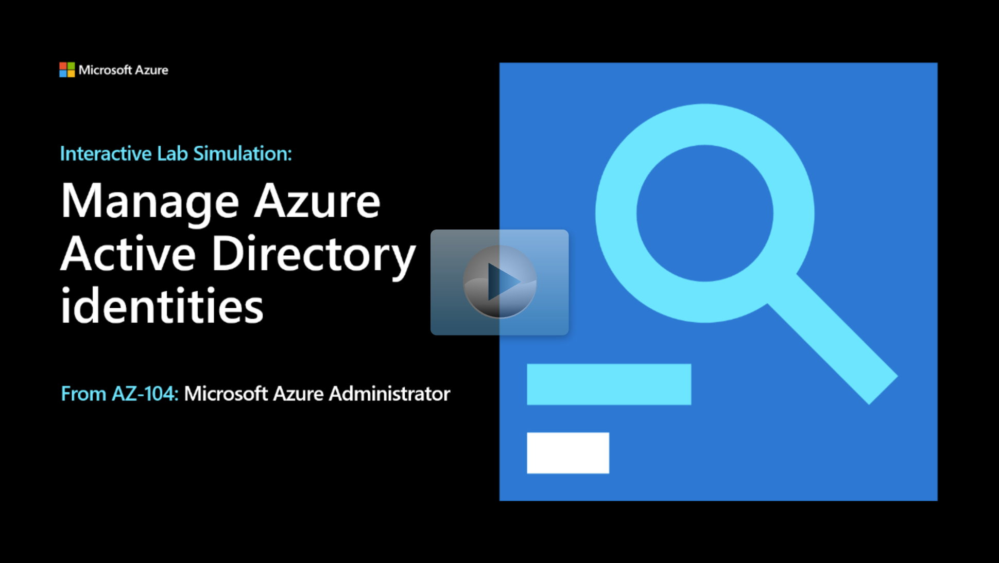

## Lab scenario

Your organization will be using Microsoft Entra authentication. You've been tasked with provisioning the required user and group accounts. Membership of the groups should be updated automatically based on the user job titles. You also need to invite guest users from another tenant. These guest users should have only limited permissions to resources in your subscription.

Your organization has these specific requirements: 

+ Any user with the Cloud Administrator job title should be assigned to the IT Cloud Administrator group.
+ Any user with the System Administrator job title should be assigned to the IT System Administrator group. 
+ Any user that is a member of the IT Cloud Administrator group or the IT System Administrator group should be assigned to the IT Lab Administrator group.
+ A System Administrator in another Active Directory tenant should be invited as guest user with limited permissions.  

## Architecture diagram

:::image type="content" source="../media/lab-01.png" alt-text="Architecture diagram as explained in the text.":::

## Objectives

+ **Task 1**: Create and configure Microsoft Entra users. 
    + User **AZ104-01a-aaduser1** will be a Cloud Administrator assigned the User Administrator role. 
    + User **AZ104-01a-aaduser2** will be a System Administrator. 
+ **Task 2**: Create AD groups with assigned and dynamic membership. 
    + The **IT Cloud Administrator** group should include any user with the Cloud Administrator job title. 
    + The **IT System Administrator** group  should include any user with the System Administrator job title.
    + The **IT Lab Administrator** group should include any user in the IT Cloud Administrator group or the IT System Administrator group.
+ **Task 3**: Create a Microsoft Entra tenant. This tenant will be used to demonstrate guest users. 
+ **Task 4**: Manage Microsoft Entra guest users.
    + In the new Microsoft Entra tenant create a System Administrator user, **az104-01b-aaduser1**. 
    + Invite the new user as a guest user to your subscription.

> [!NOTE]
> Click on the thumbnail image to start the lab simulation. When you're done, be sure to return to this page so you can continue learning. 

