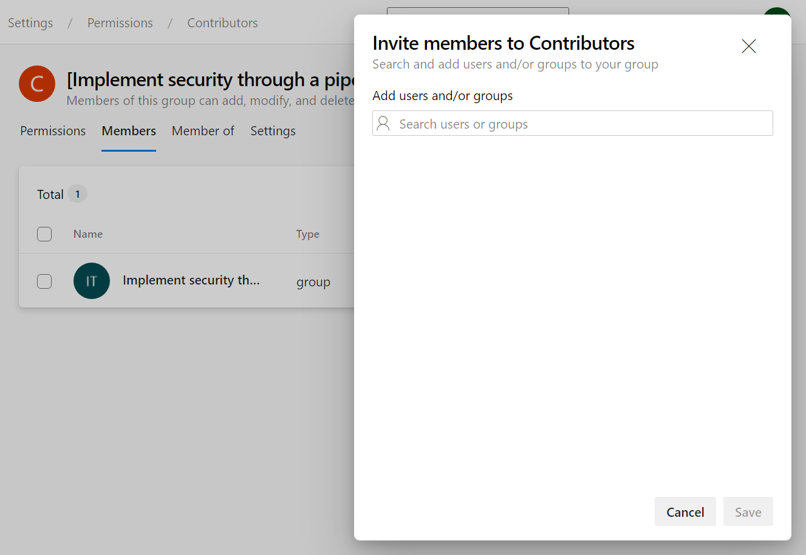
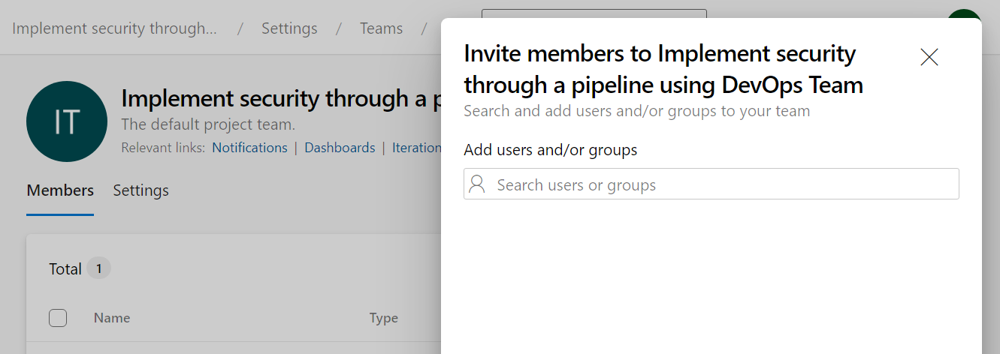

By validating user permissions, you can check that only authorized users can access and modify your pipelines and that unauthorized users are blocked from performing actions that could compromise your code or resources. Validating user permissions can help you identify and fix security gaps or pipeline issues.

There are many ways to configure user permissions in Azure DevOps. You can use the Azure DevOps web interface or the Azure DevOps REST API. You can also use the Azure DevOps CLI to manage user permissions.

When you decide how to add permissions, you should consider the following factors:

- The number of users and groups you need to add to your project.
- The users who need temporary access to a specific resource or pipeline.
- Whether you want to add users and groups to a specific project or the entire organization.
- Whether you want to add users and groups to a specific pipeline, resource, approval, branch check, audit, environment, etc.

For every user and group you add to your project, you can specify the permissions they have for the project. Azure DevOps provides a set of predefined permissions that you can use to control access to your project. You can also create custom permissions to meet your specific needs.

It's recommended to follow the principle of least privilege, granting users only the minimum level of access required to perform their job functions and regularly reviewing and updating permissions as needed.

## Add users or groups to the project

1. Open the Azure DevOps project and select the Project settings.
2. In the Project Settings menu, select the Permissions option under General.
3. You can view and manage the security groups, users, and their permissions.
4. Select the group you want to add users.

    >[!NOTE]
    > To understand the different types of groups and permissions, see [Security groups, service accounts, and permissions in Azure DevOps](https://learn.microsoft.com/azure/devops/organizations/security/permissions/).

5. Select the "Members" tab to view the list of users in the group.
6. Click on the "+ Add" button, then select the user or group you want to add.
7. To specify permissions for the user, you can open the new added user and make changes to the default inherited permissions.

    

## Add users to specific teams

You can create teams or groups based on your organizational structure if you have many users and groups. Teams are a collection of users and groups with access to a specific project. You can add users to a team and then add the team to a particular pipeline. This way, you can manage permissions for many users and groups in a single place.

1. Open the Azure DevOps project and select the Project settings.
2. In the Project Settings menu, select the Teams option under General.
3. You can view and manage the teams and their permissions.
4. Select the team you want to add users.
5. Select the "Members" tab to view the list of users in the team.
6. Click on the "+ Add" button, then select the user or group you want to add.
7. To specify permissions for the user, you can open the new added user and make changes to the default inherited permissions.

    

## Tips for validating user permissions

- Use test cases to verify that users have access to the resources they need to complete their tasks.
- Perform a thorough review of your user permissions at regular intervals to ensure that they're up to date and reflect the project's current state.
- Use the Azure DevOps audit logs to monitor changes to user permissions and track any unauthorized changes.

## Challenge yourself

You're a DevOps engineer responsible for managing a team project in Azure DevOps. The project has several teams, and you must set up specific permissions for each group.

Team A should be able to create and manage projects but can't delete or rename them. Team B should be able to manage work items but need permission to move out of the project and view analytics. Team C should have full access to everything. How would you configure the user permissions for each team in Azure DevOps?

For more information about permissions, security groups, and accounts, see:

- [Security groups, service accounts, and permissions in Azure DevOps](https://learn.microsoft.com/azure/devops/organizations/security/permissions/)
- [Add organization users and manage access](https://learn.microsoft.com/azure/devops/organizations/accounts/add-organization-users)
- [About access levels](https://learn.microsoft.com/azure/devops/organizations/security/access-levels)
- [Troubleshoot access and permission issues](https://learn.microsoft.com/azure/devops/organizations/security/troubleshoot-permissions)
