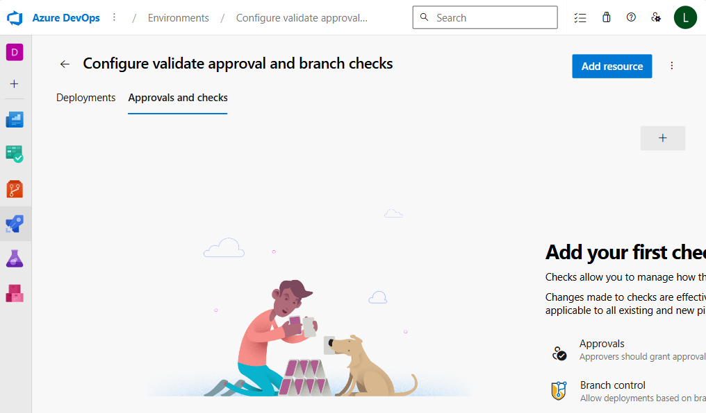
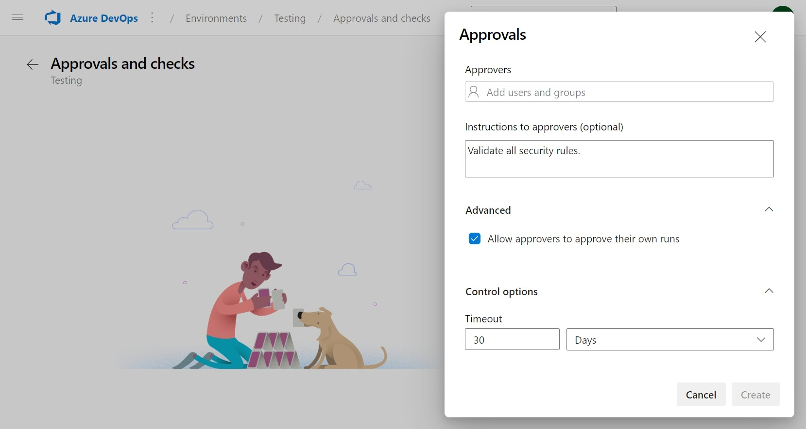
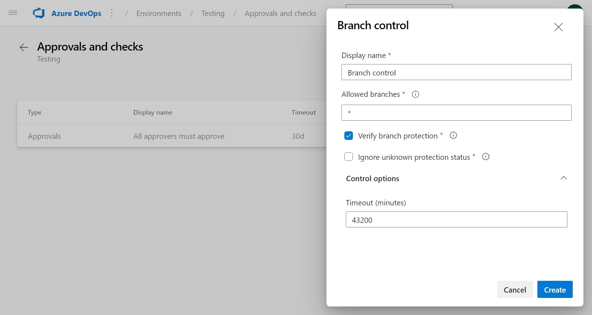
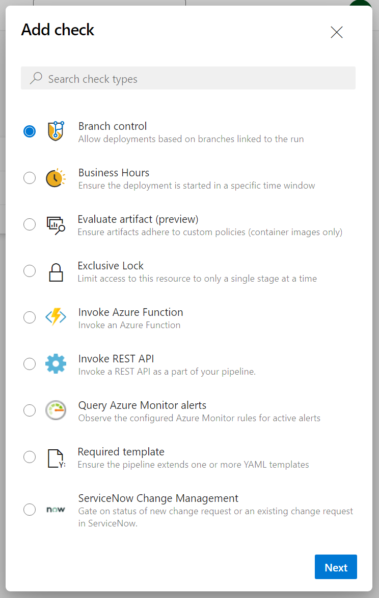

In Azure DevOps, you can configure and validate approvals and branch checks to ensure that changes to your code are reviewed and approved before being deployed to production. It helps to prevent errors and vulnerabilities in your code from reaching production and causing issues.

Approval and branch checks are critical components of a secure software development process. By requiring approvals for code changes and validating branch names and versions, you can prevent unauthorized changes from being deployed to production.

In this unit, learn how to configure and validate approvals and branch checks in Azure DevOps.

## Set up approvals and checks

1. In your Azure DevOps project, click on Environments under Pipelines.
2. Select the environment for which you want to create the approval or branch check. If you don't have an environment, you can create one by clicking on the "New environment" button.
3. Click on the three dots "..." button next to the Add resource button and select "Approvals and Checks" from the dropdown menu.

    

4. To add an approval check, select the "Approvals".
5. In the "Add Approvals" dialog box, you can configure the details of the approval check, such as the approvers, the instructions to approvers, if the approver can approve their own runs, and the approval timeout.

    

6. Click on the Create button to create the approval check.
7. Back to "Approvals and Checks" to add a branch check, select the "Branch control".
8. In the "Branch control" dialog box, you can configure the details of the branch check, such as the allowed branches, a check to verify branch protection, and the timeout.
9. Click on the "Create" button to save your changes.

    

There are other types of checks that you can add to your environment. It's important to understand the purpose of each check and how it can help you to secure your software development process.

For example:
Business Hours, Evaluate artifact, Exclusive Lock, Invoke Azure Function, Invoke REST API, Query Azure Monitor alerts, Required template, ServiceNow Change Management, etc.

## Challenge yourself

Create a pipeline in Azure DevOps and configure approval and branch checks to ensure that code changes are reviewed and approved before being deployed to production. Then, validate the approval and branch checks to ensure that they're working as expected.

For more information about approvals and checks, see:

- [Explore release recommendations](https://learn.microsoft.com/training/modules/explore-release-strategy-recommendations/)
- [Create a release pipeline](https://learn.microsoft.com/training/modules/create-release-pipeline-devops/)
- [Define approvals and checks](https://learn.microsoft.com/azure/devops/pipelines/process/approvals)
- [Use gates and approvals to control your deployment](https://learn.microsoft.com/azure/devops/pipelines/release/deploy-using-approvals)
