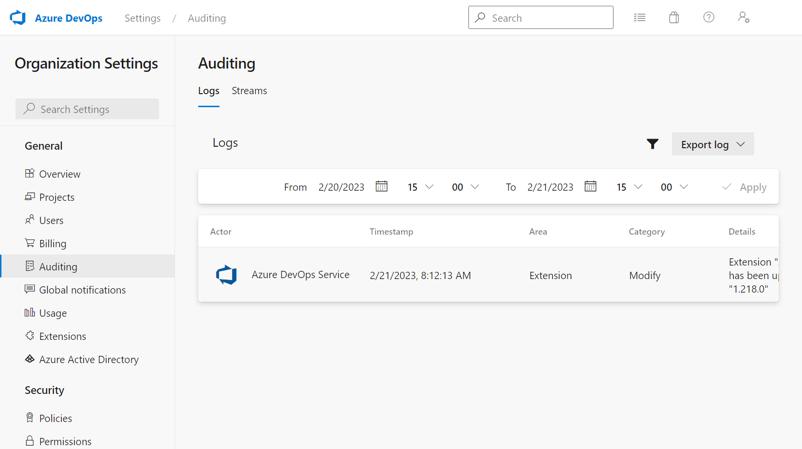

Managing permissions are essential to maintaining security and control over your pipelines and resources. By setting permissions, you can restrict access to sensitive data and ensure that only authorized users can access certain features.

In this unit, learn how to manage and audit permissions using Azure DevOps.

## Manage organization permissions

You can also set permissions for specific projects. The steps and configuration are similar to the organization-level permissions.

To configure permissions for an organization:

1. Sign in to your Azure DevOps organization.
2. Click on Organization Settings at the bottom left and in Permissions under Security section.
3. Under "Permissions," select the group or user you want to manage permissions for.
4. Click on "Permissions," and select the type of permissions you want to set (for example, "General," "Repos," "Pipelines," "Auditing," etc.).
5. Choose the level of permission you want to assign (for example, "Allow," "Deny," or "Not set").

## Audit permissions

Audit logs provide a record of every operation that occurs in Azure DevOps, including all changes made to work items, builds, releases, and pipelines.

By reviewing audit logs, administrators and security professionals can identify unauthorized access attempts, suspicious activity, or compliance violations. This information can help prevent security breaches and ensure compliance with regulations and organizational policies.

In addition, audit logs can help teams identify issues and improve their processes by providing detailed information about what actions were taken and by whom. By regularly reviewing audit logs, teams can identify potential problems and take corrective measures to prevent them.

To configure auditing for your organization:

   1. Sign in to your Azure DevOps organization.
   2. Click on Organization Settings at the bottom left and in Policies under the Security section.
   3. Under Security policies, enable Log Audit Events.
   4. The Auditing section appears in the left navigation pane, under General. Click on it.
   5. The audit log provides a simple view into the audit events recorded for your organization.
   6. You can filter the audit log by user, date range, or permission type to get a more specific view of the changes.
   7. (Optional) You can export the audit log to a CSV or JSON file by clicking on the Export button, or you can view the details of a specific event by clicking on the event.

        

Consider sending your events downstream to a Security Information and Event Management (SIEM) tool using the [Audit Streaming feature](https://learn.microsoft.com/azure/devops/organizations/audit/auditing-streaming) for long-term storage and analysis of your auditing events. We recommend exporting the auditing logs for cursory data analysis.

> [!NOTE]
> Auditing is only available for organizations backed by Azure Active Directory. For more information, see [Connect your organization to Azure Active Directory](https://learn.microsoft.com/azure/devops/organizations/accounts/connect-organization-to-azure-ad).

## Challenge yourself

To reinforce your understanding of managing and auditing permissions, try the following challenge:

- Enable Auditing for your organization.
- Configure a group with permissions to manage the pipelines in the project.
- Use the audit log to confirm the permissions and configurations.

For more information about approvals and checks, see:

- [Access, export, and filter audit logs](https://learn.microsoft.com/azure/devops/organizations/audit/azure-devops-auditing/)
- [Auditing events list](https://learn.microsoft.com/azure/devops/organizations/audit/auditing-events/)
- [Security groups, service accounts, and permissions in Azure DevOps](https://learn.microsoft.com/azure/devops/organizations/security/permissions/)
