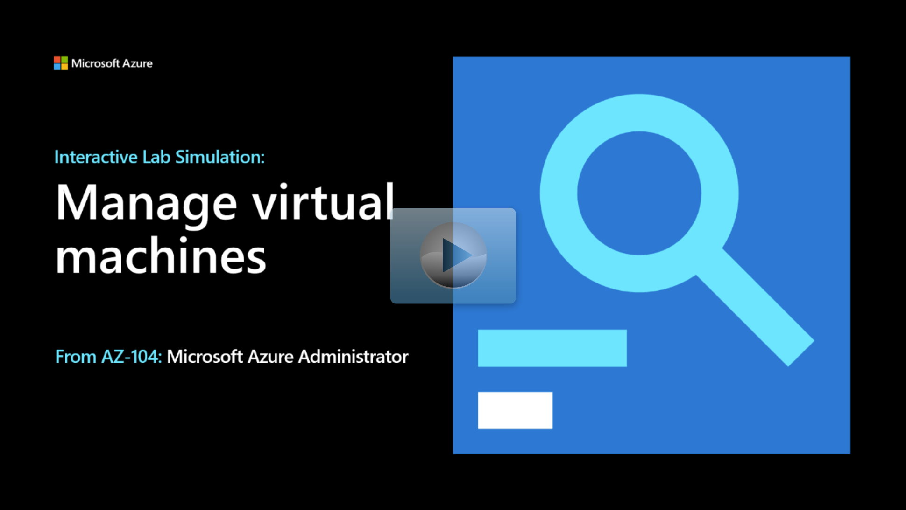

## Lab scenario

Your organization is deploying virtual machines in Azure. As the Azure Administrator you need to:

+ Determine different virtual machine compute and storage options.
+ Implement Virtual Machine Scale Sets, including storage resiliency and scalability options.
+ Explore using Azure Virtual Machine Custom Script extensions to automatically configure virtual machines.

## Architecture diagram

:::image type="content" source="../media/lab-08.png" alt-text="Architecture diagram as explained in the text.":::

## Objectives

> [!NOTE]
> The [lab files](https://github.com/MicrosoftLearning/AZ-104-MicrosoftAzureAdministrator/tree/master/Allfiles/Interactive%20Lab%20Simulation%20Files/08) are available in the GitHub.

+ **Task 1**: Deploy zone-resilient Azure virtual machines by using the Azure portal and an Azure Resource Manager template. 
    + Create a virtual machine in the Azure portal.
    + Review the template and deploy a second virtual machine. 
+ **Task 2**: Configure Azure virtual machines by using virtual machine extensions. 
    + Create a blob storage container. 
    + Upload an Azure PowerShell script. This script will install the Windows Server Web Server role on a virtual machine. 
    + Use the custom script extension feature to run the script on a virtual machine. Export the template.
    + Configure the exported template to install the role on a different virtual machine. 
+ **Task 3**: Scale compute and storage for Azure virtual machines. In this task, you'll scale compute for Azure virtual machines by changing their size and scale their storage by attaching and configuring their data disks.
    + Resize the virtual machine.
    + Create and attach a new disk to the virtual machine.
    + Use Azure PowerShell to initialize and partition the new disk.
    + Customize the template to resize the virtual machine and change the disk configuration. 
+ **Task 4**: Register the Microsoft Insights and Microsoft Alerts Management resource providers.
+ **Task 5**: Deploy zone-resilient Azure Virtual Machine Scale Sets by using the Azure portal.
    + Use the Azure portal to create a Virtual Machine Scale Set. 
    + Configure the virtual network to include an inbound rule to allow HTTP.
    + Configure load balancing and manual scaling.
    * Deploy the virtual scale set. 
+ **Task 6**: Configure Azure Virtual Machine Scale Sets by using virtual machine extensions.
    + Upload an Azure PowerShell script to install the install Windows Server Web Server role. 
    + Run the script on the virtual machines using the custom script extension feature. 
    + Confirm the IIS is now available on the virtual machines. 
+ **Task 7**: Scale compute and storage for Azure Virtual Machine Scale Sets. 
    + Confirm the virtual machines in the scale set are in different regions.
    + Configure autoscale based on a metric.
    + Use Azure PowerShell to start an infinite loop that sends the HTTP requests to the web sites hosted on the instances of Azure Virtual Machine Scale Sets
    + Verify a new resource is provisioned. 

> [!NOTE]
> Click on the thumbnail image to start the lab simulation. When you're done, be sure to return to this page so you can continue learning. 

