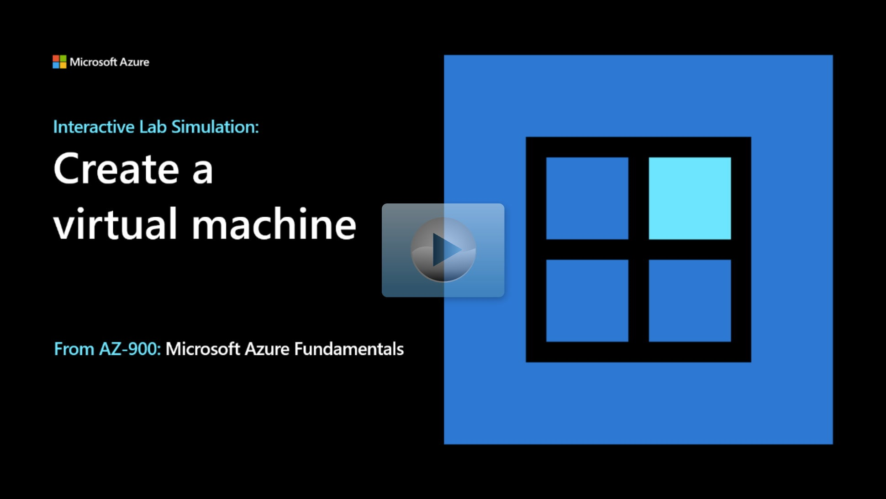

## Lab scenario

Your organization is planning on using virtual machines in Azure. As the Azure Administrator you need to:

+ Be able to use virtual machine Quickstart templates. 
+ Use templates to create and configure virtual machines.
+ Be able to monitor virtual machine activity.

## Objectives

+ **Task 1**: Use the Azure Quickstart Template gallery to deploy a virtual machine. 
    + Browse to the [Azure Quickstart Template gallery](https://azure.microsoft.com/resources/templates/?azure-portal=true).
    + Search for a template that deploys a simple Windows Server virtual machine.
    + Edit the template and customize the parameters and variables.
    + Deploy the template to create the virtual machine.  
+ **Task 2**: Verify and monitor your virtual machine.
    + In the portal, locate your new virtual machine. 
    + View monitoring data for CPU, network, and data usage. 
    + View activity log information. 

> [!NOTE]
> Click on the thumbnail image to start the lab simulation. When you're done, be sure to return to this page so you can continue learning. 

