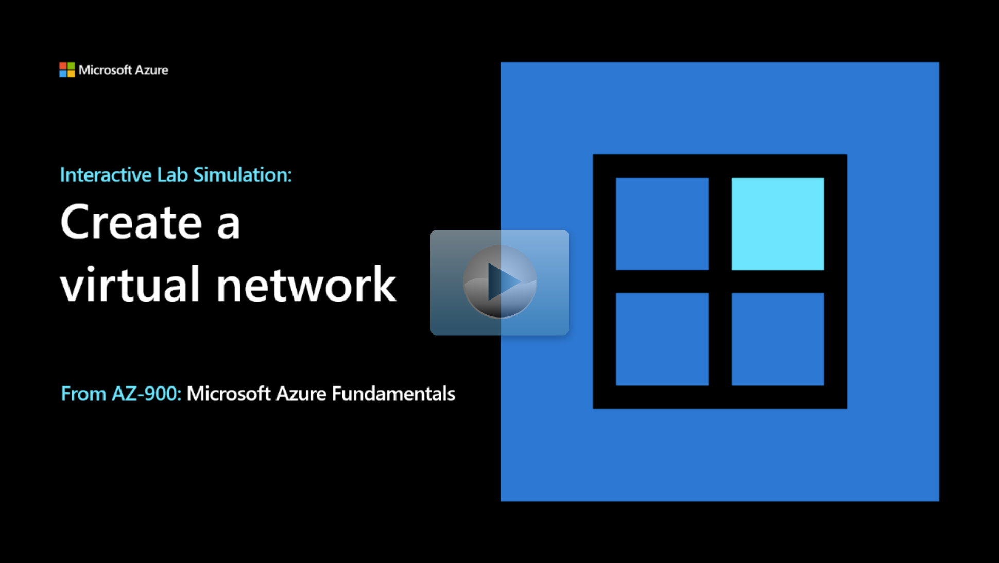

## Lab scenario

Your organization is migrating network infrastructure and virtual machines to Azure. As the Azure Administrator you need to:

+ Configure Azure virtual networks and subnets.
+ Connect remotely to Azure virtual machines by using RDP.
+ Verify virtual machines in the same virtual network can communicate. 

## Architecture diagram

:::image type="content" source="../media/create-network-architecture.png" alt-text="Diagram of the architecture as explained in the text." border="false":::

## Objectives

+ **Task 1**: Create a virtual network.
    + Create a virtual network, **vnet1**, with an IP address space of 10.1.0.0/16.
    + Create a subnet, **default**, with an IP address space of 10.1.0.0/24.
+ **Task 2**: Create two virtual machines.
    + Create a virtual machine, **vm1**, in **vnet1** and allow inbound RDP.
    + Create a second virtual machine, **vm2**, in **vnet1** and allow inbound RDP. 
    + Ensure both virtual machines are deployed and running before continuing.
+ **Task 3**: Test the virtual machine connections.
    + Connect to **vm1** with RDP. 
    + Connect to **vm2** with RDP. 
    + Disable the public and private Windows Firewall on both virtual machines.
    + Use Azure PowerShell to confirm **vm1** can ping **vm2**. 

> [!NOTE]
> Select the thumbnail image to start the lab simulation. When you're done, be sure to return to this page so you can continue learning. 

