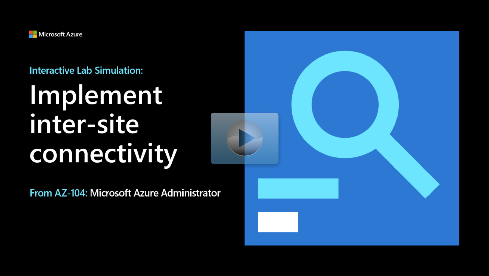

## Lab scenario

Your organization has three datacenters connected with a mesh wide-area network. As the Azure Administrator, you need to implement the on-premises infrastructure in Azure. 

+ There are two offices, New York and Boston, in one region.
+ There's one office, Seattle, in another region.
+ All the offices need to be networked together so they can share information. 
+ This simulation focuses on the connectivity of the offices, and not creating the individual Azure resources. 

## Architecture diagram

:::image type="content" source="../media/lab-05.png" alt-text="Architecture diagram as explained in the text." border="false":::

## Objectives

> [!NOTE]
> You may find slight differences between the interactive simulation and the Azure environment, but the core concepts and ideas being demonstrated are the same.

+ **Task 1**: Create the infrastructure environment. In this task, you deploy three virtual machines. Virtual machines are deployed in different regions and virtual networks. 
    + Use a template to create the virtual networks and virtual machines in the different regions. You can review the [lab templates](https://github.com/MicrosoftLearning/AZ-104-MicrosoftAzureAdministrator/tree/master/Allfiles/Interactive%20Lab%20Simulation%20Files/05).
    + Use Azure PowerShell to deploy the template. 
+ **Task 2**: Configure local and global virtual network peering. 
    + Create a local virtual network peering between the two virtual networks in the same region.
    + Create a global virtual network peering between virtual networks in different regions. 
+ **Task 3**: Test intersite connectivity between virtual machines on the three virtual networks.
    + Test the virtual machine connections in the same region.
    + Test the virtual machine connections in different regions. 

> [!NOTE]
> select the thumbnail image to start the lab simulation. When you're done, be sure to return to this page so you can continue learning. 

