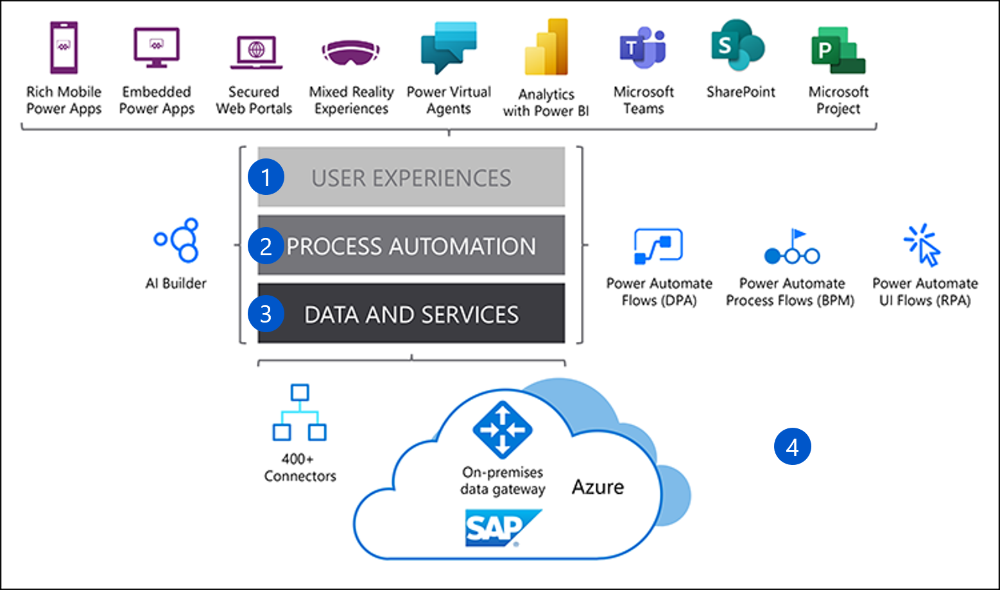
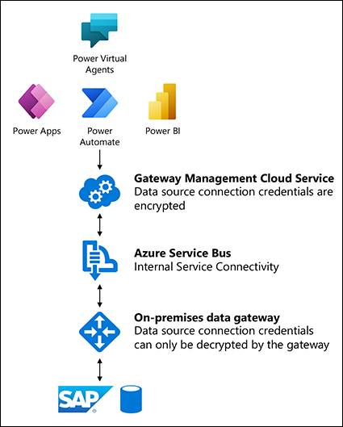

Your Power Platform integration with SAP requires multiple components and services; from the end-user device to Azure services and Microsoft 365. Microsoft 365 and Azure cloud services handle all the underlying infrastructure, authentication, and connectivity between the components.

The figure below shows the conceptual layers, including the user experience (1); process automation (2); data and services (3); and interaction with the On-premises data gateway (4).

## User experience

Users can consume the benefits of the Power Platform integration through embedded and mobile apps, mixed reality, Power BI analytics, Microsoft Teams, and SharePoint sites.

## Process automation

Organizations can increase productivity by automating routine end-user tasks using Power Apps and Power Automate.

## Data and services

Data and the services that support integration includes connectors and data gateways, plus internal communication services such as Azure Service Bus.

Additional Azure services include IaaS and PaaS capabilities, AI, and machine learning. IaaS offerings include Azure Virtual Machines that run SAP; PaaS offerings include the Azure Service Bus to connect with other Azure services. Azure also can run the **On-premises data gateway** that supports connectivity into SAP.

## The On-premises data gateway

There are multiple ways to achieve connectivity and integration, but the most common are connectors, drivers, and gateways. Power Platform and SAP integration typically requires a gateway. Microsoft developed the **On-premises data gateway** (also known as the **Power BI gateway**), because organizations wanted to integrate their on-premises systems and data sources with Azure and Office 365, but without exposing data and application connections directly onto the internet.

You can use the gateway to access your SAP system from the Power Platform, with the isolation you need to help protect your SAP environment. You can [install and run the gateway on-premises](https://docs.microsoft.com/data-integration/gateway/) or in an Azure virtual machine. If your SAP workload is hosted in Azure, the on-premises data gateway must run in an Azure Virtual Machine hosted in the same virtual network as the SAP instance in Azure.

The On-premises data gateway provides data transfer between an SAP data source and Azure and Office 365 cloud services. These services include Power BI, Power Apps, Power Automate, Azure Analysis Services, and Azure Logic Apps. By using the gateway, organizations can securely access data sources and databases, such as SAP HANA, and include them in Power Platform solutions.

The gateway has two modes:

- **Standard** (or **Enterprise**) mode allows multiple users to connect to multiple data sources with a single or clustered gateway installation.

- **Personal** mode allows only one user to connect to data sources. This mode works only with Power BI, and is well-suited to scenarios where one person creates reports from SAP data and doesn’t need to share data sources.

## Integrating SAP using the data gateway

You can access SAP data sources directly from the Power BI Desktop application. However, to publish your dashboards or reports to the Power BI online service, you need the On-premises data gateway. The gateway handles authentication and connection into SAP, allowing you to integrate SAP with Power Platform cloud services.

Power Automate and Power Apps also use the data gateway for data access and application integration.

To support secure and compliant connections with SAP, the On-premises data gateway enables connection to the Azure Service Bus, which then connects to a Gateway Management Cloud Service. The Gateway Management Cloud Service serves as a resource broker by:

- Encrypting and storing SAP data source credentials and data gateway details.

- Routing queries and results between Microsoft Cloud services, the data gateway, and the data source.

- Providing connectivity into SAP and managing credentials for access into the SAP environment.

- Sending queries to the SAP data or application source and returning the results to the Gateway Cloud Service.

- Temporarily storing results on the data gateway virtual machine for large results, if required.

With the gateway in place, organizations have a scalable and secure mechanism to connect the Power Platform online services with their SAP environment.